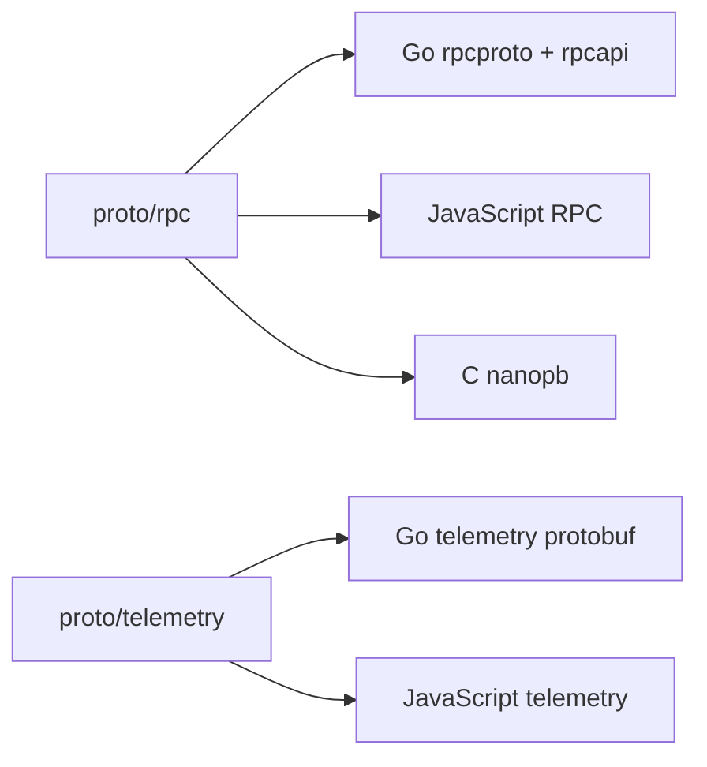

# Proto API

`api/proto/` 是所有 Protobuf source contract 的根目录。Protobuf 是编码格式；其下继续按协议用途区分 RPC 与 Telemetry，不能把所有 `.proto` 文件平铺到同一目录。

```text
api/proto/
├── rpc/
│   ├── rpc.proto
│   ├── nanopb.options
│   └── payload/
└── telemetry/
    └── peer_telemetry.proto
```

## 边界

- `rpc/` 定义 Peer connection 上的请求、响应、error、stream frame 和 method payload。
- `telemetry/` 定义 Peer 向 Server 单向发送的高频 event wire format。
- 两者可以共享 Protobuf 工具链，但不能因为都使用 Protobuf 就混淆 transport semantics。
- Proto schema 不从 HTTP Shared/Resource JSON Schema 转换生成，也不反向生成 HTTP DTO。

## 生成结果



## 子文档

- [Peer RPC](./rpc/overview)：RPC schema 分工、provider/caller 方向和跨语言边界。
- [Telemetry](./telemetry)：Telemetry event 数据路径与设计规则。
- [生成与变更](../generation)：完整生成命令和验证流程。
