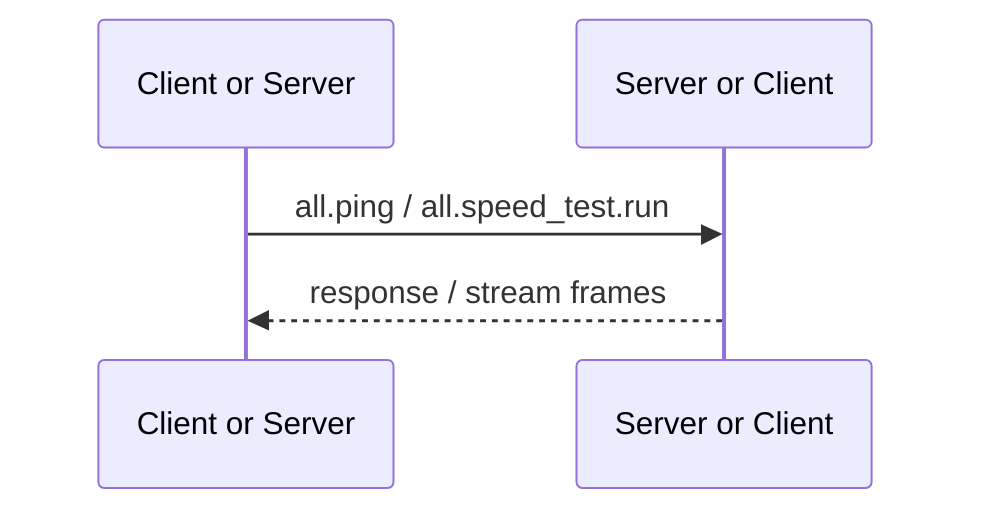

# Both Provided

Both Provided RPC 由连接两端都实现。Client 或 Server 均可作为 caller，也均可作为 provider，用于连接诊断和 transport measurement，不读取某一端独有的产品资源。

准确的 method ID、名称与用途由 [RPC API Reference](/references/rpc#连接诊断与设备信息) 统一维护。本页只说明 `all.*` 的 provider 方向与实现约束。

## 调用关系

`all.*` 只适合真正对称的基础能力。只由一端拥有的数据或行为必须使用 `client.*` 或 `server.*`，不能为了复用 handler 放入 `all.*`。
