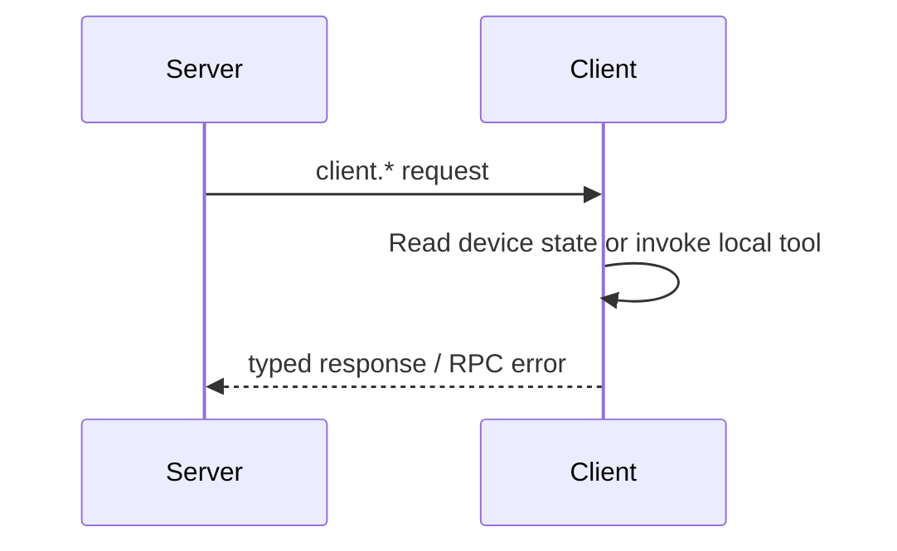

# Client Provided to Server

这一组能力由 Client/Device 实现，由 Server 在 Peer connection 上调用。Server 使用它读取设备自身信息或请求设备执行本地能力。

准确的 method ID、名称与用途由 [RPC API Reference](/references/rpc) 统一维护。本页只说明 `client.*` 的 provider 方向与 ownership。

## 调用关系

Client provider 只能返回该 Client 拥有或可执行的数据。Server resource access decision、跨 Peer lookup 和持久化管理不能实现为 `client.*`。

Go Client 的 provider dispatch 位于 `sdk/go/gizcli` 的 RPC Client implementation；Server 侧通过在线 Peer connection 调用这些 methods。
