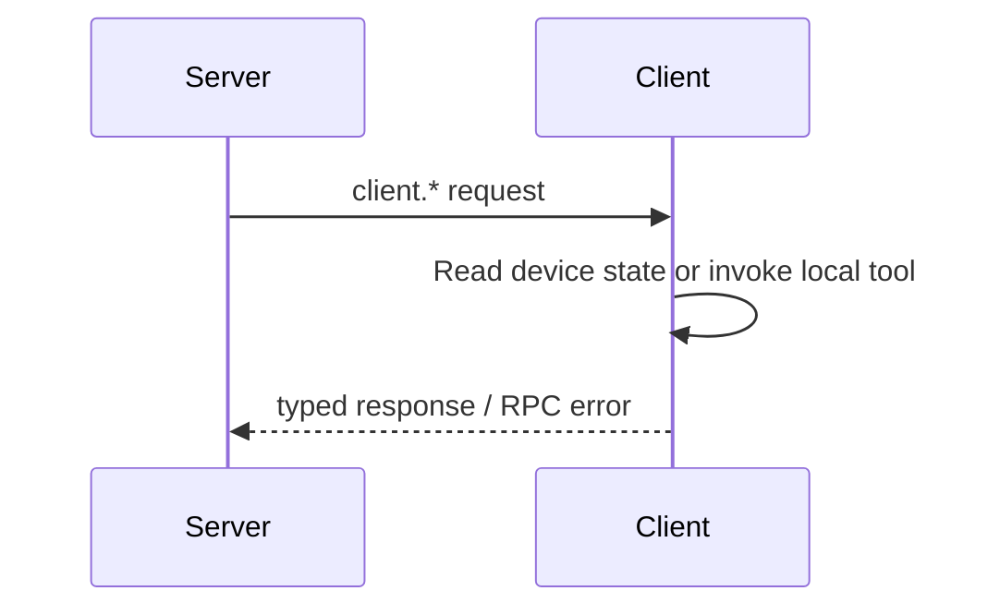

# Client Provided to Server

这一组能力由 Client/Device 实现，由 Server 在 Peer connection 上调用。Server 使用它读取设备自身信息或请求设备执行本地能力。

准确的 method ID、名称与用途由 [RPC API Reference](/references/rpc) 统一维护。本页只说明 `client.*` 的 provider 方向与 ownership。

## 调用关系

```mermaid
sequenceDiagram
    participant Server
    participant Client
    Server->>Client: client.* request
    Client->>Client: Read device state or invoke local tool
    Client-->>Server: typed response / RPC error
```

Client provider 只能返回该 Client 拥有或可执行的数据。Server resource access decision、跨 Peer lookup 和持久化管理不能实现为 `client.*`。

## 设备控制 provider

`client.device.status.get`（100）、`client.device.volume.set`（101）、`client.device.sound.play`（102）、`client.device.reboot`（103）、`client.wifi.status.get`（104）、`client.wifi.saved.list`（105）、`client.wifi.saved.forget`（106）、`client.wifi.scan`（108）与 `client.wifi.connect`（109）由设备 `rpc_provider` 实现；Server 在处理 Public HTTP `/gizclaw/v1/device*` 控制请求时调用它们。除扫描使用请求中 1–15 秒的上界外，控制超时为 5 秒。Provider 责任：

- `volume.set` 设置绝对 `level`（0–100）与 `muted`，并在响应中返回应用后的完整 `PeerStatus`；`status.get` 返回当前 `PeerStatus`。相同输入重复调用结果相同。
- `sound.play` 的 `sound` 是设备自定义字符串（最多 32 UTF‑8 bytes），由设备校验取值，未知取值返回 `INVALID_PARAMS`；`duration_ms` 可选。
- `reboot` 必须先发出响应再执行重启，可选 `delay_ms`。
- `wifi.status.get` 返回 `WifiStatus { connected, ssid, rssi_dbm, ip, bssid }`；`wifi.saved.list` 返回已保存网络的 `ssid`；`wifi.saved.forget` 对不存在的 `ssid` 返回 `NOT_FOUND`，删除已存在的网络后再次调用同样返回 `NOT_FOUND`。`ssid` 最多 32 UTF‑8 bytes，nanopb 设有界长度。
- `wifi.scan` 在 `timeout_ms` 内返回按 `rssi_dbm` 降序且按 SSID 保留最强项的 `WifiScanResult` 列表；`security` 是设备上报的小写标识符，Server 不做枚举校验。
- `wifi.connect` 接收开放网络或 8–63 bytes PSK。设备必须先返回 `ClientWifiConnectResponse`，再断开当前网络并切换；失败时回退原网络。密码不得持久化、记录日志或写入错误。
- 设备只能返回自身可执行的结果：参数非法返回 `INVALID_PARAMS`，未实现的方法返回 `METHOD_NOT_FOUND`，其他失败返回 `INTERNAL_ERROR` 并附简短 message。Server 分别映射为 `400 DEVICE_REJECTED`、`501 DEVICE_UNSUPPORTED` 与脱敏的 `502 DEVICE_ERROR`。

C SDK 的 `inbound_is_client_method` 接受这 9 个方法并分发到 `gzc_client_config_t.rpc_provider`；未注册 provider 或 provider 未处理的方法按 `METHOD_NOT_FOUND` 回复。Go SDK 通过 `gizcli.Client.HandleDeviceControl(gizcli.DeviceControlHandlers{...})` 安装 provider，handler 返回 `gizcli.ErrDeviceRejected` / `gizcli.ErrDeviceResourceNotFound` 映射为 `INVALID_PARAMS` / `NOT_FOUND`；Flutter SDK 通过 `GizClawPeerRpcHandlers.deviceControl`（`GizClawDeviceControlHandlers`）安装，handler 抛出 `GizClawDeviceControlException` 指定 RPC error code。两者对未安装的 handler 都回复 `METHOD_NOT_FOUND`。

Go Client 的 provider dispatch 位于 `sdk/go/gizcli` 的 RPC Client implementation；C Client 通过 `gzc_client_config_t.rpc_provider` 注册同一方向的 provider，callback 在返回前提供 borrowed Protobuf response bytes 或稳定的 RPC error。Server 侧通过在线 Peer connection 调用这些 methods。
