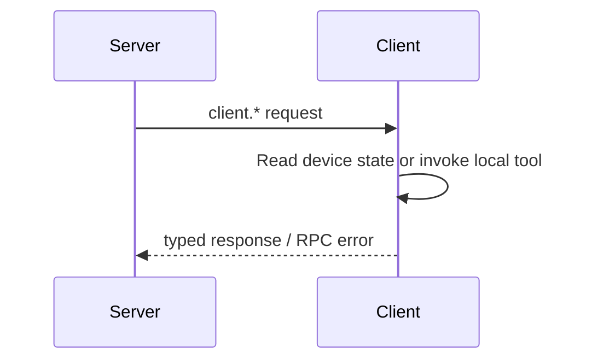

# Client Provided to Server

这一组能力由 Client/Device 实现，由 Server 在 Peer connection 上调用。Server 使用它读取设备自身信息或请求设备执行本地能力。

准确的 method ID、名称与用途由 [RPC API Reference](/references/rpc) 统一维护。本页只说明 `client.*` 的 provider 方向与 ownership。

## 调用关系

```mermaid
sequenceDiagram
    participant Server
    participant Client
    Server->>Client: client.* request
    Client->>Client: Read device state or invoke local tool
    Client-->>Server: typed response / RPC error
```

Client provider 只能返回该 Client 拥有或可执行的数据。Server resource access decision、跨 Peer lookup 和持久化管理不能实现为 `client.*`。

## 设备控制 provider

`client.device.status.get`（100）、`client.device.volume.set`（101）、`client.device.sound.play`（102）、`client.device.find`（126）、`client.device.reboot`（103）、`client.wifi.status.get`（104）、`client.wifi.saved.list`（105）、`client.wifi.saved.forget`（106）、`client.wifi.scan`（108）、`client.wifi.connect`（109）与 `client.firmware.update`（111）由设备 `rpc_provider` 实现；Server 在处理 Public HTTP `/gizclaw/v1/device*` 控制请求时调用它们。除扫描使用请求中 1–15 秒的上界外，控制超时为 5 秒。Provider 责任：

- `volume.set` 设置绝对 `level`（0–100）与 `muted`，并在响应中返回应用后的完整 `PeerStatus`；`status.get` 返回当前 `PeerStatus`。相同输入重复调用结果相同。
- `sound.play` 的 `sound` 是设备自定义字符串（最多 32 UTF‑8 bytes），由设备校验取值，未知取值返回 `INVALID_PARAMS`；`duration_ms` 可选。
- `find` 让用户找到设备：设备播放内置的本地找寻提示音并逐步增大音量，不下载任何 URL 或曲目。`duration_ms` 可选且非负，省略时由设备决定响铃时长。设备开始响铃后即应答，重复调用重新开始响铃。
- `reboot` 必须先发出响应再执行重启，可选 `delay_ms`。
- `firmware.update` 必须先发出响应再执行 OTA。可选 `channel` 指定要安装的 channel，省略时沿用设备自身的 channel；可选 `sha256` 是调用方看到的目标包摘要，与设备解析出的包不一致时返回 `INVALID_PARAMS`。设备自行下载、校验、写入并重启；已经运行目标包时直接返回成功。设备通过 `PeerStatus.firmware_sha256` 上报当前运行的包，`status.get` 与 `volume.set` 的响应会把它写回 Server。
- `wifi.status.get` 返回 `WifiStatus { connected, ssid, rssi_dbm, ip, bssid }`；`wifi.saved.list` 返回已保存网络的 `ssid`；`wifi.saved.forget` 对不存在的 `ssid` 返回 `NOT_FOUND`，删除已存在的网络后再次调用同样返回 `NOT_FOUND`。`ssid` 最多 32 UTF‑8 bytes，nanopb 设有界长度。
- `wifi.scan` 在 `timeout_ms` 内返回按 `rssi_dbm` 降序且按 SSID 保留最强项的 `WifiScanResult` 列表；`security` 是设备上报的小写标识符，Server 不做枚举校验。
- `wifi.connect` 接收开放网络或 8–63 bytes PSK。设备必须先返回 `ClientWifiConnectResponse`，再断开当前网络并切换；失败时回退原网络。密码不得持久化、记录日志或写入错误。
- 设备只能返回自身可执行的结果：参数非法返回 `INVALID_PARAMS`，未实现的方法返回 `METHOD_NOT_FOUND`，其他失败返回 `INTERNAL_ERROR` 并附简短 message。Server 分别映射为 `400 DEVICE_REJECTED`、`501 DEVICE_UNSUPPORTED` 与脱敏的 `502 DEVICE_ERROR`。

C SDK 的 `inbound_is_client_method` 接受这些设备控制方法并分发到 `gzc_client_config_t.rpc_provider`；未注册 provider 或 provider 未处理的方法按 `METHOD_NOT_FOUND` 回复。Go SDK 通过 `gizcli.Client.HandleDeviceControl(gizcli.DeviceControlHandlers{...})` 安装 provider，handler 返回 `gizcli.ErrDeviceRejected` / `gizcli.ErrDeviceResourceNotFound` 映射为 `INVALID_PARAMS` / `NOT_FOUND`（OTA provider 是 `UpdateFirmware`）；Flutter SDK 通过 `GizClawPeerRpcHandlers.deviceControl`（`GizClawDeviceControlHandlers`）安装，handler 抛出 `GizClawDeviceControlException` 指定 RPC error code。两者对未安装的 handler 都回复 `METHOD_NOT_FOUND`。

Go Client 的 provider dispatch 位于 `sdk/go/gizcli` 的 RPC Client implementation；C Client 通过 `gzc_client_config_t.rpc_provider` 注册同一方向的 provider，callback 在返回前提供 borrowed Protobuf response bytes 或稳定的 RPC error。Server 侧通过在线 Peer connection 调用这些 methods。

## 设备配置与能力发现

`client.device.settings.get`（128）、`client.device.settings.set`（129）、`client.device.factory_reset`（130）与
`client.rpc.methods.get`（131）同样由设备 `rpc_provider` 实现，用于读取和修改设备自身的选项。

`DeviceSettings` 的每个成员在两个方向上都是可选的，这正是它能用一个消息服务不同硬件、而不必为每个选项新增
一个 RPC method 的原因：

| 成员 | 类型 | 含义 |
| --- | --- | --- |
| `cellular_enabled` | `optional bool` | 蜂窝（4G）模块是否供电并允许承载流量。 |
| `screen_off_timeout_ms` | `optional int64` | 无操作多久后熄屏；`0` 表示常亮。 |
| `screen_brightness` | `optional int64` | 屏幕背光亮度，取值 0–100。 |
| `led_brightness` | `optional int64` | 指示灯亮度，取值 0–100。 |
| `locale` | `optional string` | 界面语言，BCP 47 标签，例如 `zh-CN`。 |
| `default_interaction_mode` | `optional DeviceInteractionMode` | 默认交互模式：`push-to-talk` 或 `realtime`，与 `WorkspaceInputMode` 使用同一套取值。 |
| `key_feedback` | `optional DeviceKeyFeedback` | 按键提示方式：`none`、`sound`、`vibrate`、`sound_and_vibrate`。 |

Provider 责任：

- `settings.get` 只上报本设备真正支持的成员。没有对应硬件的选项应当缺省，而不是填一个占位值——调用方正是靠
  "缺省"与"存在但为关闭"来区分"不支持"和"已关闭"。
- `settings.set` 只应用请求中出现的成员，未出现的保持不变；响应返回应用后的完整 `DeviceSettings`，调用方据此
  得知设备实际接受了哪些项。设备不支持的成员应忽略而不是报错，这样新版 Server 可以对接旧设备。超出取值范围的
  成员应在应用任何一项之前返回 `INVALID_PARAMS`，避免设备停在配置了一半的状态。
- `factory_reset` 清除设备本机状态，设备侧不可撤销；可选 `keep_network` 保留已保存的 Wi‑Fi 与蜂窝配置，
  使设备无需重新配网即可回连。Server 自身的 Peer 记录不受影响。与 `reboot` 一样必须先发出响应再执行。
- `rpc.methods.get` 返回设备实现的 method name 列表，调用方据此隐藏或跳过设备只会拒绝的控制项。名称使用
  registry 名（例如 `client.device.reboot`）；读取方必须忽略未知名称而不是拒绝整个响应。

JavaScript SDK 通过 `GizClawDeviceControlHandlers` 的 `getSettings`、`setSettings`、`factoryReset` 安装
provider，并直接从已注册的 handler 推导 `client.rpc.methods.get` 的返回值，因此这个列表不会与设备真正接受的
方法脱节。

## 音乐播放器

设备的单个播放器通过 `client.device.audioplayer.*` 提供七个方法：`get`（113）、`playlist.get`（114）、`playlist.set`（115）、`playlist.append`（116）、`play`（117）、`stop`（118）、`mode.set`（119）。无需 `play_id`；`playlist_revision` 标识设备列表版本，不能用于自动重试 append。

| 方法 | 设备行为 |
| --- | --- |
| `get` | 返回完整播放器状态 |
| `playlist.get` | 返回设备当前列表和版本，不读取服务器缓存 |
| `playlist.set` | 校验并原子替换列表，停止当前播放；空列表清空；失败保留原列表和播放 |
| `playlist.append` | 原子追加，保留顺序和重复项，不中断或自动开始播放 |
| `play` | 必填零起始 `index`；从所选歌曲开头播放，替换当前播放 |
| `stop` | 幂等停止，保留列表和循环模式 |
| `mode.set` | `off` 播完列表停止，`one` 单曲循环，`all` 列表循环；不打断当前歌曲 |

列表最多 32 项。每项 `url` 是不含凭据和 fragment 的 HTTPS 音频地址，最多 1024 UTF-8 bytes；可选 `title` 和不透明 `source_ref` 各最多 128 bytes。Server 不解析 catalog，也不下载音频。设备负责下载、解码和播放，完整校验请求并预留容量后才修改列表；不支持的格式或下载错误通过播放状态报告。列表变更递增设备 `playlist_revision`，纯播放或模式变化不改变列表版本。列表持久化由设备决定，连接恢复后调用 `playlist.get` 确认实际列表。

`play` 成功只表示接受请求。设备通过 telemetry 的 `audioplayer` observation（field 15）报告 `stopped`、`buffering`、`playing`、`ended` 或 `error`，包含当前索引、实际播放进度 `position_ms`、可选时长 `duration_ms`、循环模式、列表长度和版本。未知时长省略；毫秒整数不超过 JavaScript 安全整数上限。错误仅在 `error` 状态携带 `error_code`（128 bytes）和 `error_message`（512 bytes），不得包含 URL 凭据。设备应在状态切换时立即上报，并在播放中以适当间隔上报进度。

Server 把状态写入现有 KV `PeerStatus.audioplayer` 快照，按观察时间拒绝旧状态覆盖新状态，不生成 Prometheus 播放器序列。RPC 状态响应也更新同一快照；未提供设备墙钟时使用服务器接收时间。应用读取 `/device/status` 查看快照，调用播放器 `get` 才联系在线设备。Go provider 位于 `DeviceControlHandlers.AudioPlayer`；JavaScript 和 Flutter 位于 `deviceControl.audioplayer`；C 使用已有 `rpc_provider` 和有界 nanopb 消息。Go、JavaScript、C 的 telemetry 接口均支持播放器 observation。

## 社交提醒

`client.social.ping`（127）通知设备有好友呼叫（`server.friend.ping`）或 Friend Group 成员发起集结（`server.friend_group.ping`）。请求携带 `from_peer_public_key`、发起方自己设置的可选 `from_display_name`，集结时还携带 `friend_group_name`——它是接收设备自己对该群的本地 name，与该设备 `server.friend_group.list` 中的 name 一致。设备提醒用户后应尽快返回空的 `ClientSocialPingResponse`：Server 最多等待 3 秒，超时、`METHOD_NOT_FOUND` 或其他错误都计为未送达，不重试。Server 只推送调用方有权发出的提醒，设备无需再校验关系。

C SDK 的 `inbound_is_client_method` 接受 `client.device.find` 与 `client.social.ping` 并分发到 `rpc_provider`，nanopb 消息有界（`from_display_name` 256 bytes、`friend_group_name` 255 bytes）。Go SDK 提供 `DeviceControlHandlers.Find` 与 `gizcli.Client.HandleSocialPing`；JavaScript 使用 `deviceControl.find` 与顶层 `socialPing` handler；Flutter 使用 `GizClawDeviceControlHandlers.find` 与 `GizClawPeerRpcHandlers.socialPing`。各 SDK 在 handler 未设置时回复 `METHOD_NOT_FOUND`，`duration_ms` 为负或 `from_peer_public_key` 为空时回复 `INVALID_PARAMS`。“找设备”在控制 SDK 中分别是 `device.find`（JavaScript）、`findDevice`（Flutter）与 `gzc_control_find_device`（C）。
