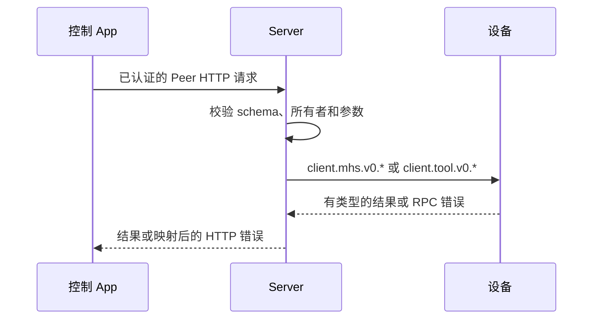

# Client Provided to Server

设备只提供少量基础 RPC 与两个带版本的 family：MHS v0 管硬件状态，tool/v0 管操作。[RPC Reference](/references/rpc) 列出全部 method 和预定义 `ClientTool`。这些调用经在线 Peer connection 执行；`GET /gizclaw/v1/device/status` 读取 Server 快照，不会触碰设备。

```mermaid
sequenceDiagram
    participant App as 控制 App
    participant Server
    participant Device as 设备
    App->>Server: 已认证的 Peer HTTP 请求
    Server->>Server: 校验 schema、所有者和参数
    Server->>Device: client.mhs.v0.* 或 client.tool.v0.*
    Device-->>Server: 有类型的结果或 RPC 错误
    Server-->>App: 结果或映射后的 HTTP 错误
```

## 协议发现

`client.rpc.methods.list`（137）返回 `RpcMethod` 数字，其中 MHS 操作只包含设备实际安装的部分。它用于识别协议 family 和版本，不列举具体操作。`client.tool.v0.list`（136）只返回设备实际安装 handler 的 `ClientTool` 值。调用方忽略未知的未来枚举值；列表不含 `CLIENT_TOOL_UNSPECIFIED`。

`client.tool.v0.invoke`（135）携带一个 `ClientTool` 枚举值，以及用 `payload/tool.proto` 中该枚举声明的请求消息编码的 protobuf `payload`。响应同理携带对应的响应消息。空消息使用空 payload。未安装的操作返回 `UNIMPLEMENTED`；畸形 payload 返回 `INVALID_PARAMS`。设备错误通过 RPC envelope 返回。

## MHS v0 状态

绑定的 RuntimeProfile `spec.mhs.v0` manifest 定义产品自有的 `(device_id, state)` key、类型、范围与权限。`client.mhs.v0.read`（133）读取指定 key；`client.mhs.v0.write`（134）写入声明为 `read_write` 的 key 并返回实际生效值。Server 在接触设备前按 manifest 校验整批输入。设备也必须先验证整批输入和自身安全限制，再应用任何一项。未知或未实现的 key 返回 `NOT_FOUND`；前提条件不满足或值非法时拒绝整批。

`MhsValue` 恰好设置 `bool_value`、`int_value`、`double_value` 或 `string_value` 之一。false、零和空字符串都保留 presence；枚举值用 `string_value` 中的语义字符串。每次请求或响应包含 1–32 个状态。key 最多 64 ASCII 字节，字符串最多 256 UTF-8 字节且不含 NUL；整数必须是 JSON 安全整数，浮点数必须有限。写入超时后应重新读取确认状态。

音量、亮度、语言、提醒模式、Wi-Fi 连接状态等产品硬件状态属于 manifest key。manifest 只声明 key，不会自动安装设备 handler。

## tool/v0 操作

21 个预定义操作是 `info.get`、`identifiers.get`、`device.status.get`、`device.reboot`、`device.factory_reset`、`device.find`、`sound.play`、`wifi.scan`、`wifi.connect`、`wifi.saved.list`、`wifi.saved.forget`、`firmware.update`、七个 `audioplayer.*`、`run.workspace.set` 与 `social.ping`。确切的枚举数字及请求、响应消息见 [RPC Reference](/references/rpc#clienttool-v0)。设备通过 `client.tool.v0.list` 只公布实际安装的子集。tool/v0 不允许 Agent 调用产品自定义的设备本地 Tool。

- `device.status.get` 返回实时 `PeerStatus` 并刷新 Server 快照。超出 MHS manifest 的设备标识与遥测字段仍在该状态中。
- `sound.play` 接受最多 32 UTF-8 字节的设备自定义声音名和可选非负时长。`device.find` 用内置找寻提示音响铃，可选时长。`device.reboot` 先应答再重启。`device.factory_reset` 先应答再清除本机状态；`keep_network` 可保留 Wi-Fi 和蜂窝配置。设备若同时删除自身 Peer，相关 API Key 也会失效。
- `wifi.scan` 的超时限于 1–15 秒，最多返回 32 个接入点。`wifi.connect` 接受最多 32 UTF-8 字节的 SSID 及可选 8–63 字节密码，先应答再切换网络，不能记录或回显密码。`wifi.saved.list` 列出保存的 SSID；`wifi.saved.forget` 对不存在的 SSID 返回 `NOT_FOUND`。
- `firmware.update` 接受可选 channel 和 SHA-256 摘要，先应答再执行 OTA；摘要与设备解析出的包不符时拒绝。设备通过 `PeerStatus.firmware_sha256` 上报当前固件摘要。
- `run.workspace.set` 接受已解析的 `workspace_name` 和可选 `kickoff`。Server 在调用设备前解析 collection/workflow 目标。设备先应答，再通过 `server.run.workspace.reload-with-options` 切换；应答不代表 Workspace 已就绪。
- `social.ping` 通知设备好友呼叫或群组集结，携带发送方 public key 和可选昵称、群组名。设备应及时应答；Server 把超时或缺少 handler 计作未送达，不重试。

## 音乐播放器

单个设备播放器提供七个 `audioplayer.*` 操作：`get`、`playlist.get`、`playlist.set`、`playlist.append`、`play`、`stop` 和 `mode.set`。列表最多 32 项。`playlist.set` 整体验证后原子替换并停止播放；`playlist.append` 保留顺序与重复项，失败后不自动重试。`play` 要求从零开始的 index，应答仅表示接受，实际状态与进度由 audioplayer telemetry 上报。`stop` 幂等，`mode.set` 选择 `off`、`one` 或 `all`。列表项含不带凭证或 fragment 的 HTTPS 音频 URL，以及可选标题和来源引用。Server 不下载音频。列表变更更新 `playlist_revision`；重连后通过 `playlist.get` 读取设备真实列表。

## Provider 与错误契约

Go 设备通过 `gizcli.DeviceControlHandlers` 或逐个 `ClientTool` 安装 handler；JavaScript、Flutter 与 C 安装相应的有类型 handler。各 SDK 从实际安装的 handler 推导发现列表。C provider 用 nanopb callback 解码 invoke bytes，避免新增大型静态 payload 缓冲区。

Server 在打开 RPC stream 前验证 Peer HTTP 的有类型参数。设备离线映射为 `409 DEVICE_OFFLINE`；未安装操作为 `501 DEVICE_UNSUPPORTED`；超时为 `504 DEVICE_TIMEOUT`；设备 `INVALID_PARAMS` 为 `400 DEVICE_REJECTED`；其他设备错误为隐去细节的 `502 DEVICE_ERROR`。保存的 SSID 不存在时使用路由对应的 not-found 映射。设备 handler 不得在状态或错误中泄露凭证。
