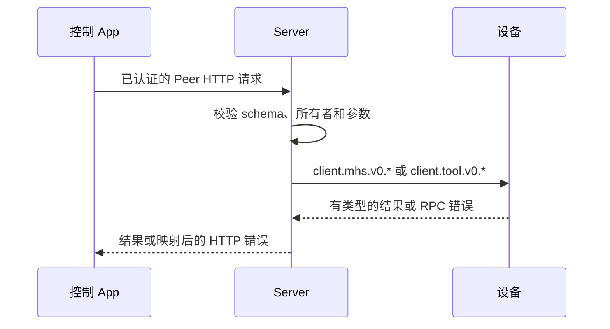

# Client Provided to Server

设备只提供少量基础 RPC 与两个带版本的 family：MHS v0 管硬件状态，tool/v0 管操作。[RPC Reference](/references/rpc) 列出全部 method 和预定义 `ClientTool`。这些调用经在线 Peer connection 执行；`GET /gizclaw/v1/device/status` 读取 Server 快照，不会触碰设备。


```mermaid
sequenceDiagram
    participant App as 控制 App
    participant Server
    participant Device as 设备
    App->>Server: 已认证的 Peer HTTP 请求
    Server->>Server: 校验 schema、所有者和参数
    Server->>Device: client.mhs.v0.* 或 client.tool.v0.*
    Device-->>Server: 有类型的结果或 RPC 错误
    Server-->>App: 结果或映射后的 HTTP 错误
```

## 协议发现

`client.rpc.methods.list`（137）返回 `RpcMethod` 数字，其中 MHS 操作只包含设备实际安装的部分。它用于识别协议 family 和版本，不列举具体操作。`client.tool.v0.list`（136）只返回设备实际安装 handler 的 `ClientTool` 值。调用方忽略未知的未来枚举值；列表不含 `CLIENT_TOOL_UNSPECIFIED`。

`client.tool.v0.invoke`（135）携带一个 `ClientTool` 枚举值，以及用 `payload/tool.proto` 中该枚举声明的请求消息编码的 protobuf `payload`。响应同理携带对应的响应消息。空消息使用空 payload。未安装的操作返回 `UNIMPLEMENTED`；畸形 payload 返回 `INVALID_PARAMS`。设备错误通过 RPC envelope 返回。

## MHS v0 HWD

`payload/mhs_v0.proto` 的 `ClientHwd` 枚举把每种 HWD 绑定到一个 read 响应消息；display、led、speaker 还绑定 write 请求和实际生效响应消息。wifi、ble、modem、battery、mic 没有 write 消息。绑定的 RuntimeProfile manifest 只列出 `{id,hwd}` 实例。

`client.mhs.v0.read`（133）请求包含实例 `id` 与 HWD，响应 payload 是该 HWD 的 read protobuf。`client.mhs.v0.write`（134）还携带该 HWD 的 write protobuf，响应 payload 是实际生效值的 protobuf。每次只访问一个实例。Server 在转发前校验实例与类型；设备对不存在的物理实例返回 NOT_FOUND，对非法值返回 INVALID_ARGUMENT。协议错误走 RPC envelope。写入超时后应重新读取确认。

## tool/v0 操作

26 个预定义操作是 `info.get`、`identifiers.get`、`device.status.get`、`device.reboot`、`device.factory_reset`、`device.find`、`sound.play`、`wifi.scan`、`wifi.connect`、`wifi.saved.list`、`wifi.saved.forget`、`firmware.update`、七个 `audioplayer.*`、`run.workspace.set`、`social.ping`、三个 `lua.app.*` 与两个 `gnss.reporting.*`。确切的枚举数字及请求、响应消息见 [RPC Reference](/references/rpc#clienttool-v0)。设备通过 `client.tool.v0.list` 只公布实际安装的子集。tool/v0 不允许 Agent 调用产品自定义的设备本地 Tool。

- `device.status.get` 返回实时 `PeerStatus` 并刷新 Server 快照。超出 MHS manifest 的设备标识与遥测字段仍在该状态中。
- `sound.play` 接受最多 32 UTF-8 字节的设备自定义声音名和可选非负时长。`device.find` 用内置找寻提示音响铃，可选时长。`device.reboot` 先应答再重启。`device.factory_reset` 先应答再清除本机状态；`keep_network` 可保留 Wi-Fi 和蜂窝配置。设备若同时删除自身 Peer，相关 API Key 也会失效。
- `wifi.scan` 的超时限于 1–15 秒，最多返回 32 个接入点。`wifi.connect` 接受最多 32 UTF-8 字节的 SSID 及可选 8–63 字节密码，先应答再切换网络，不能记录或回显密码。`wifi.saved.list` 列出保存的 SSID；`wifi.saved.forget` 对不存在的 SSID 返回 `NOT_FOUND`。
- `firmware.update` 接受可选 channel 和 SHA-256 摘要，先应答再执行 OTA；摘要与设备解析出的包不符时拒绝。设备通过 `PeerStatus.firmware_sha256` 上报当前固件摘要。
- `run.workspace.set` 接受已解析的 `workspace_name` 和可选 `kickoff`。Server 在调用设备前把 `workflow_name` 目标解析为一个 Workspace。设备先应答，再通过 `server.run.workspace.reload-with-options` 切换；应答不代表 Workspace 已就绪。
- `social.ping` 通知设备好友呼叫或群组集结，携带发送方 public key 和可选昵称、群组名。设备应及时应答；Server 把超时或缺少 handler 计作未送达，不重试。

## GNSS 上报开关

`gnss.reporting.get`（25）与 `gnss.reporting.set`（26）通过现有的 `client.tool.v0.invoke`
读写设备自己的定位上报开关。HTTP 调用同样使用 `POST /gizclaw/v1/device/tool/v0/invoke`：

```json
{"tool":"gnss.reporting.get","args":{}}
```

```json
{"tool":"gnss.reporting.set","args":{"enabled":false}}
```

两个调用均返回 `{"result":{"enabled":false}}` 这样的结果，其中 `enabled` 是设备返回的
当前值或设置后的实际生效值。set 必须显式传入 boolean，`false` 是有效值；省略、null、数字
或字符串均非法。Protobuf request 与两个 response 使用 optional bool 保存 presence，
服务端拒绝缺少 `enabled` 的 set 请求和设备响应。重复 set 设置相同值，不执行 toggle。

设备 handler 拥有读取、应用、默认值、持久化与实际停发行为。Server 只校验和转发，
不保存该开关，不新增 `PeerStatus` 字段，也不改变 GNSS telemetry 的接收或存储规则。
Go 的 `DeviceControlHandlers.GNSSReportingGet/Set`、JavaScript/Flutter 的
`gnssReportingGet/Set` 或各语言的通用 ClientTool handler 提供实现；C 使用已有
`gzc_tool_handler_t` 注册对应枚举并编码 `ClientGnssReporting*` message。
控制端 JavaScript 使用 `device.getGnssReporting()` / `device.setGnssReporting(enabled)`，
Dart 使用 `getDeviceGnssReporting()` / `setDeviceGnssReporting(enabled)`，
C 使用 `gzc_control_get_device_gnss_reporting` / `gzc_control_set_device_gnss_reporting`，
均返回设备给出的 boolean。
只公布实际安装的 handler；未安装时返回 `UNIMPLEMENTED`，HTTP 为 `501 DEVICE_UNSUPPORTED`。

## Lua 应用

`lua.app.list` 返回设备已安装、可启动的应用，每项含包的稳定 `app_id`、独立 SemVer 和可选的 `display_name`、`description`。最多 32 项，ID 不重复。这里的 `app_id` 沿用 GizOS 应用包身份，不是 Server 的 Peer resource ID，也不是文件路径。

`lua.app.install` 接受完整 `.lua-app.tar.zlib` 包的 HTTP(S) `url`，以及可选的压缩包 `sha256`。HTTP(S) 地址最多 1024 UTF-8 字节，不含嵌入凭证或 fragment。兼容入口也接受 `data:application/zlib;base64,` 和 `data:application/octet-stream;base64,`，要求无空白的 canonical Base64，含前缀最多 262144 ASCII 字节。该上限可容纳约 192 KiB 压缩包，覆盖 164484 字节应用样本，并为 Tool/RPC envelope 留出 1 MiB 接收上限内的余量；更大的包使用 Binary 入口。Server 只校验和转发，安装 RPC 最多等待 120 秒；设备负责流式下载、zlib/USTAR 解析、format-1 `lua-app` manifest 和全部文件长度/SHA-256 校验。设备必须限制解压总量、文件数量、路径和可用空间，先暂存完整应用，在全部校验成功后发布新安装；失败保留旧应用和用户数据。空间不足或没有安装能力返回 `UNIMPLEMENTED`，HTTP 映射为 `501 DEVICE_UNSUPPORTED`。成功响应中的 `app` 表示安装完成，不能用下载已排队冒充成功。调用方不得自动重放超时请求。

包格式以 GizOS [固定版本的公共打包器](https://github.com/GizClaw/gizos/blob/604492cc10e2b86b730a365288694d4bf1fc76ab/libs/lua/app_package.py) 为准。USTAR 在文件边界后必须包含两个完整的 512 字节全零结束块；其后的填充也只能是完整的全零块。zlib 校验成功不能代替 tar 完整性验证。

`client.lua.app.install`（RPC 139）是独立的上传 contract，不属于 `ClientTool`。首个小型 Protobuf `RpcRequest` 的 payload 为 `ClientLuaAppInstallStreamRequest { uint32 content_length; string sha256; }`；压缩包长度范围 1–16777216 字节，SHA-256 必填且为 64 位十六进制。随后同一有序 stream 接收多个 Binary 帧，单帧最多 65535 字节，最后是请求 EOS。禁止用 Protobuf bytes、Base64 envelope 或多次 RPC 拼装包体。总期限 120 秒；16 MiB 限制传输工作量，设备继续施加较低的存储、文件数量及解压限制。

设备必须复用 URL 安装器，边收边解压、校验并写暂存文件，完整压缩包不落盘。压缩长度与 SHA-256、manifest、全部文件长度与摘要、两个 tar 结束零块和 zlib EOS 均通过后才原子发布，并发送 `ClientLuaAppInstallResponse` 与响应 EOS。错误、取消、超时或中断都清理暂存状态，保留旧应用与用户数据；失败不重放。早期拒绝可在上传完成前发送最终错误。

控制入口 `POST /gizclaw/v1/device/lua-app/install?content_length=N&sha256=HEX` 使用 `application/octet-stream` 原始请求体，支持 chunked HTTP。鉴权仍绑定 API Key owner；Server/Edge 只转发字节，不持有另一份解包器。返回 `{ "app": ... }`，错误沿用 `DEVICE_REJECTED`、`DEVICE_UNSUPPORTED`、`DEVICE_TIMEOUT` 和脱敏 `DEVICE_ERROR`。列表及启动仍使用 URL Tool 所在的 `tool/v0/invoke` 入口。

C 设备通过 `gzc_client_config_t.lua_app_install` 安装借用的 `gzc_rpc_stream_provider_t`，只有实际注册才在 `client.rpc.methods.list` 公布 139：

| 回调 | 生命周期 |
| --- | --- |
| `begin(userdata, method, metadata, &session)` | 一次性接收借用的 protobuf 元信息并建立 owner；非空 session 必有一次 close。不能返回 WOULD_BLOCK。 |
| `write(session, bytes, len)` | 借用字节只在回调内有效。OK 表示整块已消费；WOULD_BLOCK 表示未消费，SDK 保留同一帧并在 poll 重试，暂缓 backend poll。 |
| `finish(session, respond, userdata)` | 仅在声明长度与请求 EOS 一致后调用。完成压缩 SHA 和包校验及原子发布后才 respond；pending 可返回 WOULD_BLOCK，期间继续 backend poll 以观察取消；不得保留 respond 指针。 |
| `close(session, status)` | 最后一次操作结束后的唯一清理点；成功为 OK，失败、断连、client close 或 120 秒超时为错误状态。回滚未提交状态，释放 owner。 |

回调由串行 poll owner 调用，不得重入 client，且应及时返回。异步设备 worker 若需要跨回调处理必须复制到自身有界存储；SDK 不为回调创建线程。SDK 校验元信息和压缩长度；C provider 的 finish 负责压缩 SHA-256 与全部安装校验。普通 URL Tool 保持同步 respond 合同，不能借用它接收额外 Binary 包体。

Go 的 `gizcli.DeviceControlHandlers.InstallLuaApp` 返回 `LuaAppInstallSession`；JS 的 `GizClawPeerRPCHandlers.installLuaApp` 返回 `LuaAppInstallSession` 并接收 `AbortSignal`；Flutter 的 `GizClawPeerRpcHandlers.installLuaApp` 返回同名 owner 并接收 `LuaAppInstallCancellation`。这些 provider 只负责接线，安装实现由设备拥有。Go/JS/Flutter 在 finish 前也校验压缩 SHA。Go controller 使用生成的 Peer HTTP client 或 `rpcapi.UploadLuaApp`；JS `WebRTCRPCClient.installLuaApp` 和 Flutter `PeerRpcClient.installLuaApp` 接受逐块输入，复用现有发送背压与 EOS。

`lua.app.run` 接受 `app_id` 和可选 `params`。`params` 是字符串到字符串的对象，直接映射为 GizOS `h2_lua_arg_t` 和 Lua 全局 `args`；省略等价于空对象，不需要把整份 JSON 编码为一个字符串。最多 16 对，键 1–64 UTF-8 字节、值最多 1024 字节、键和值总计最多 4096 字节，均禁止 NUL。数字或结构化内容需要应用自行约定和解析。未安装的 ID 返回 `NOT_FOUND`，HTTP 为 `404 LUA_APP_NOT_FOUND`。设备先应答接受启动，再移交界面或断开会话；应答不表示游戏已经完成。

例如 `{"tool":"lua.app.run","args":{"app_id":"tetris","params":{"mode":"single","difficulty":"easy"}}}`。Lua 侧读取 `args.mode` 和 `args.difficulty`。对话 Agent 通过 RuntimeProfile 的 `client_tool` bindings 和 Workflow `toolkit.tool_names` 获得 `lua.app.list`、`lua.app.run`，先将用户说的游戏名匹配到设备返回的 ID，再传递应用支持的字符串参数。SDK 只公布实际注册的 handler；新增协议不会自动给现有固件安装实现。

## 音乐播放器

单个设备播放器提供七个 `audioplayer.*` 操作：`get`、`playlist.get`、`playlist.set`、`playlist.append`、`play`、`stop` 和 `mode.set`。列表最多 32 项。`playlist.set` 整体验证后原子替换并停止播放；`playlist.append` 保留顺序与重复项，失败后不自动重试。`play` 接受从零开始的可选 index，省略时由设备选择默认曲目，应答仅表示接受，实际状态与进度由 audioplayer telemetry 上报。`stop` 幂等，`mode.set` 选择 `off`、`one` 或 `all`。列表项含不带凭证或 fragment 的 HTTPS 音频 URL，以及可选标题和来源引用。Server 不下载音频。列表变更更新 `playlist_revision`；重连后通过 `playlist.get` 读取设备真实列表。

## Provider 与错误契约

Go 设备通过 `gizcli.DeviceControlHandlers` 或逐个 `ClientTool` 安装 handler；JavaScript、Flutter 与 C 安装相应的有类型 handler。各 SDK 从实际安装的 handler 推导发现列表。C provider 用 nanopb callback 解码 invoke bytes，避免新增大型静态 payload 缓冲区。

Server 在打开 RPC stream 前验证 Peer HTTP 的有类型参数。设备离线映射为 `409 DEVICE_OFFLINE`；未安装操作为 `501 DEVICE_UNSUPPORTED`；超时为 `504 DEVICE_TIMEOUT`；设备 `INVALID_PARAMS` 为 `400 DEVICE_REJECTED`；其他设备错误为隐去细节的 `502 DEVICE_ERROR`。保存的 SSID 不存在时使用路由对应的 not-found 映射。设备 handler 不得在状态或错误中泄露凭证。

## 运行时 Tool 能力声明

`client.rpc.methods.list` 的 `mhs_v0` 是可选的实际实例能力列表，每项固定 `id/hwd` 和设备实现的 `write_fields`。未提供实例能力时，运行时目录显示未知，不从通用 HWD Schema 推断支持。Go SDK 使用 `DeviceControlHandlers.MhsCapabilities` 生成该列表；每次解析按 family 查询一次。`client.mhs.v0.read` 的可选 `write_capabilities` 同样只声明当前实例实际可写字段。模型执行前重新授权及发现，设备自身仍需验证参数与安全限制。
