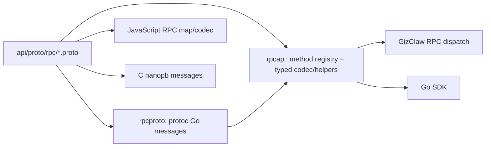

# Peer RPC

Peer RPC 是 Giznet Peer connection 上的请求、响应和 stream contract。它使用 Protobuf 定义 wire messages，不通过 OpenAPI 或 JSON Schema 生成。

## Schema 分工

```text
api/proto/rpc/
├── rpc.proto          # request、response、error、stream 与 method registry
├── nanopb.options     # C/nanopb 生成配置
└── payload/
    ├── ai.proto
    ├── edge.proto
    ├── enums.proto
    ├── firmware.proto
    ├── gameplay.proto
    ├── social.proto
    ├── system.proto
    └── workspace.proto
```

`rpc.proto` 统一拥有核心 RPC protocol：`RpcRequest`、`RpcResponse`、`RpcStreamFrame`、`RpcError`、`RpcErrorCode`、`RpcMethodOptions` 和完整 `RpcMethod` registry。Request 与 Response 属于同一 envelope contract，不拆成 `peer.proto` 与 `common.proto`。

`nanopb.options` 只控制 C/nanopb 的生成行为，不定义 wire message。`payload/` 按领域拥有 method-specific messages，避免核心 `rpc.proto` 吸收业务 DTO。

## 生成与运行关系



`rpcproto` 只拥有 Protobuf wire messages，Go package 名为 `rpcpb`。`rpcapi` 在其上提供 method registry、typed payload codec 与 stream frame helpers；手写接口和调用点直接使用定义消息的 `rpcpb` 类型，不通过 `rpcapi` alias 重命名。RPC handler 和领域 service 不属于这两个 package。

## Method 设计

- Method name 应稳定并体现领域所有权，不能绑定某个 Go 文件名。
- Request/response payload 放进对应领域 proto；跨领域 enum 才进入 `enums.proto`。
- 普通请求响应、长数据 stream 和 direct packet 是不同 transport shape，不应通过可选字段揉成一个消息。
- Error code 是 wire contract；领域错误必须在 Server adapter 处稳定映射，不能把内部 error string 当协议。
- Edge route RPC 直接使用 `edge.proto` messages，不在 HTTP shared schema 中再维护 JSON DTO。

任何 method 或 payload 变化都必须同步检查 Go Server、Go SDK、JavaScript SDK、C SDK 和 e2e，而不是只确认 Protobuf 能生成。

## Provider 方向

RPC method 前缀描述谁提供能力，不是请求从哪个文件发出：

- [Both Provided](./both-provided)：Client 与 Server 都实现的通用诊断方法。
- [Client Provided to Server](./client-provided-to-server)：Server 调用、Client 实现的设备能力。
- [Server Provided to Client](./server-provided-to-client)：Client 调用、Server 实现的产品与资源能力。
- [Server Provided to Edge-node](./server-provided-to-edge-node)：Edge-node 调用、Server 实现的路由控制能力。
