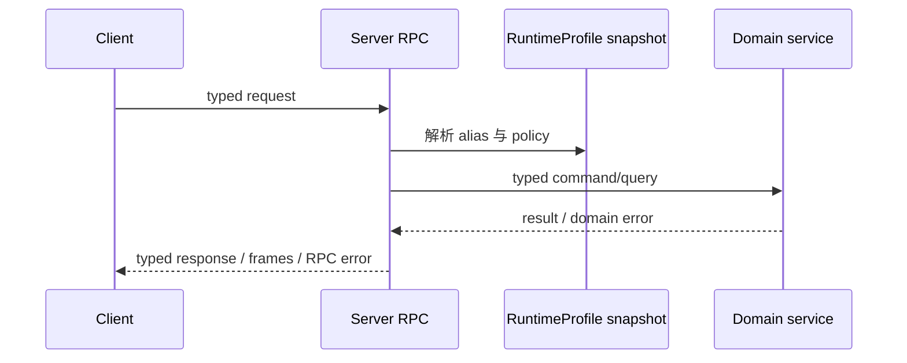

# Server Provided to Client

这一组方法由 Server 实现，由 Client/Device 通过 Peer connection 调用。

准确的 method ID、名称、分组与用途由 [RPC API Reference](/references/rpc) 统一维护。本页只说明 Server-provided RPC 的 resource projection、调用关系与实现 ownership。Edge-node 专属方法的授权边界见 [Server Provided to Edge-node](./server-provided-to-edge-node)。

## RuntimeProfile resource projection

真实 Workflow、Model、Credential、Voice 和 Tool 都由 Admin 管理。Peer RPC 不提供 Workflow、Model、Credential、Tool create/put/delete，也不存在 `source=runtime|owned` selector。

Workflow alias 按 RuntimeProfile Collection 分组。`server.workflow.list` 必须传 Collection，`server.workflow.get` 使用全局唯一 alias。Model、Voice、Tool list/get 同样使用 RuntimeProfile alias。响应只包含安全 alias metadata，并携带 RuntimeProfile name 与 revision；真实 ID、provider 配置、credential、ownership 和 executor routing 都留在 Server。

Workspace create 必须传 `collection` 与 `workflow_alias`。Server 通过内部 Workspace label 保存 Collection。Workspace list 必须传 Collection并做精确筛选，但 Peer 响应不包含通用 labels。删除 alias 不会隐藏或删除已有 Workspace；alias 恢复前 reload/run 返回 not found。

## 调用关系

RPC adapter 负责 payload decode、framing、lifecycle 和稳定 error mapping；领域 service 负责 storage、resource validation、authorization 与 execution。

`server.peer.delete` 使用空 request/response message，不接受目标 public key。它会原子创建或复用 caller 的 pending-deletion handoff，同时保留 active Peer；随后 Server 立即把当前 connection 标为 retiring 并拒绝新工作，再尝试 flush response 和 EOS；即使任一写入失败也会关闭完整 connection。`server.workspace.delete` 只对 caller-owned 用户 Workspace 创建或复用同样透明的 handoff，system Workspace 始终不可通过该方法删除。`server.pet.delete` 保留 Pet，并写入或复用 Pet pending work，同时保留绑定的 system Workspace。
