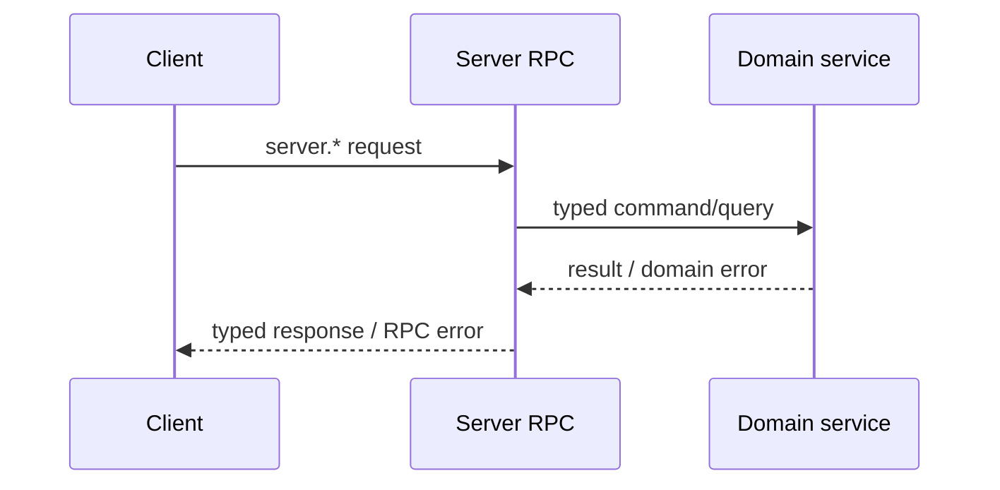

# Server Provided to Client

这一组能力由 Server 实现，由 Client/Device 通过 Peer connection 调用。它是 Client 访问 Server runtime、资源和产品服务的主要 RPC surface。

## Method groups

| Prefix | 主要能力 |
| --- | --- |
| `server.info.*` | Server/Peer information 的读取与更新 |
| `server.runtime.*`、`server.status.*` | Runtime 与 status 查询 |
| `server.run.*` | Agent、Workspace、history、memory、recall、say、reload 与 stop |
| `server.firmware.*` | Firmware list/get 与 files download |
| `server.workspace.*` | Workspace CRUD、history 与 history audio |
| `server.workflow.*` | Workflow list/get 只读查询 |
| `server.model.*` | Model CRUD |
| `server.voice.*` | Voice list/get |
| `server.credential.*` | Credential CRUD |
| `server.contact.*` | Contact CRUD |
| `server.friend.*` | Friend 与 invite-token operations |
| `server.friend_group.*` | Group、member、message 与 invite-token operations |
| `server.game_ruleset.*` | Gameplay ruleset lookup |
| `server.pet.*` | Pet resource CRUD 与 drive |
| `server.pet.actions.get` | 按 Pet 获取可用 actions，不返回完整 PetDef |
| `server.pet.pixa.download` | 按 Pet 下载 PIXA metadata 与素材，不暴露 PetDef API |
| `server.badge.*` | Badge resource query |
| `server.badge_def.pixa.download` | 下载 Badge Definition 关联的 PIXA 素材；不提供 Badge Definition CRUD |
| `server.points.*` | Points account 与 transactions |
| `server.game_result.*`、`server.reward_grant.*` | Gameplay result 与 reward query |
| `server.tool.*` | Tool CRUD |
| `server.asset.download` | 下载当前 Peer 有 read 权限的 Resource public display asset |

`server.peer.lookup`、`server.peer.assign` 和 `server.route.resolve` 不属于本页；它们只提供给 Edge-node。

## Workflow localization

`server.workflow.list` 与 `server.workflow.get` 接受 `WorkflowLocale lang`。初始 enum 只包含 `en` 与 `zh-CN`；未指定、请求语言不存在或无法识别时，Server 使用 Workflow 的 `i18n.default_locale`。RPC response 中的 `Workflow.i18n` 只包含最终选中的一个 `WorkflowI18nCatalog`，不返回完整语言表，也不返回实际命中的 locale。

catalog 按语言整体选择，不跨语言逐字段拼接。选中 catalog 缺少 `name` 时，客户端使用稳定的 `Workflow.name`；缺少 `description` 时使用空字符串。Admin API 仍返回完整 `WorkflowI18n`，并由 Server 与 Workflow 一起持久化。

## 调用关系

RPC adapter 负责 payload decode、method dispatch 和稳定 error mapping；领域 service 负责 authorization、resource rule、storage 与 lifecycle。不能在 generated RPC package 中实现这些业务行为。

## Asset download

`server.asset.download` 接受 canonical `asset://<32-lowercase-hex>`。Server 必须同时确认 reverse binding 仍与完整 owner 结构一致、ref 位于 Resource 的 public `displays` 投影，并完成该 Resource 的 read ACL；任一步失败都不能先发送 binary frame。

成功 response 先发送 `AssetMetadata`，再使用既有 binary frame 传输 bytes。metadata 包含 ref、canonical media type、size、SHA-256、created time 与可选 expiration，不包含 bindings、ObjectStore key、backend 或 bucket。取消、disconnect、read failure 和 client early close 都必须关闭 reader 与 stream。
