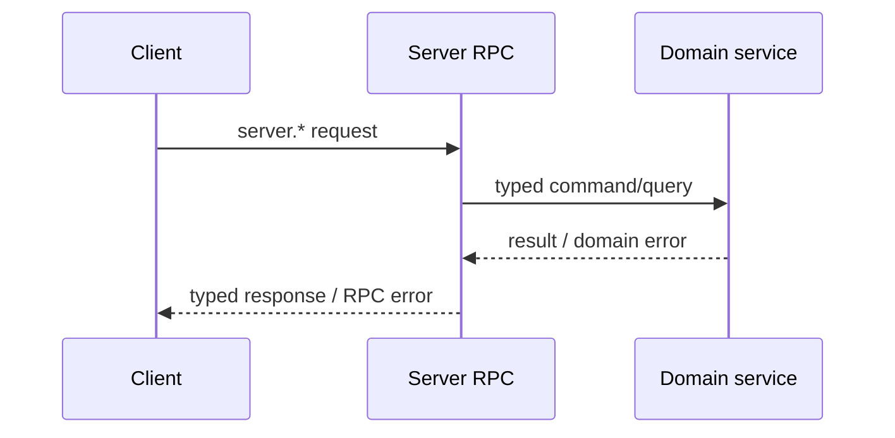

# Server Provided to Client

这一组能力由 Server 实现，由 Client/Device 通过 Peer connection 调用。它是 Client 访问 Server runtime、资源和产品服务的主要 RPC surface。

## Method groups

| Prefix | 主要能力 |
| --- | --- |
| `server.info.*` | Server/Peer information 的读取与更新 |
| `server.runtime.*`、`server.status.*` | Runtime 与 status 查询 |
| `server.run.*` | Agent、Workspace、history、memory、recall、say、reload 与 stop |
| `server.firmware.*` | Firmware list/get 与 files download |
| `server.workspace.*` | Workspace CRUD、history 与 history audio |
| `server.workflow.*` | 按 source 查询 Workflow，以及 owned Workflow CRUD |
| `server.model.*` | Model CRUD |
| `server.voice.*` | Voice list/get |
| `server.credential.*` | Credential CRUD |
| `server.contact.*` | Contact CRUD |
| `server.friend.*` | Friend 与 invite-token operations |
| `server.friend_group.*` | Group、member、message 与 invite-token operations |
| `server.register` | 使用 RegistrationToken 选择当前 connection 的 Firmware 与 RuntimeProfile |
| `server.pet.*` | Pet resource CRUD 与 drive |
| `runtime.adopt` | 从当前 connection 的 RuntimeProfile 领养 Pet |
| `server.pet.actions.get` | 按 Pet 获取可用 actions，不返回完整 PetDef |
| `server.pet.pixa.download` | 按 Pet 下载 PIXA metadata 与素材，不暴露 PetDef API |
| `server.badge.*` | Badge resource query |
| `server.badge_def.pixa.download` | 下载 Badge Definition 关联的 PIXA 素材；不提供 Badge Definition CRUD |
| `server.points.*` | Points account 与 transactions |
| `server.game_result.*`、`server.reward_grant.*` | Gameplay result 与 reward query |
| `server.tool.*` | Tool CRUD |

`server.peer.lookup`、`server.peer.assign` 和 `server.route.resolve` 不属于本页；它们只提供给 Edge-node。

## Workflow source

`server.workflow.list` 与 `server.workflow.get` 必须指定 `source=runtime` 或 `source=owned`。Runtime 结果以当前 RuntimeProfile alias 作为 RPC `id`，Server 在内部解析到真实 Workflow，并且只允许读取；引用目标不存在时 list 跳过该项，get 返回 not found。Owned 结果以全局唯一的真实 Workflow name 作为 `id`，create、put、delete 只允许操作当前 Peer 自己拥有的 Workflow。

Workspace create 与 put 同样携带 Workflow `source`，因此 runtime alias 与 owned name 不会混淆。Workflow 不包含 icon、显示名称或 i18n；客户端用稳定的 RuntimeProfile alias 自行映射本地展示内容。

## 调用关系

RPC adapter 负责 payload decode、method dispatch 和稳定 error mapping；领域 service 负责 authorization、resource rule、storage 与 lifecycle。不能在 generated RPC package 中实现这些业务行为。
