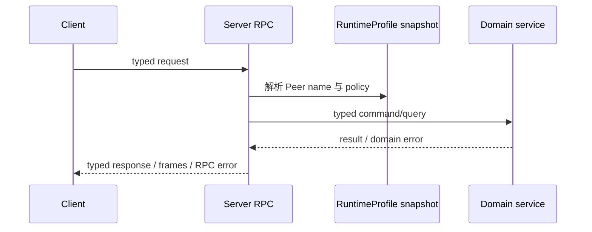

# Server Provided to Client

这一组方法由 Server 实现，由 Client/Device 通过 Peer connection 调用。

准确的 method ID、名称、分组与用途由 [RPC API Reference](/references/rpc) 统一维护。本页只说明 Server-provided RPC 的 resource projection、调用关系与实现 ownership。Edge-node 专属方法的授权边界见 [Server Provided to Edge-node](./server-provided-to-edge-node)。

## RuntimeProfile resource projection

真实 Workflow、Model、Credential、Voice 和 Tool 都由 Admin 管理。Peer RPC 不提供 Workflow、Model、Credential、Tool create/put/delete，也不存在 `source=runtime|owned` selector。

RuntimeProfile binding alias 按 Collection 分组，但 Peer 边界把每个 binding 统一投影为不可变 `name`。`server.workflow.list` 必须传 Collection；Workflow、Model、Voice、Tool 的 get/list request 与 response 都只使用 name。响应使用 `runtime_profile_name`；RuntimeProfile 没有独立的 Peer alias，因此其值是 canonical RuntimeProfile ID 原样投影得到的 Peer name，并同时携带 revision。这是正常的 Peer 投影规则，不是兼容字段。其他 canonical ID、provider 配置、credential、ownership 和 executor routing 都留在 Server。

Workspace create 必须传 `collection` 与 `workflow_name`。Server 把该 Peer name 解析为当前 RuntimeProfile binding，并通过内部 Workspace label 保存 Collection。Workspace list 必须传 Collection 并做精确筛选，但 Peer 响应不包含通用 labels。删除 binding 不会隐藏或删除已有 Workspace；name 再次可解析前 reload/run 返回 not found。

## 调用关系

```mermaid
sequenceDiagram
    participant Client
    participant RPC as Server RPC
    participant Profile as RuntimeProfile snapshot
    participant Service as Domain service
    Client->>RPC: typed request
    RPC->>Profile: 解析 Peer name 与 policy
    RPC->>Service: typed command/query
    Service-->>RPC: result / domain error
    RPC-->>Client: typed response / frames / RPC error
```

RPC adapter 负责 payload decode、framing、lifecycle 和稳定 error mapping；领域 service 负责 storage、resource validation、authorization 与 execution。

已认证的 Peer 连接是 API Key 的根管理入口。`server.api_key.create`（method 96）、`server.api_key.list`（method 97）和 `server.api_key.revoke`（method 98）都从当前 active Client connection 推导 owner，并验证 durable RuntimeProfile owner binding。create 只在成功响应中返回一次完整 secret；list 使用 cursor 分页且只返回 metadata；revoke 只接受一个同 owner 的 opaque key name。根管理操作不需要 API Key，也不检查 `manage_api_keys`。

Friend Group 消息是群组绑定 Workspace History 的只读投影。list/get/audio 请求接收当前认证成员自己的 `friend_group_name`，需要时再携带消息的 `history_name`；Server 将它们解析为 canonical ID，验证 membership 后只在内部继续携带 ID。每条响应都以 `name` 暴露记录身份，以 `actor_name` 暴露归属显示。Conversation 是唯一写入路径。audio get 使用标准 metadata、binary frames、EOS 响应，不暴露 canonical group、Workspace 或 asset locator。

`server.peer.delete` 使用空 request/response message，不接受目标 public key。它会原子创建或复用 caller 的 pending-deletion handoff，同时保留 active Peer；随后 Server 立即把当前 connection 标为 retiring 并拒绝新工作，再尝试 flush response 和 EOS；即使任一写入失败也会关闭完整 connection。`server.workspace.delete` 只对 caller-owned 用户 Workspace 创建或复用同样透明的 handoff，system Workspace 始终不可通过该方法删除。`server.pet.delete` 保留 Pet，并写入或复用 Pet pending work，同时保留绑定的 system Workspace。
