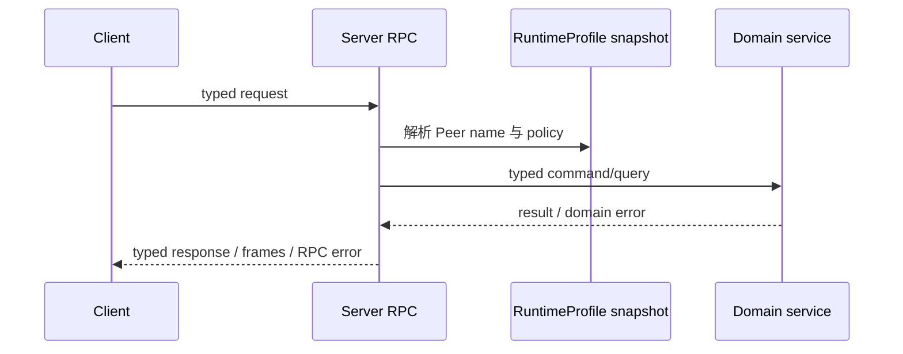

# Server Provided to Client

这一组方法由 Server 实现，由 Client/Device 通过 Peer connection 调用。

准确的 method ID、名称、分组与用途由 [RPC API Reference](/references/rpc) 统一维护。本页只说明 Server-provided RPC 的 resource projection、调用关系与实现 ownership。Edge-node 专属方法的授权边界见 [Server Provided to Edge-node](./server-provided-to-edge-node)。

## RuntimeProfile resource projection

真实 Workflow、Model、Credential、Voice 和 Tool 都由 Admin 管理。Peer RPC 不提供 Workflow、Model、Credential、Tool create/put/delete，也不存在 `source=runtime|owned` selector。

RuntimeProfile binding alias 按 Collection 分组，但 Peer 边界把每个 binding 统一投影为不可变 `name`。`server.workflow.list` 必须传 Collection；Workflow、Model、Voice、Tool 的 get/list request 与 response 都只使用 name。响应使用 `runtime_profile_name`；RuntimeProfile 没有独立的 Peer alias，因此其值是 canonical RuntimeProfile ID 原样投影得到的 Peer name，并同时携带 revision。这是正常的 Peer 投影规则，不是兼容字段。其他 canonical ID、provider 配置、credential、ownership 和 executor routing 都留在 Server。

`server.workspace.input.put` 只更新一个 Workspace 的 input mode。Client 传 Workspace `name` 与目标 `WorkspaceInputMode`，Server 读取当前 Workspace、按 Workflow driver 解析继承的 parameters variant、只替换 `input` 并写回，其余 parameters 字段与 toolkit policy 保持不变。Client 不得先 GET Workspace 或 Workflow 再 PUT。Workspace 不存在返回 404，Workflow driver 没有 input mode（`dashscope-realtime`、`doubao-realtime-duplex`）或 input 非法返回 400，system Workspace 的其他更新限制仍然适用。

Workspace create 必须传 `collection` 与 `workflow_name`。Server 把该 Peer name 解析为当前 RuntimeProfile binding，并通过内部 Workspace label 保存 Collection。Workspace list 必须传 Collection 并做精确筛选，但 Peer 响应不包含通用 labels。删除 binding 不会隐藏或删除已有 Workspace；name 再次可解析前 reload/run 返回 not found。

## 调用关系

```mermaid
sequenceDiagram
    participant Client
    participant RPC as Server RPC
    participant Profile as RuntimeProfile snapshot
    participant Service as Domain service
    Client->>RPC: typed request
    RPC->>Profile: 解析 Peer name 与 policy
    RPC->>Service: typed command/query
    Service-->>RPC: result / domain error
    RPC-->>Client: typed response / frames / RPC error
```

RPC adapter 负责 payload decode、framing、lifecycle 和稳定 error mapping；领域 service 负责 storage、resource validation、authorization 与 execution。

已认证的 Peer 连接是 API Key 的根管理入口。`server.api_key.create`（method 96）、`server.api_key.list`（method 97）和 `server.api_key.revoke`（method 98）都从当前 active Client connection 推导 owner，并验证 durable RuntimeProfile owner binding。create 与 cursor 分页的 list 都返回可恢复的完整 API Key；revoke 只接受一个同 owner 的 opaque key name。根管理操作不需要 API Key，也不检查 `manage_api_keys`。

Friend Group 消息是群组绑定 Workspace History 的只读投影。list/get/audio download 请求接收当前认证成员自己的 `friend_group_name`，需要时再携带消息的 `history_name`；Server 将它们解析为 canonical ID，验证 membership 后只在内部继续携带 ID。每条响应都以 `name` 暴露记录身份，以 `actor_name` 暴露归属显示。Conversation 是唯一写入路径。audio download 使用标准 metadata、binary frames、EOS 响应，不暴露 canonical group、Workspace 或 asset locator。

`server.peer.delete` 使用空 request/response message，不接受目标 public key。它会原子创建或复用 caller 的 pending-deletion handoff，同时保留 active Peer；随后 Server 立即把当前 connection 标为 retiring 并拒绝新工作，再尝试 flush response 和 EOS；即使任一写入失败也会关闭完整 connection。`server.workspace.delete` 只对 caller-owned 用户 Workspace 创建或复用同样透明的 handoff，system Workspace 始终不可通过该方法删除。`server.pet.delete` 保留 Pet，并写入或复用 Pet pending work，同时保留绑定的 system Workspace。

## Server 发起的设备控制

Public HTTP `/gizclaw/v1/device*` 的控制 route 由 Server 作为 caller，经 API Key owner 的在线 Peer connection 调用 `client.device.status.get`（100）、`client.device.volume.set`（101）、`client.device.sound.play`（102）、`client.device.reboot`（103）、`client.wifi.status.get`（104）、`client.wifi.saved.list`（105）与 `client.wifi.saved.forget`（106）。这些方法的 provider 责任、幂等要求与错误码见 [Client Provided to Server](./client-provided-to-server)。Server 侧规则：每个命令使用独立 RPC stream，超时 5 秒；同一 owner 的命令按到达顺序串行转发，不合并、不重放；`volume.set` 返回的 `PeerStatus` 以设备回报时间写入 owner 的 status，随后 `server.status.get` 与 `GET /device/status` 读到同一份数据；设备确认 `reboot` 后，同一连接上的后续命令返回 `DEVICE_OFFLINE`，直到设备以新连接重连。
