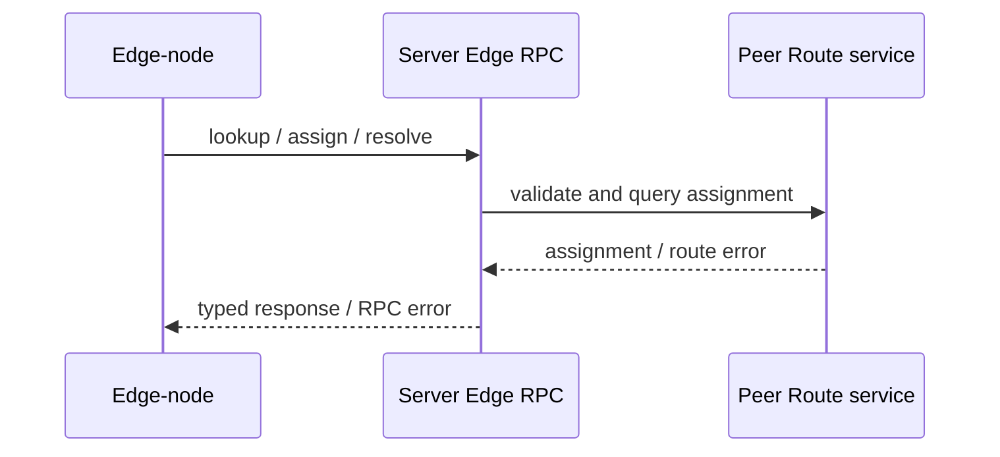

# Server Provided to Edge-node

这一组能力由 Server 实现，只提供给具有 Edge-node role 的连接。Edge-node 使用它查询 Peer assignment 和解析上游路由，不向普通 Client 暴露控制面能力。

准确的 method ID、名称与用途由 [RPC API Reference](/references/rpc#edge-rpc) 统一维护。本页只说明 Edge-node role、调用关系与授权边界。

## 调用关系

Server 使用独立 Edge RPC dispatch，只接受上述三个 methods。普通 Client RPC surface 即使共享同一 `rpc.proto` registry，也不能因为 method 可解码就获得调用权限；role authorization 与 service exposure 必须同时限制 Edge control plane。
