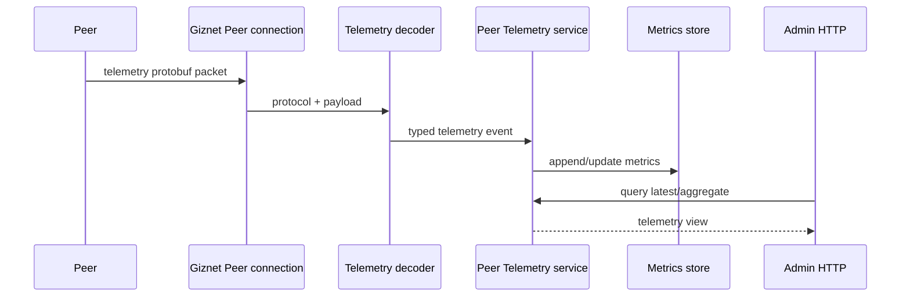

# Telemetry API

`api/proto/telemetry/peer_telemetry.proto` 定义 Peer 向 Server 发送的 telemetry event wire format。它是高频单向事件流，不是 RPC method，也不是 Admin HTTP resource。

## 数据路径

Telemetry Protobuf 拥有设备上报的 wire fields。Metrics store 拥有保存与查询语义；Admin HTTP 拥有面向管理员的 response contract。不要为了方便直接把 storage model 当 telemetry wire message，也不要让设备依赖 Admin response DTO。

## 设计规则

- 高频字段应保持紧凑、稳定并向后兼容。
- 新字段必须明确单位、时间语义和缺省值；不能仅靠 Go 注释猜测。
- Decoder 将 malformed 或超限输入视为不可信边界。
- Aggregation、retention 和 query filtering 属于 service/store，不属于 wire schema。
- Schema 变化后重新生成 Go 与 JavaScript telemetry code，并验证真实 packet decode 和 service ingestion。
