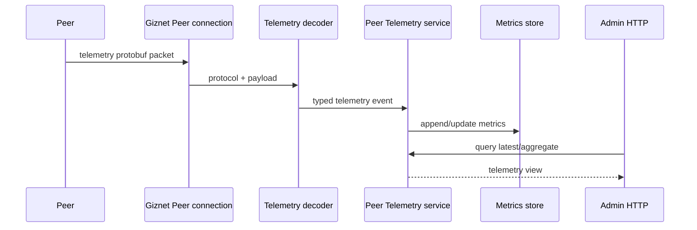

# Telemetry API

`api/proto/telemetry/peer_telemetry.proto` 定义 Peer 向 Server 发送的 telemetry event wire format。它是高频单向事件流，不是 RPC method，也不是 Admin HTTP resource。

Direct packet protocol、可靠性与 transport 边界见 [Streams Reference](/references/streams#direct-packets)。

## 数据路径

```mermaid
sequenceDiagram
    participant Peer
    participant Conn as Giznet Peer connection
    participant Decoder as Telemetry decoder
    participant Service as Peer Telemetry service
    participant Store as Metrics store
    participant Admin as Admin HTTP

    Peer->>Conn: telemetry protobuf packet
    Conn->>Decoder: protocol + payload
    Decoder->>Service: typed telemetry event
    Service->>Store: append/update metrics
    Admin->>Service: query latest/aggregate
    Service-->>Admin: telemetry view
```

Telemetry Protobuf 拥有设备上报的 wire fields。Metrics store 拥有保存与查询语义；Admin HTTP 拥有面向管理员的 response contract。不要为了方便直接把 storage model 当 telemetry wire message，也不要让设备依赖 Admin response DTO。

## 设计规则

- 高频字段应保持紧凑、稳定并向后兼容。
- 新字段必须明确单位、时间语义和缺省值；不能仅靠 Go 注释猜测。
- Decoder 将 malformed 或超限输入视为不可信边界。
- Aggregation、retention 和 query filtering 属于 service/store，不属于 wire schema。
- Schema 变化后重新生成 Go 与 JavaScript telemetry code，并验证真实 packet decode 和 service ingestion。

## OTA 上报

`Observation.ota`（field 14）使用 `OtaObservation`，在同一个 `update_id` 下报告一次升级尝试：

| 状态 | 数值 | 含义 |
| --- | --- | --- |
| `OTA_STATE_STARTED` | 1 | 设备开始本次升级。 |
| `OTA_STATE_DOWNLOADING` | 2 | 正在下载，必须携带 `download_percent`。 |
| `OTA_STATE_SUCCEEDED` | 3 | 设备确认升级成功；下载到 100% 不表示升级成功。 |
| `OTA_STATE_FAILED` | 4 | 本次升级失败，可携带 `error_code` 和 `error_message`。 |

`update_id` 是设备提供的非空尝试标识，最多 128 UTF-8 bytes；重试使用新的标识。
`target_version` 可选，最多 128 UTF-8 bytes。`download_percent` 是有限的 0–100
百分比，缺省表示未报告，显式 0 表示下载进度为零。错误字段只允许出现在失败状态，
`error_code` 最多 128 UTF-8 bytes，`error_message` 最多 512 UTF-8 bytes。
错误描述必须由设备提供适合日志的安全诊断，不得包含 credential、签名 URL 或 secret。
时间沿用 frame 的 `observed_at_unix_ms` 加 observation 的 `observed_at_delta_ms`。

Go 使用 `Client.SendOTATelemetry(*telemetrypb.OtaObservation)`，JavaScript 使用
`otaTelemetry`、`OtaState` 和已有发送接口。C 使用 `gzc_telemetry_ota_frame_t`、
`gzc_telemetry_encode_ota_frame` 和 `gzc_client_send_ota_telemetry`；每个 C OTA frame
携带一个 observation，字符串在调用期间借用，原有 C frame/observation 布局保持不变。
Go 和 JavaScript 可以在同一个 frame 中混合多种 observation。Flutter 当前没有 telemetry
发送 surface，本 contract 不增加独立的 Flutter transport。

SDK 负责 wire 编码和发送，服务端负责上述语义校验，拒绝未指定或不支持的状态。
服务端在整个 frame 校验通过后，以 `gizclaw: ota telemetry` 输出结构化日志：
`peer_public_key`、`update_id`、`ota_state`、`sequence`、`observed_at_unix_ms`，以及已报告的
版本、进度、错误字段。失败使用 WARN，其他状态使用 INFO，持久化依赖已配置的日志 sink。
OTA 不写入数值 metrics 或固定 Peer status，也不通过 telemetry latest/aggregate API 查询。

上报沿用 direct packet 的发送与可靠性语义，不提供业务确认、重试或恰好一次交付。
服务端逐条记录有效事件，不依据乱序或重复包推断最终升级状态；设备应节制进度上报频率。
