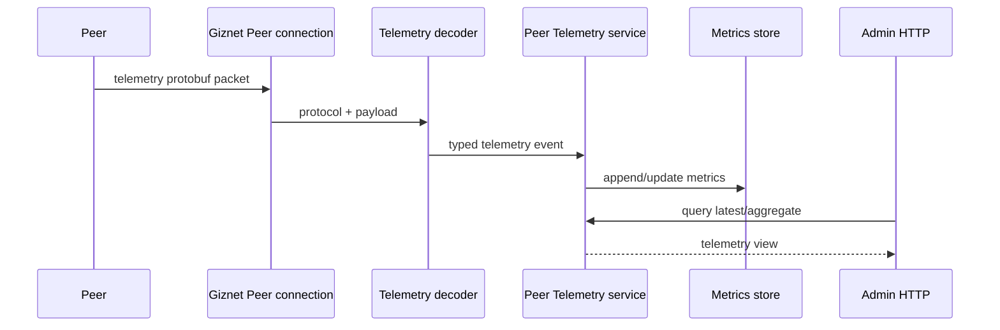

# Telemetry API

`api/proto/telemetry/peer_telemetry.proto` 定义 Peer 向 Server 发送的 telemetry event wire format。它是高频单向事件流，不是 RPC method，也不是 Admin HTTP resource。

Direct packet protocol、可靠性与 transport 边界见 [Streams Reference](/references/streams#direct-packets)。

## 数据路径

```mermaid
sequenceDiagram
    participant Peer
    participant Conn as Giznet Peer connection
    participant Decoder as Telemetry decoder
    participant Service as Peer Telemetry service
    participant Store as Metrics store
    participant Admin as Admin HTTP

    Peer->>Conn: telemetry protobuf packet
    Conn->>Decoder: protocol + payload
    Decoder->>Service: typed telemetry event
    Service->>Store: append/update metrics
    Admin->>Service: query latest/aggregate
    Service-->>Admin: telemetry view
```

Telemetry Protobuf 拥有设备上报的 wire fields。Metrics store 拥有保存与查询语义；Admin HTTP 拥有面向管理员的 response contract。不要为了方便直接把 storage model 当 telemetry wire message，也不要让设备依赖 Admin response DTO。

## 设计规则

- 高频字段应保持紧凑、稳定并向后兼容。
- 新字段必须明确单位、时间语义和缺省值；不能仅靠 Go 注释猜测。
- Decoder 将 malformed 或超限输入视为不可信边界。
- Aggregation、retention 和 query filtering 属于 service/store，不属于 wire schema。
- Schema 变化后重新生成 Go 与 JavaScript telemetry code，并验证真实 packet decode 和 service ingestion。

## Network 上报

`Observation.network`（field 12）使用 `NetworkObservation` 报告当前默认数据路由的信号与蜂窝身份：

| 字段 | 编号 | 类型 | 含义与校验 |
| --- | --- | --- | --- |
| `rssi_dbm` | 1 | `optional double` | 接收信号强度，单位 dBm，必须有限；写入 `network.rssi_dbm` 指标。 |
| `signal_level` | 2 | `optional double` | 设备定义的信号等级，必须有限；写入 `network.signal_level` 指标。 |
| `rat` | 3 | `optional string` | 无线接入技术，例如 `lte`、`nr`、`wifi`；只用于校验，不落库。 |
| `operator` | 4 | `optional string` | 运营商名称；只用于校验，不落库。 |
| `connected` | 5 | `optional bool` | 路由是否已连接；写入 `network.connected` 指标。 |
| `imei` | 6 | `optional string` | 调制解调器硬件 IMEI，必须恰好 15 个 ASCII 数字（`^[0-9]{15}$`）。没有调制解调器的设备不设置。 |
| `imsi` | 7 | `optional string` | 当前承载默认数据路由的 SIM 的 IMSI，6 到 15 个 ASCII 数字（`^[0-9]{6,15}$`）。无法读取 SIM 时不设置。 |

`imei` 与 `imsi` 只对蜂窝路由有意义：`rat` 为 `wifi`（不区分大小写）时携带任一字段，整个 frame 按
`ErrInvalidFrame` 拒绝；模式不匹配同样拒绝整个 frame，不产生部分状态写入。未携带 6、7 号字段的旧
SDK frame 解码与存储行为不变。

身份字符串不是指标：它们不进入 metrics store、`PeerTelemetryField` 枚举或 Prometheus 风格的 label，
而是随观测时间进入 owner-scoped 的 `PeerStatus.network_imei` / `PeerStatus.network_imsi`，并在
`details.telemetry_status` 下记录 `network_imei_at_unix_ms` / `network_imsi_at_unix_ms`。逐字段排序
与 battery、GNSS 相同：较旧的观测不会覆盖更新的已存值；与已存值相等的观测只刷新 `_at` 时间戳，不额外推进
`reported_at`；值与时间戳都未变化时不重写状态。telemetry 从不清除身份字段，设备丢失 SIM 后只是停止上报
`imsi`；清除属于管理操作，不在 telemetry 范围内。

`PeerStatus` 已由 Peer RPC `server.status.get`、`GET /gizclaw/v1/device/status` 等既有状态接口返回，
两个新字段随之暴露，不新增 endpoint。Side-control 与 monitor 投影把它们当作不透明字符串。

隐私范围：IMEI 与 IMSI 与 GNSS 一样是 owner-scoped 状态，不得出现在 Server、Edge 或 SDK 的日志、trace
或错误信息中，校验错误只报告字段名。设备只为当前承载流量的 SIM 上报 `imsi`，不得上报已移除 SIM 的缓存值。
telemetry 上报的 IMEI 与 `client.identifiers.get` 返回的 `DeviceIdentifiers.imeis` 是相互独立的来源，
不合并，也不影响 `by-imei` 索引。

Go 使用 `telemetrypb.NetworkObservation` 的 `Imei` / `Imsi`；JavaScript 使用 `networkTelemetry({ imei, imsi })`；
C 使用 `gzc_telemetry_network_t` 的 `has_imei` / `imei` 与 `has_imsi` / `imsi`，编码前按上述长度与数字规则
校验并在 `rat` 为 `wifi` 时返回 `GZC_ERR_INVALID_ARGUMENT`。字符串在调用期间借用。Flutter 没有 telemetry
发送 surface，只通过生成的 `PeerStatus` 读取 `network_imei` / `network_imsi`。

## OTA 上报

`Observation.ota`（field 14）使用 `OtaObservation`，在同一个 `update_id` 下报告一次升级尝试：

| 状态 | 数值 | 含义 |
| --- | --- | --- |
| `OTA_STATE_STARTED` | 1 | 设备开始本次升级。 |
| `OTA_STATE_DOWNLOADING` | 2 | 正在下载，必须携带 `download_percent`。 |
| `OTA_STATE_SUCCEEDED` | 3 | 设备确认升级成功；下载到 100% 不表示升级成功。 |
| `OTA_STATE_FAILED` | 4 | 本次升级失败，可携带 `error_code` 和 `error_message`。 |

`update_id` 是设备提供的非空尝试标识，最多 128 UTF-8 bytes；重试使用新的标识。
`target_version` 可选，最多 128 UTF-8 bytes。`download_percent` 是有限的 0–100
百分比，缺省表示未报告，显式 0 表示下载进度为零。错误字段只允许出现在失败状态，
`error_code` 最多 128 UTF-8 bytes，`error_message` 最多 512 UTF-8 bytes。
错误描述必须由设备提供安全诊断，不得包含 credential、签名 URL 或 secret。
时间沿用 frame 的 `observed_at_unix_ms` 加 observation 的 `observed_at_delta_ms`。

Go 使用 `Client.SendOTATelemetry(*telemetrypb.OtaObservation)`，JavaScript 使用
`otaTelemetry`、`OtaState` 和已有发送接口。C 使用 `gzc_telemetry_ota_frame_t`、
`gzc_telemetry_encode_ota_frame` 和 `gzc_client_send_ota_telemetry`；每个 C OTA frame
携带一个 observation，字符串在调用期间借用，原有 C frame/observation 布局保持不变。
Go 和 JavaScript 可以在同一个 frame 中混合多种 observation。Flutter 当前没有 telemetry
发送 surface，本 contract 不增加独立的 Flutter transport。

SDK 负责 wire 编码和发送，服务端负责上述语义校验，拒绝未指定或不支持的状态。
服务端在整个 frame 校验通过后更新 runtime 状态。OTA payload（包括诊断文本）不写入
日志，不写入数值 metrics，也不通过 telemetry latest/aggregate API 查询。长度受限的
诊断字段按原文保留，不使用启发式 secret 检测，仅通过已有鉴权的设备状态接口返回。
设备不应在诊断中包含 secret。

最新 OTA 状态保存在设备 runtime 的 KV Store，通过 `PeerStatus.ota` 暴露。
LiteLink 等 API Key 调用方读取 `GET /gizclaw/v1/device/status` 的 `ota`：
`state`（`started`、`downloading`、`succeeded`、`failed`）、`update_id`、`observed_at`，以及
可选的 `target_version`、`download_percent`、`error_code`、`error_message`。
Peer RPC `server.status.get` 返回同一状态。HTTP/RPC 状态 SDK 保留未知未来 state 字符串。
设备断开连接后仍可查询最后快照；`/device/runtime` 的连接统计不承载 OTA。

runtime 以独立的 per-peer OTA record 原子比较更新。较旧时间戳不覆盖新状态；同一次
尝试的终态不可退回下载中，下载百分比不可倒退；相同时间戳只能推进同一尝试。新尝试
需要新的 `update_id` 和更晚时间，替换完整快照并清除旧错误和进度。同一尝试未报告的
版本和进度保留上次值。音量等控制状态写入不能覆盖 OTA。

上报沿用 direct packet 的发送与可靠性语义，不提供业务确认、重试或恰好一次交付。
服务端按上述顺序规则维护最新快照；设备应节制进度上报频率。
