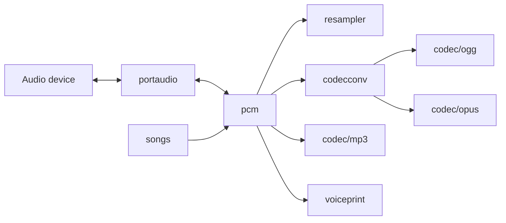

# pkgs/audio 总览

`pkgs/audio` 提供 GizClaw 可复用的 audio codec、PCM pipeline、设备 I/O、重采样、音乐渲染和 voiceprint 能力。产品层可以组合这些 packages，但 codec 和 audio processing 不拥有 Peer、Agent、workspace 或 transport lifecycle。

## Package 结构

```text
pkgs/audio/
├── codec/
│   ├── mp3/         # MP3 encode / decode
│   ├── ogg/         # Ogg pages, packets and streams
│   └── opus/        # Opus encode / decode
├── codecconv/       # PCM, Ogg and Opus conversion
├── pcm/             # PCM formats, chunks, tracks and mixer
├── portaudio/       # Native capture and playback
├── resampler/       # Sample-rate and channel conversion
├── songs/           # Song definitions and PCM rendering
└── voiceprint/      # Speaker embedding and identity detection
```

## 数据流关系



## Package 导航

- Codec：[mp3](./codec-mp3)、[ogg](./codec-ogg)、[opus](./codec-opus)
- Conversion 与 PCM：[codecconv](./codecconv)、[pcm](./pcm)、[resampler](./resampler)
- Device 与产品素材：[portaudio](./portaudio)、[songs](./songs)
- 识别：[voiceprint](./voiceprint)

Audio packages 只拥有格式、frame、sample、device stream 与 signal-processing contract。WebRTC track、Peer connection、Agent realtime stream 和产品资源分别属于 giznet、gizclaw runtime 与领域 services。
