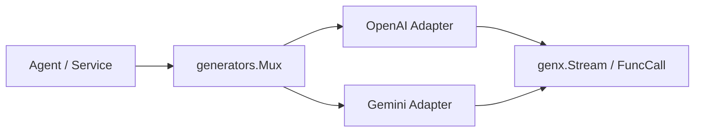

# Generators 总览

`pkgs/genx/generators` 管理 `genx.Generator` 的注册与选择。调用方使用 pattern 选择 Generator，再以统一的 `ModelContext -> Stream` contract 执行生成，不直接绑定具体模型协议。

[Go API References](https://pkg.go.dev/github.com/GizClaw/gizclaw-go@v0.0.0-20260707135347-b9bf1fb24b9f/pkgs/genx/generators)

## 结构

| 模块 | 职责 |
| --- | --- |
| [OpenAI Adapter](./openai) | 将 OpenAI-compatible Chat Completions 转换为 GenX message、stream、tool call 与 usage。 |
| [Gemini Adapter](./gemini) | 将 Gemini GenerateContent 转换为相同的 GenX contract。 |

## 核心结构与主函数

| 符号 | 作用 |
| --- | --- |
| [`Mux`](https://pkg.go.dev/github.com/GizClaw/gizclaw-go@v0.0.0-20260707135347-b9bf1fb24b9f/pkgs/genx/generators#Mux) | 保存 pattern 到 Generator 的路由，并完成匹配。 |
| [`NewMux`](https://pkg.go.dev/github.com/GizClaw/gizclaw-go@v0.0.0-20260707135347-b9bf1fb24b9f/pkgs/genx/generators#NewMux) | 创建独立 Generator registry。 |
| [`Handle`](https://pkg.go.dev/github.com/GizClaw/gizclaw-go@v0.0.0-20260707135347-b9bf1fb24b9f/pkgs/genx/generators#Handle) | 向默认 registry 注册 Generator。 |
| [`GenerateStream`](https://pkg.go.dev/github.com/GizClaw/gizclaw-go@v0.0.0-20260707135347-b9bf1fb24b9f/pkgs/genx/generators#GenerateStream) | 选择 Generator，并返回生成结果 Stream。 |
| [`Invoke`](https://pkg.go.dev/github.com/GizClaw/gizclaw-go@v0.0.0-20260707135347-b9bf1fb24b9f/pkgs/genx/generators#Invoke) | 请求模型调用指定 FuncTool，并返回 usage 与解析后的 call。 |

Generators 只管理生成协议与路由。模型配置、credential、tenant 和产品 catalog 不属于这个 package。
