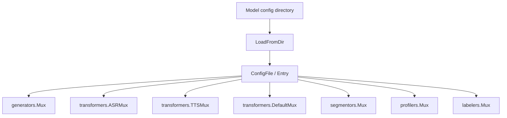

# Model Loader

`pkgs/genx/modelloader` 读取模型配置，并把 Generator、ASR、TTS、Realtime、Segmentor、Profiler 和 Labeler 注册到相应的 mux。它是配置到运行时能力注册之间的适配层。

[Go API References](https://pkg.go.dev/github.com/GizClaw/gizclaw-go@v0.0.0-20260707135347-b9bf1fb24b9f/pkgs/genx/modelloader)

## 装载关系

## 核心结构与主函数

| 符号 | 作用 |
| --- | --- |
| [`ConfigFile`](https://pkg.go.dev/github.com/GizClaw/gizclaw-go@v0.0.0-20260707135347-b9bf1fb24b9f/pkgs/genx/modelloader#ConfigFile) | 表达单个模型配置文件。 |
| [`Entry`](https://pkg.go.dev/github.com/GizClaw/gizclaw-go@v0.0.0-20260707135347-b9bf1fb24b9f/pkgs/genx/modelloader#Entry) | 描述要注册的模型能力及其参数。 |
| [`VoiceEntry`](https://pkg.go.dev/github.com/GizClaw/gizclaw-go@v0.0.0-20260707135347-b9bf1fb24b9f/pkgs/genx/modelloader#VoiceEntry) | 描述语音模型使用的 voice 配置。 |
| [`LoadFromDir`](https://pkg.go.dev/github.com/GizClaw/gizclaw-go@v0.0.0-20260707135347-b9bf1fb24b9f/pkgs/genx/modelloader#LoadFromDir) | 扫描目录、解析配置并注册能力，返回成功装载的条目。 |

Model Loader 不拥有产品 model catalog 或 credential resource。产品层负责生成并保护配置，Loader 只解释配置并建立运行时注册关系。
