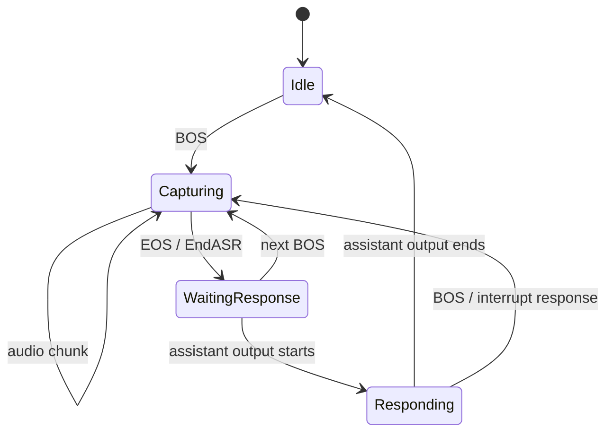

# Doubao Speech Adapter

Doubao Speech Adapter 将豆包语音协议适配为 `genx.Transformer`，覆盖单向识别、语音生成、实时对话、双工实时对话和语音翻译。

各 Adapter 使用 package-owned typed constructor：

```go
doubaoasr.New(doubaoasr.Config{Client: client})
doubaotts.NewSeedV2(doubaotts.SeedV2Config{Client: client, Speaker: speaker})
doubaotts.NewICLV2(doubaotts.ICLV2Config{Client: client, Speaker: speaker})
doubaoast.New(doubaoast.Config{Client: client})
doubaorealtime.New(doubaorealtime.Config{Client: client, Model: realtimeModel})
doubaorealtimeduplex.New(doubaorealtimeduplex.Config{Client: client, Model: duplexModel})
```

每个 constructor 返回实现 `genx.Transformer` 的具体类型，不接收 Workspace 或 Workflow。Config 只包含已解析的 provider client 和不可变 session option；每次 `Transform` 使用独立 session/WebSocket。Realtime Dialogue 和 Realtime Duplex 都要求显式 `Model`，空字符串或纯空白值会失败，不会使用 SDK 默认值。ASR、TTS、AST 和 Realtime Dialogue 都不接收 Toolkit 配置；Realtime Duplex 的 provider protocol 支持 function-call output continuation，因此属于 agent-capable runtime。

## 能力

| Transformer | 输入与输出 |
| --- | --- |
| `doubaoasr.Transformer` | Audio Stream → transcription Stream。 |
| `doubaotts.SeedV2` | Text Stream → generated audio Stream。 |
| `doubaotts.ICLV2` | Text Stream → ICL voice audio Stream。 |
| `doubaorealtime.Transformer` | 适配豆包 Realtime Dialogue API（`volc.speech.dialog`），显式处理 ASR、Chat、TTS 事件，并支持 Push-to-Talk、连续语音和文本输入。 |
| `doubaorealtimeduplex.Transformer` | 适配独立的 Realtime Duplex API，只处理连续双工音频；使用 transcription、response text/audio、function call 和 response cancel 事件。 |
| `doubaoast.Transformer` | Speech input → translated text/audio Stream。 |

每个 Transformer 的 typed Config 定义稳定配置；调用方通过 `Transform` 的 context 控制单次请求的生命周期。Adapter 必须在内部完成豆包事件、音频格式、usage、终态和错误到 GenX Stream 的转换。

每个 Doubao Transformer 都负责自己创建的 output route 或 MIME channel 的显式生命周期。ASR transcript 与 history audio、TTS audio、AST transcript/translation/history/audio，以及 Realtime transcript/assistant text/audio，都在第一段 data 之前或同时发出 BOS，并且只发出一个匹配的 EOS；空结果和错误终态也遵守同一约束。Transformer 没有创建的 input 或无关 route 继续透传，不替其他组件修补或关闭边界。

### ASR 空识别

豆包 ASR provider session 正常结束，但 final result text 和 definite utterance text 均不包含非空白内容时，`doubaoasr.Transformer` 将本次识别作为成功的空结果结束，不发送已识别 transcript text。现有 Stream route 所需的零内容 terminal chunk 仍是成功的内部边界，不表示用户产生了已识别文本。

收到显式 audio EOS 后，`doubaoasr.Transformer` 最多等待 provider finalization 一分钟。Provider 始终静默时，transformer 会关闭该 provider session，并以 `doubao asr: finalization timeout` 错误结束 output stream，而不是继承 caller 更长的生命周期 deadline。

已经打开 interim transcript route、但始终没有 definite result 的 session 仍是错误。Provider、protocol、cancellation、interrupted-input、malformed-audio、unsupported-format failure 和下述例外之外的 timeout 继续按原有路径传播错误。

`EmitInterim` 的 continuous ASR 会把每个 audio frame 立即以 non-final packet 发给当前健康 SAUC session。显式 audio EOS 发送 terminal marker、结束该 provider session，同时保持 outer Transformer stream 打开；下一条 audio route 创建 replacement session，并独立绑定 transcript。Finalization 期间的 provider packet-wait timeout 是预期的可恢复 route boundary；其他 provider error 和一分钟本地 finalization timeout 仍终止 outer stream。

### ASR 断句参数

`doubaoasr.Config` 通过 `VADSegmentDuration`、`EndWindowSize` 和 `ForceToSpeechTime` 把 BigASR VAD 请求参数传给每个 SAUC session。这些字段使用 `*int`：`nil` 表示不发送并保留 provider 默认行为，非 `nil` 表示发送对应值，包括显式的零值。

GizClaw 的 Volc ASR Builder 接受 `vad_segment_duration`、`end_window_size` 和 `force_to_speech_time`，同时兼容对应的 camelCase 名称。调用方没有提供任何断句参数时，Builder 使用 `end_window_size=200` 和 `force_to_speech_time=0`，使 continuous ASR 在短句后的静音阶段更快产生 definite transcript；只要调用方提供任意一个断句参数，Builder 就只发送显式提供的字段。

### Seed V2 空音频

`doubaotts.SeedV2` 只有在非空、可朗读的 segment 至少发出一个规范化音频字节后，才把 provider 的成功终态视为合成成功。Provider 只返回成功 final frame，或任何其他成功 stream 最终发出零个规范化音频字节时，对应 audio route 必须以 `doubaotts: seed v2 completed without audio` 错误结束，不能发送成功 audio EOS。

Provider、protocol、context cancellation、normalizer 和下游 emit error 保持原有错误 identity。Adapter 不重试请求、不切换已配置 Voice，也不合成替代内容；shared TTS 与 Audio Dock 通过现有 route lifecycle 继续传播该 terminal error。

## AST Translate 输入模式

`doubaoast.Transformer` 支持 realtime 和 Push-to-Talk 音频输入，同时保持 provider 上传与事件接收并发执行：

| 模式 | 输出边界 |
| --- | --- |
| Realtime | Provider 事件到达时立即转发规范化后的 transcript、translation 和 TTS chunks。 |
| Push-to-Talk | 输入期间持续消费 provider 事件，但规范化后的 transcript、translation、history 和 TTS chunks 在匹配的输入音频 EOS 前保持未发布。 |

Push-to-Talk 的输入音频 EOS 按原始顺序一次性提交未发布 chunks。Provider failure 如果在提交前被记录，会丢弃整个未发布 turn 并返回 provider error，不暴露任何 retained data 或 control chunks。Commit gate 同时绑定输入 StreamID 与 provider session epoch，因此被打断 session 的迟到事件不能影响复用同一 StreamID 的新 session。

每个 turn 未发布的 assistant TTS output 最多保留两分钟，以规范化 Opus packet duration 计算。超过限制时丢弃整个未发布 turn，并只为对应 StreamID 发送一个 error EOS，不关闭共享 transformer output；input 和 history audio 不计入该限制。

## 两套 Realtime API

| 边界 | Realtime Dialogue | Realtime Duplex |
| --- | --- | --- |
| Go Adapter | `doubaorealtime.Transformer` | `doubaorealtimeduplex.Transformer` |
| Provider session | `Client.Realtime.Connect` | `Client.RealtimeDuplex.OpenSession` |
| 输入方式 | Push-to-Talk、continuous realtime、text | Continuous full-duplex audio |
| Provider events | ASR、Chat、TTS、Session | Transcription、Response text/audio、Function call、Session |
| 打断操作 | `Interrupt` | `CancelResponse` |
| Tool result | 不由该 session contract 提供 | `SendFunctionCallOutputs` |

这两个 Adapter 可以共用 GenX Stream、audio conversion、StreamID 和 lifecycle 基础设施，但不能合并 provider session interface 或 event mapping。Push-to-Talk 只属于 Realtime Dialogue API，不应由 Realtime Duplex Adapter 模拟。

### Realtime Duplex Stream identity 与输入边界

Realtime Duplex 使用 provider server VAD 连续划分 utterance。Control route BOS 与同 StreamID 的 audio MIME BOS 打开本地输入 segment；audio MIME EOS 和 control route EOS 只负责按各自边界关闭本地 codec/segment，不发送 `input_audio_buffer.commit`。BOS 或 EOS chunk 如果同时携带 audio data，Adapter 必须先发送该 payload，再完成对应边界转换；非 audio MIME 边界不能提前关闭 audio segment。

Provider 的 `ResponseID` 与 `QuestionID` 是协议元数据，同一逻辑 response 的不同 event 也可能给出不同值，因此不能作为 GenX route identity。Adapter 为当前 response 创建一个稳定的自有 StreamID，assistant text 与 audio MIME channel 共用该 StreamID，并各自发出完整 BOS/data/EOS。Provider transcription delta 可能是 token，也可能是累计 hypothesis；Adapter 只发布相对已输出内容新增的后缀，重复 hypothesis 不产生重复语义内容。

## Realtime Duplex function-tool 续跑

```go
transformer, err := doubaorealtimeduplex.New(doubaorealtimeduplex.Config{
    Client:       client,
    Model:        duplexModel,
    ToolInvoker: runtimeTools,
    MaxToolCalls: 32,
})
```

`ToolInvoker` 非空时，每次 `Transform` 都会在打开 provider session 前解析当次可用函数的名称、说明和 JSON Schema。Realtime Duplex function call 按 provider 顺序通过 `InvokeTool(name, arguments)` 执行；每个 raw JSON result 都立即使用原 provider call ID 发回，使 provider 继续同一段会话。ToolCall 和 ToolResult control data 始终留在内部，不进入公开 GenX Stream。

Transformer 自己管理 provider call ID、顺序、重复 ID 拒绝和 invocation 级 `MaxToolCalls` 额度。零值采用 32，负数非法。独立的并发 `Transform` 即使共用同一个 invoker，也各自拥有 call-ID set 和额度。nil invoker 不声明工具；此时 provider 如果仍返回 function call，该 Transform 会失败。

解析、执行、非法 result JSON、提交 result、取消、重复 ID 和额度耗尽错误只终止受影响的 Transform。注入的 invoker 负责 runtime resource lookup、权限、参数校验和 Executor dispatch。Realtime Dialogue 不变，因为它的 session contract 没有 function-result continuation 操作。

## Realtime Dialogue 输入模式

`doubaorealtime.Transformer` 支持三种输入模式：

| 模式 | 输入边界 |
| --- | --- |
| Push-to-Talk | BOS 开始一次按键讲话，audio chunks 属于当前 turn，EOS 结束输入并触发 `EndASR`。 |
| Realtime | 连续发送 audio，由 provider VAD 划分用户 utterance；输入 EOS 只关闭本地 segment。 |
| Text | 发送 text chunks，不接受 audio input。 |

`Config.Model` 是必填项，transformer 不会猜测默认 model。`Config.Instructions` 是初始音频对话的语义指令。GizClaw 将它原样交给 `doubao-speech-go`；SDK 在规范化 model 后，将其映射到 O20 的 `dialog.system_role` 或 SC20 的 `dialog.character_manifest`。精确的 `SystemRole`、`SpeakingStyle` 和 `CharacterManifest` 仍是独立高级字段，由 SDK 校验兼容性。Adapter 不会把语义指令复制到 `prompt.system`，也不会向 SC20 session 注入 O-only `BotName`。

一个 provider response 只拥有一条 spoken-text route 和一条 audio route。TTS start event `350` 中的非空 sentence text 是 canonical source，每个合成句只发布一次；Chat event `550` text 先缓冲，只有整个 response 未出现任何 TTS sentence text 时才作为 fallback 发布。第一次 TTS start 或 audio payload 发送一次 audio BOS，后续 sentence start 复用同一 route，TTS finish 发送一次 audio EOS，选中的 text source 只发送一次 text EOS。Failure 和 interruption 会丢弃尚未朗读的 Chat buffer，不会把它作为成功回复发布。

长连接生命周期由 transformer 持有。`Transform` 启动后即开始连接，并在普通 input turn 和 BOS/EOS 边界之间复用同一个健康的 Realtime Dialogue session。Realtime 模式的 BOS 打断 active response 时，会在本地关闭该 provider session，并立即使用相同的 instructions、model 和 `DialogID` 打开 replacement session；不会发送只允许 Push-to-Talk 使用的 `ClientInterrupt` event。新 route 中尚未读取的 audio 只由 replacement 消费。`ASREnded` 绑定 Realtime response 时，该 response epoch 获得一个绝对的一分钟完成期限；partial ASR 不会启动期限，后续 Chat 或 TTS 进度也不会延长它。匹配 route 完成或 interruption 会解除期限；期限到期则向仍打开的 transcript 或 assistant route 发送带 error 的 EOS，关闭 stalled session 并开始重连。旧 epoch 不能取消或触发 replacement 的期限。Provider terminal event、transport error 或 session I/O error 同样走这条带上限指数退避的 replacement 路径；只要 transform context 和 output stream 尚未结束，就不限制尝试次数。

Push-to-Talk 在匹配的 `ASREnded` 到达时，根据当前 turn 累积并 trim 后的 ASR hypothesis 分类。空 hypothesis 是成功的无输入 turn：transformer 先发布空 transcript lifecycle，再为该 turn 发布完整的空 assistant text 与 audio lifecycle，并立即让状态机回到 Idle。Provider 在空 `ASREnded` 后不会继续接受同一 session 上的新 Push-to-Talk ASR turn，因此 transformer 会关闭该 session 并立即打开 replacement，同时保留 caller 的 Transformer stream 与尚未读取的 input。这次确定性 handoff 不会启动 response deadline、报告 provider loss、发送 `ClientInterrupt` 或应用重连退避。非空 hypothesis 继续走既有 Push-to-Talk Chat/TTS response 路径；Push-to-Talk 不使用 Realtime response deadline。

已经交给失败 session 的 input 不会重放；尚未读取的 input 保留在有界 stream backpressure 之后，由 replacement session 继续消费。Push-to-Talk 中 provider loss 会使当前 turn 失效：丢弃 retained transcript 和 assistant output，在本地持续消费该 turn 剩余 chunks 直到 audio EOS，下一次 BOS 再开始新 turn。

Realtime 模式把普通 BOS、MIME EOS 和 route EOS 只视为本地 stream boundary；它们不会调用 `EndASR`、注入静音、commit audio 或发送 `ClientInterrupt`。唯一由 BOS 触发的 session replacement 是上述本地 interruption handoff。Input EOF 仍是 transform 终态：它停止重连，并在已提交的有限 Push-to-Talk 或 Text turn 排空匹配的 Chat/TTS response 后关闭当前 session；没有待完成 response 时直接关闭，且不会触发重建。Provider `ASRInfo` 在 response pending 时执行同样的本地 close-and-replace handoff；closed epoch 的重复或迟到 event 不能影响 replacement。Text 模式永不发送 `EndASR` 或 `ClientInterrupt`，只有 Push-to-Talk 使用这两个 provider operation。

### doubaorealtime Push-to-Talk 状态机

本节只描述 `doubaorealtime.Transformer` 对 Realtime Dialogue API 原生 Push-to-Talk 模式的适配。`doubaorealtimeduplex.Transformer` 不支持 Push-to-Talk，不使用这套状态机。



`doubaorealtime.Transformer` 的 Push-to-Talk 适配必须显式跟踪当前 turn：Idle 状态不能接收 audio 或 EOS；Capturing 中每个 turn 只能接受一次 EOS；EOS 后不能继续向同一 turn 发送 audio。新 BOS 到达时，如果上一轮 assistant 仍在输出，应调用 Realtime Dialogue session 的 `Interrupt`，再为新 turn 建立输入边界。

Push-to-Talk 会保留最新 ASR hypothesis 和全部 assistant output，直到 input audio EOS 与 provider `ASREnded` 都已发生；随后只发布一次最终 transcript 和 transcript EOS，再按 provider 顺序释放 assistant chunks。如果累积 hypothesis 不包含语义文本，则改为成功关闭空 assistant text 与 audio route，并直接完成 turn，不等待 provider response event。语义 turn 的 retained assistant Opus 以规范化 packet duration 计算，最多两分钟；超过限制时丢弃整个未提交 turn，只发送一个 assistant error EOS，并保持 transformer 可供后续 turn 使用。

所有 `OpenSession`、`SendAudio`、`SendText`、`EndASR`、interrupt/cancel 和 function-call output 操作都必须使用 `Transform` 收到的 context。取消 Transform 必须能够终止 provider I/O、event receiver 和 input reader，不能启动脱离调用生命周期的 `context.Background()` 请求。

## 公共 Realtime Pipeline

Realtime 与 Realtime Duplex 可以使用不同的 provider event adapter，但应共用以下基础组件：

- audio MIME normalization、PCM/MP3/Opus decode、Opus encode/transcode 与 frame preparation；
- per-stream audio input lifecycle；
- StreamID、segment 与 response ID 管理；
- assistant interruption epoch、BOS/EOS 和 growable output buffering；
- pending input、session restart、context cancellation 与错误关闭。

Provider-specific event enum、session method 和 config conversion 留在各自 Adapter 中。公共媒体与 stream lifecycle 不能复制成 realtime/duplex 两套实现。

## 变更与回归约束

Doubao Transformers 同时处理 provider session、并发 event receiver、audio codec、StreamID 和 BOS/EOS，任何修改都必须先固定行为 contract，再改变实现。

### Bug 修复流程

1. 先在最小层级增加能够稳定失败的 regression test，证明 bug 的输入、状态和错误结果。
2. 如果问题同时存在于 Realtime 与 Duplex，先把相同 test case 加入公共 contract test；不能只修其中一份复制实现。
3. 只修改拥有该职责的层：provider event mapping、公共 media pipeline 或 GenX Stream lifecycle，不能跨层顺手重写。
4. 保持 provider event、GenX chunk、StreamID、role、label、BOS/EOS 和 error 的映射兼容；预期改变必须在同一变更中更新 contract 文档。
5. 修复后运行目标测试、完整 package tests 和 race tests，再进行一次新的代码审查。

### 必测行为矩阵

| 维度 | 必测边界 |
| --- | --- |
| Input format | PCM、MP3、raw Opus；支持的采样率和声道；非法 MIME 与损坏 frame。 |
| Stream contract | BOS、data、EOS；duplicate/out-of-order marker；StreamID、role、label 和 terminal error。 |
| Lifecycle | normal close、context cancel、provider EOF/error、blocked Send/Recv、session restart 和 repeated Close。 |
| Realtime Dialogue | Push-to-Talk 合法状态转换、每 turn 单次 EndASR、Realtime VAD、text mode 与 Interrupt。 |
| Realtime Duplex | continuous input、transcription、text/audio response、function call output 与 CancelResponse。 |
| Barge-in | pending response、正在输出 text、正在输出 audio；只产生一次 interrupted EOS，旧 epoch 不得继续输出。 |
| Output buffering | provider audio 必须立即 drain 到 growable buffer；慢 consumer 不得反向阻塞 provider session。 |

Realtime 与 Duplex 的公共媒体和 Stream lifecycle 必须使用同一组 table-driven contract tests。Provider-specific fake session 只补充各自 event/session 差异，不能复制整套通用测试。

### 必需验证

```sh
go test ./pkgs/genx/transformers -count=1
go test -race ./pkgs/genx/transformers -count=1
go test ./pkgs/genx/... -count=1
```

涉及真实 provider contract、SDK upgrade 或 event schema 变化时，还必须运行受凭据保护的 integration test；单元测试 fake 不能替代真实 session 的 cancel、Close/Recv 并发和 event ordering 验证。
