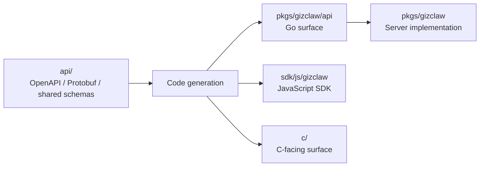

# pkgs/gizclaw/api

`pkgs/gizclaw/api` 保存 GizClaw 生成并提交的 Go API surface，以及紧贴生成 contract 的 codec 和适配。Public contract 的 source of truth 位于仓库根目录 `api/`。

## 目录关系



API 变更必须从 source schema 开始，再同步生成并验证所有受影响语言 surface。不能把某个生成目录当作独立 contract 修改。

## 目录结构

```text
pkgs/gizclaw/api/
├── adminhttp/     # Admin HTTP Go surface
├── apitypes/      # 多个 surface 共享的 GizClaw 类型
├── openaihttp/    # OpenAI-compatible HTTP surface
├── peerhttp/      # Peer HTTP Go surface
├── rpcapi/        # RPC method registry、wrapper 和 codec
├── rpcproto/      # Protobuf 生成的 RPC message
└── telemetry/     # Telemetry protobuf contract
```

## Ownership 边界

`adminhttp`、`peerhttp` 和 `openaihttp` 对应不同的 HTTP surface。它们拥有生成的 request/response 类型和 server/client interface，但不拥有 handler 的领域实现。

`apitypes` 保存多个 surface 共享的 GizClaw product type。只有确实跨 API contract 共享的类型才属于这里，不能用它替代领域内部 model。

`rpcproto` 直接来自 RPC protobuf source；`rpcapi` 在 protobuf message 之上提供 GizClaw RPC method registry、payload codec 和稳定 Go wrapper。RPC payload 不通过另一套 JSON/OpenAPI DTO 重复定义。

`telemetry` 保存设备 telemetry protobuf 生成面。Telemetry 如何映射成 Server status 和 metrics 属于 `services/runtime/peertelemetry`。

## 代码放置规则

应该修改根 `api/`：

- 新增或修改 public HTTP endpoint。
- 新增或修改 RPC method、payload 或 enum。
- 修改跨语言共享的 product schema。
- 修改 telemetry wire contract。

应该写入 `pkgs/gizclaw/api`：

- Schema generation 产生并提交的 Go 文件。
- 生成器本身和生成配置。
- 紧贴 wire/generated contract、且不包含业务 storage 或领域规则的 codec/adapter。

不应该写入这里：

- Admin、Peer 或 Edge handler 的业务实现。
- 领域 resource storage、validation 和 lifecycle。
- JavaScript、C 或 desktop-specific implementation。
- 手工维护的第二套 public DTO。

API 目录的核心边界是 contract，不是 service implementation。
