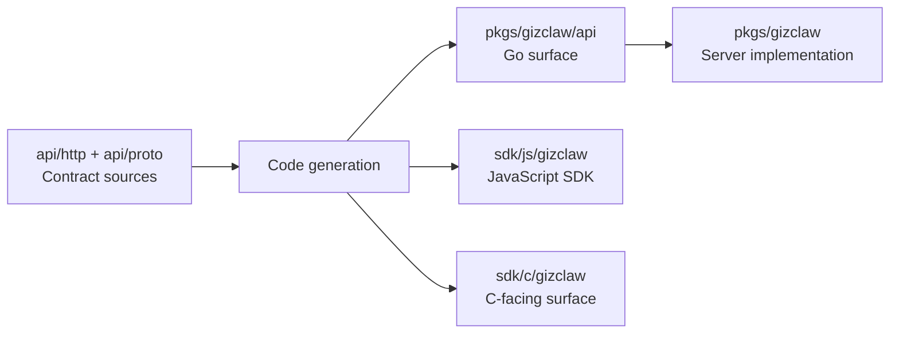

# pkgs/gizclaw/api

`pkgs/gizclaw/api` 保存 GizClaw 生成并提交的 Go API surface，以及紧贴生成 contract 的 codec 和适配。Public contract 的 source of truth 位于仓库根目录 `api/`。

## 目录关系



API 变更必须从 source schema 开始，再同步生成并验证所有受影响语言 surface。不能把某个生成目录当作独立 contract 修改。

## 目录结构

```text
pkgs/gizclaw/api/
├── adminhttp/     # Admin HTTP Go surface
├── apitypes/      # HTTP Shared 与 Resource Go models
├── openaihttp/    # OpenAI-compatible HTTP surface
├── peerhttp/      # Peer HTTP Go surface
├── rpcapi/        # RPC method registry、wrapper 和 codec
├── rpcproto/      # Protobuf 生成的 RPC message
└── telemetry/     # Telemetry protobuf contract
```

## 子目录职责

### adminhttp

保存 Admin HTTP OpenAPI 生成的 request/response 类型、client、server interface 和 route contract。它描述管理 surface 的 HTTP 协议，不拥有 ACL、AI、Gameplay、Peer 或其他资源的业务实现。

### apitypes

保存从 `api/http/shared.json` 及其引用的 `api/http/resources/*.json` 生成的 Go models。Source 层仍保持 Shared 与 Resources 的单向依赖和所有权边界；Go 生成输出可以集中在一个 package，不要求镜像 source 目录。

### openaihttp

保存 GizClaw OpenAI-compatible HTTP surface 的生成 contract。它负责与 OpenAI-compatible request、response 和 route 形状对齐；Agent、GenX、model 和 workflow 的运行行为属于对应 AI services。

### peerhttp

保存 Public API 的生成 contract，包括 Server 信息、登录、WebRTC Offer 和 Peer self endpoints。Go package 名保持 `peerhttp`；Session、signaling、registration 与 runtime 查询由根 `pkgs/gizclaw` handlers 和领域 services 实现。

### rpcapi

在 RPC protobuf messages 之上提供 method registry、typed payload codec、wrapper types 和错误 contract。RPC dispatch 与具体 method handler 属于根 `pkgs/gizclaw` 的 RPC 模块。

### rpcproto

保存从 RPC protobuf schema 生成的 wire messages。Go package 名为 `rpcpb`，目录路径保持 `rpcproto`；该 package 只表达 protobuf wire format，不拥有 RPC method 语义或业务行为。

### telemetry

保存设备 telemetry protobuf contract。Telemetry packet 的解码、状态投影、聚合和 metrics 写入属于 `services/runtime/peertelemetry`，不能写入生成 package。

## Ownership 边界

这些子 package 共同拥有 Go contract surface，但 contract 的 source of truth 仍在根 `api/`。生成目录之间可以共享 `apitypes`，不能互相复制 DTO，也不能把 handler、storage、authorization 或领域 lifecycle 写入生成 package。

## 代码放置规则

应该修改根 `api/`：

- 新增或修改 public HTTP endpoint。
- 新增或修改 RPC method、payload 或 enum。
- 修改跨语言共享的 product schema。
- 修改 telemetry wire contract。

应该写入 `pkgs/gizclaw/api`：

- Schema generation 产生并提交的 Go 文件。
- 生成器本身和生成配置。
- 紧贴 wire/generated contract、且不包含业务 storage 或领域规则的 codec/adapter。

不应该写入这里：

- Admin、Peer 或 Edge handler 的业务实现。
- 领域 resource storage、validation 和 lifecycle。
- JavaScript、C 或 desktop-specific implementation。
- 手工维护的第二套 public DTO。

API 目录的核心边界是 contract，不是 service implementation。
