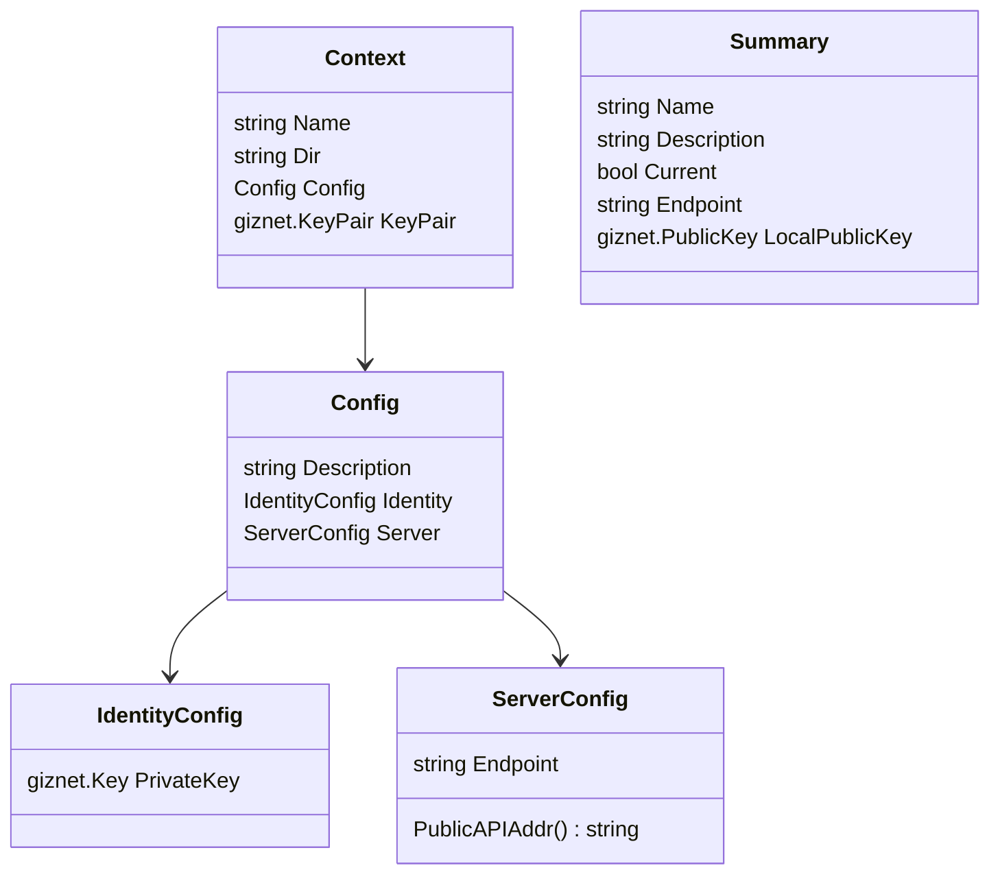
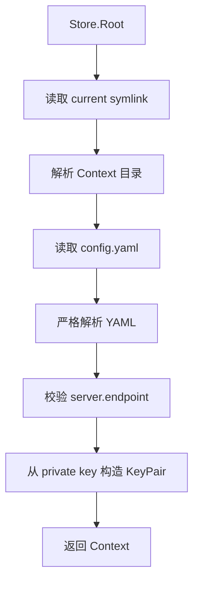

# Context Store

`pkgs/gizclaw/contextstore` 管理 GizClaw 客户端的本地连接 Context。每个 Context 绑定一个本地 Giznet identity 和一个目标 Server endpoint；CLI 或其他客户端先选择 Context，再使用其中的配置建立连接。

## 磁盘结构

```text
<context-root>/
├── current -> local
├── local/
│   └── config.yaml
└── staging/
    └── config.yaml
```

- 每个一级子目录是一个具名 Context。
- `current` 是指向当前 Context 目录名的符号链接。
- 新建 Context 目录权限为 `0700`，`config.yaml` 权限为 `0600`。
- 删除当前 Context 时会同时移除 `current`，不会自动选择替代 Context。

## config.yaml

```yaml
description: Local development server
identity:
  private-key: <giznet-private-key>
server:
  endpoint: 127.0.0.1:8080
```

`private-key` 是本地身份凭据，不能提交到仓库、文档示例或日志中。`Store.Create` 会生成新的 Giznet key pair，并只将 private key 写入 Context 配置。

## Config 结构



| YAML 字段 | Go 字段 | 含义 | 规则 |
| --- | --- | --- | --- |
| `description` | `Config.Description` | Context 的可选说明。 | 创建时去除首尾空白；可省略。 |
| `identity.private-key` | `IdentityConfig.PrivateKey` | 当前 Context 的本地 Giznet private key。 | 必填；必须能构造有效 `giznet.KeyPair`。 |
| `server.endpoint` | `ServerConfig.Endpoint` | 目标 Server Public API 地址。 | 必填；格式必须是 `host:port`，不能包含 `http://` 或 `https://`。 |

解析 `config.yaml` 时启用 unknown-field rejection。拼错或未定义的 YAML 字段会直接返回错误，不会被静默忽略。

## 加载流程



`LoadSummary` 走相同的配置与 private-key 校验，但只返回列表 UI 所需的名称、说明、endpoint、current 状态和本地 public key。

## 核心结构与主函数

| 符号 | 作用 |
| --- | --- |
| `Config` | `config.yaml` 的完整 typed representation。 |
| `Context` | 已加载的 Context 目录、配置和派生 KeyPair。 |
| `Summary` | Context 列表使用的轻量 metadata。 |
| `Store` | 以 `Root` 为边界管理多个 Context。 |
| `Load` / `LoadConfig` / `LoadSummary` | 加载完整 Context、严格配置或列表摘要。 |
| `Store.Create` / `CreateWithOptions` | 校验名称和 endpoint，生成 identity 并写入新 Context。 |
| `Store.Use` | 更新 `current` symlink 以切换 Context。 |
| `Store.Current` / `LoadByName` | 加载当前或指定名称的 Context。 |
| `Store.List` / `ListSummaries` | 按名称排序列出 Context，并标记当前项。 |
| `Store.Delete` | 删除具名 Context，并在必要时移除 `current`。 |
| `validateName` / `validateEndpoint` | 限制目录名称和 `host:port` endpoint 格式。 |

## Go API References

[查看 `contextstore` package API](https://pkg.go.dev/github.com/GizClaw/gizclaw-go@v0.0.0-20260707135347-b9bf1fb24b9f/pkgs/gizclaw/contextstore)

## Ownership 边界

Context Store 不负责 Server config、Peer registration、WebRTC signaling、HTTP/RPC client、workspace 内容或其他服务端资源。调用方从 Context Store 取得 identity 与 endpoint 后，再由连接层建立 GizClaw connection。
