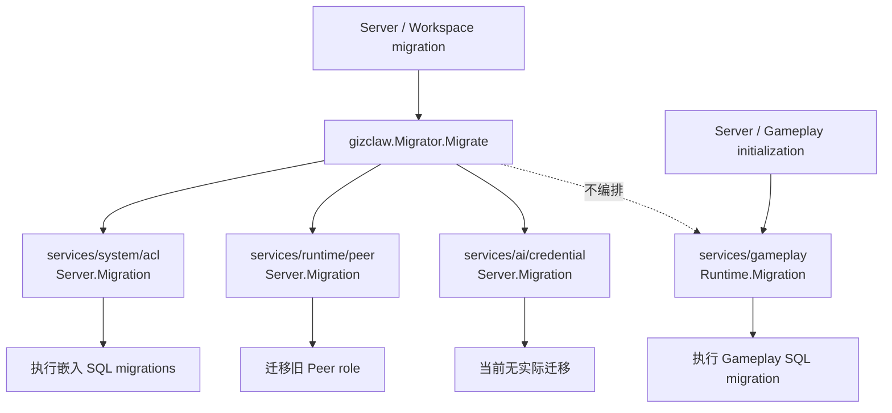

# migrator

`migrator.go` 当前有生产调用，也包含实际执行的迁移，不是未使用的历史文件。

## 文件功能

| 文件 | 包含的功能 |
| --- | --- |
| `pkgs/gizclaw/migrator.go` | 定义跨领域 `Migrator`，按照 ACL、Peer、Credential 的顺序调用各领域 migration。允许未配置的可选 store 对应 service 为 `nil`。 |
| `cmd/internal/server/migrator.go` | 根据 Server 配置打开 SQL/KV store，创建领域 service 并组装 `gizclaw.Migrator`；提供 workspace migration 入口和 store cleanup。 |

## 调用路径

```text
ServeContext
└── NewMigrator(config)
    ├── open ACL / Peer / Credential stores
    └── gizclaw.Migrator.Migrate
        ├── ACL.Migration
        ├── Peers.Migration
        └── Credentials.Migration
```

`cmd/internal/server/workspace.go` 在 Server 正式监听端口之前执行 migration。`MigrateWorkspace` 也提供不启动 Server、只迁移指定 workspace 的入口。

## Migration Service 关系



根 `Migrator` 只编排 ACL、Peer 和 Credential。Gameplay 也定义了 `Migration`，但由 Server 和 Gameplay runtime 的初始化路径直接调用，不属于根 `Migrator` 的执行序列。

## 当前已定义的迁移

| 领域 | 当前行为 |
| --- | --- |
| `services/system/acl` | 执行嵌入的 `migrations/*.sql`；创建 ACL tables，并兼容补充 `acl_policy_bindings.display_order`。 |
| `services/runtime/peer` | 扫描持久化 Peer，将旧 role 值 `gear` 更新为当前的 `client`。 |
| `services/ai/credential` | `Migration` 方法已经接入调用链，但当前只返回 `nil`，没有实际迁移行为。 |

Gameplay runtime 也有自己的 SQL migration，但由 Gameplay runtime 初始化路径执行，不属于这个根 `Migrator` 的 ACL/Peer/Credential 编排。

## Ownership 边界

具体 schema 或数据转换逻辑由对应领域 service 拥有；根 `Migrator` 只负责确定执行顺序并聚合错误。宿主层负责根据配置打开和关闭真实 store。

## 核心结构与主函数

| 符号 | 作用 |
| --- | --- |
| [`Migrator`](https://pkg.go.dev/github.com/GizClaw/gizclaw-go@v0.0.0-20260707135347-b9bf1fb24b9f/pkgs/gizclaw#Migrator) | 组合 ACL、Peer 与 Credential migration services。 |
| [`Migrator.Migrate`](https://pkg.go.dev/github.com/GizClaw/gizclaw-go@v0.0.0-20260707135347-b9bf1fb24b9f/pkgs/gizclaw#Migrator.Migrate) | 按顺序运行已配置的领域 migration。 |
