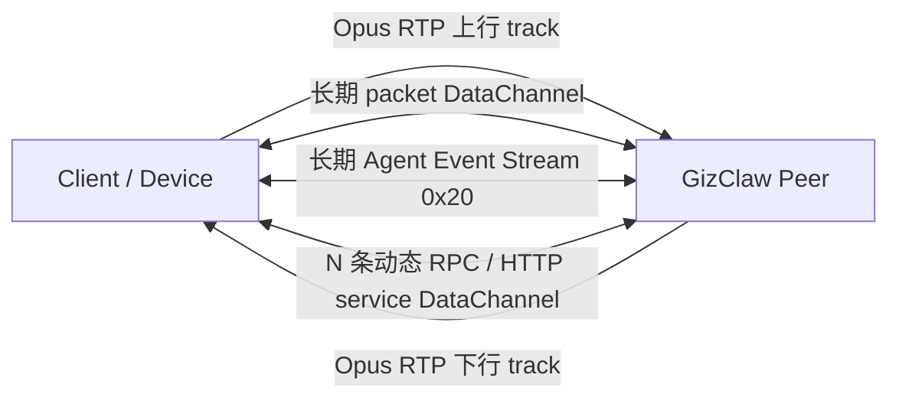

# Connection

`实现文件：peer_conn.go、peer_conn_openai.go`

`peer_conn` 前缀拥有单条 Peer connection 的产品级生命周期。

| 文件 | 包含的功能 |
| --- | --- |
| `peer_conn.go` | `PeerConn` 主生命周期；接受 Giznet service 与 packet；启动普通 RPC 和 Edge RPC；初始化 audio mixer、Agent Host、Peer GenX 与 resource view；处理 event stream、direct packet、telemetry packet 和混音音频输出；统一关闭 connection-scoped 资源。 |
| `peer_conn_openai.go` | 在当前 Peer connection 上提供 OpenAI-compatible HTTP service；组装 RuntimeProfile 与 owner resource view；接入 OpenAI API 和 voice list 等兼容入口。 |

通用 WebRTC、packet transport 和 service stream 属于 `pkgs/giznet`；通用 audio codec 属于 `pkgs/audio`；可持久化 runtime 状态属于 `services/runtime`。

## 一条 Peer connection 内的传输拓扑

当前 Giznet WebRTC connection 不是固定只有一条“数据流”。它同时承载双向 media、一条长期 packet DataChannel、可选的长期 Agent Event Stream，以及按请求动态创建的 service DataChannel。

| 载荷 | 方向 | 生命周期与数量 | WebRTC 承载 | 语义 |
| --- | --- | --- | --- | --- |
| Opus media 上行 | Client / Device → Server | connection 级别的一条 RTP track | WebRTC audio RTP | 麦克风实时音频。 |
| Opus media 下行 | Server → Client / Device | connection 级别的一条 RTP track | WebRTC audio RTP | `MixerOutput` 混音后的 Agent 播放音频。 |
| Direct packet | 双向 | connection 级别的一条长期 channel | unordered、`maxRetransmits=0` DataChannel | 使用单字节 protocol 区分 packet。Telemetry `0x40` 是 Client → Server 的高频事件，不是 service stream。Giznet API 把 Opus 暴露为 `ProtocolOpusPacket`，但 WebRTC 实现在 wire 上使用上述 RTP track，不把 Opus 写入 packet DataChannel。 |
| Agent Event Stream `0x20` | 双向 | Client 发起并通常长期保持；Server 接受并订阅 broker | reliable、ordered service DataChannel | 上行把 BOS、EOS、text 等 event 推入 Agent input；下行广播 Agent output 的 BOS、EOS、text 和 workspace history update。它不承载实时 Opus payload。 |
| Peer / Edge RPC | 双向 | 每次 round trip 新建一条，完成或失败后关闭；可并发存在 N 条 | reliable、ordered service DataChannel | `ServicePeerRPC 0x00` 或 `ServiceEdgeRPC 0x31`。Unary 和 server-streaming RPC 都在这条 request-scoped channel 内使用 RPC frame；RPC EOS 不是 Agent Event Stream 中的 `type=eos`。Server 也可反向打开 Peer RPC 调用 Client provider。 |
| HTTP service | 请求方 ↔ 提供方 | 每次 HTTP round trip 动态打开 service stream | reliable、ordered service DataChannel | Peer HTTP `0x01`、OpenAI-compatible `0x02`、Admin HTTP `0x10` 或 Edge HTTP `0x30`。 |

因此“当前有几条 stream”没有一个恒定数字。在一个已连接且已打开 Agent Event Stream、暂无 RPC/HTTP 请求的常见会话中，wire 上有两个方向的 audio RTP track、一条 packet DataChannel 和一条 Event Stream DataChannel。每个并发 RPC 或 HTTP round trip 再增加一条临时 service DataChannel。

Agent Event Stream 中的 BOS/EOS 是按 `stream_id` 划分的业务边界；关闭某个业务 stream 不会关闭 Event Stream DataChannel 或 Peer connection。DataChannel EOF 才表示该 transport stream 已终止。

## Service stream 写入流控

JavaScript、Flutter 和 C SDK 对 reliable、ordered service DataChannel 使用每 channel 串行 writer。每个原生 DataChannel message 最多承载 1400 bytes；writer 到达 high-water 后暂停，收到 buffered-amount-low 通知且队列降到 low-water 后才继续。一次写入成功表示该逻辑消息的全部分片已被本地 WebRTC 发送队列接受，不表示远端已经消费。

JavaScript 与 Flutter 的 high/low water 固定为 1 MiB / 256 KiB。C API v2 默认使用 256 KiB / 64 KiB，嵌入式调用方可以通过 `gzc_client_config_t` 的 `service_write_high_water_bytes` 和 `service_write_low_water_bytes` 调大；自定义值必须满足 high-water 至少 1400 bytes 且 low-water 小于 high-water。C 的同步发送只在调用期间借用 caller payload，并使用 `write_timeout_ms` 限制整个逻辑写入；elapsed timeout 读取 platform 的单调 `time_instant_ms`，协议时间戳仍读取 `time_unix_ms`。

Direct packet、Telemetry 和 RTP 不走这套 service stream writer，也不继承这些阈值。

## 核心结构与主函数

| 符号 | 作用 |
| --- | --- |
| [`PeerConn`](https://pkg.go.dev/github.com/GizClaw/gizclaw-go@v0.0.0-20260707135347-b9bf1fb24b9f/pkgs/gizclaw#PeerConn) | 持有 Giznet connection、PeerService、RPC Server、Agent Host、audio mixer 与 connection-scoped services。 |
| [`PeerConn.CreateAudioTrack`](https://pkg.go.dev/github.com/GizClaw/gizclaw-go@v0.0.0-20260707135347-b9bf1fb24b9f/pkgs/gizclaw#PeerConn.CreateAudioTrack) | 创建写入当前 Peer audio mixer 的 track。 |
| `serve` | 并行服务 Giznet services、direct packets、Agent output 和 mixed audio。 |
| `serveService` | 接受并分发当前 Peer 打开的 Giznet service stream。 |
| `servePackets` / `serveDirectPackets` | 接收普通与 direct packet，并分发 telemetry/media。 |
| `serveRPC` / `serveEdgeRPC` | 启动 Peer RPC 或 Edge RPC service loop。 |
| `init` / `initRPC` / `initMixer` / `initAgentHost` / `initPeerGenX` | 组装 connection-scoped runtime dependencies。 |
| `serveEvents` / `handleEventStream` | 接受 event stream 并推入 Agent input。 |
| `processTelemetryPackets` / `handleTelemetryPacket` | 解码 telemetry 并同步 Peer status。 |
| `streamMixedAudio` | 在每个 20ms pacing opportunity 从已混合 PCM stream 读取一帧，编码一次 Opus，并写入一次 WebRTC audio track。 |
| `close` | 按 lifecycle 顺序关闭所有 connection-scoped 资源。 |

`streamMixedAudio` 是生成音频唯一的发送 pacing owner。普通 Go ticker 迟到时继续读取下一帧，不丢弃、重排或批量补发 PCM，也不创建 provider epoch。Pion 在同一条 WebRTC track 生命周期内维护 SSRC、RTP sequence number 和 timestamp；每个 20ms Opus sample 在 48kHz RTP clock 上推进 960 ticks，新连接建立独立 RTP timeline。到达 jitter、adaptive playout delay、packet-loss concealment 与 Opus FEC 属于 WebRTC receiver。
