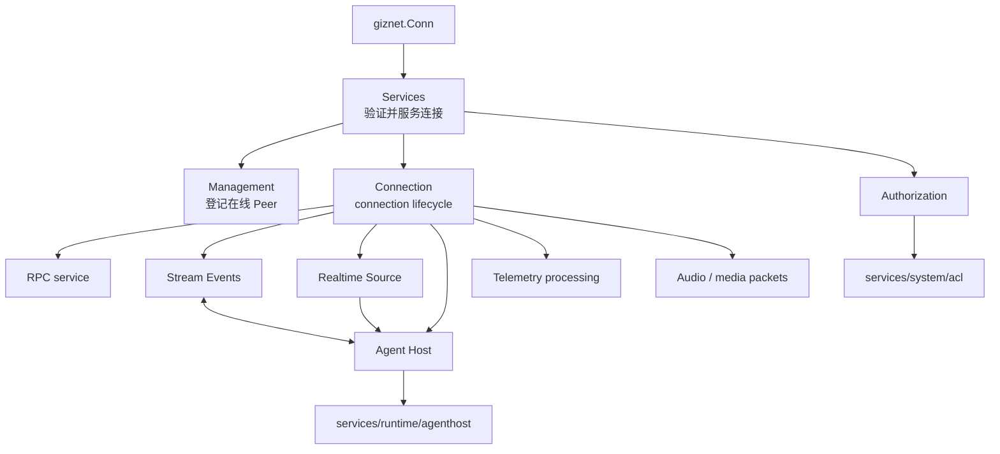

# Peer Runtime

Peer Runtime 负责把已经建立的 `giznet.Conn` 接入 GizClaw 产品运行时。入口按职责模块组织；实现文件仅用于定位代码。

## 模块

| 模块 | 职责 | 实现文件 |
| --- | --- | --- |
| [Management](./manager) | 在线 Peer、连接替换、runtime 查询与设备信息刷新。 | `peer_manager.go` |
| [Authorization](./authorizer) | 将当前 Peer identity 接入 ACL view 和 policy。 | `peer_authorizer.go` |
| [Connection](./conn) | 单条 connection 的 service、packet、Agent、telemetry 与 media 生命周期。 | `peer_conn.go`、`peer_conn_openai.go` |
| [Services](./service/overview) | 在 connection 上提供 Admin、Public HTTP、WebRTC 等 Giznet services。 | `peer_service.go`、`peer_service_*.go` |
| [Agent Host](./agent-host) | 为当前 Peer 组装 Agent Host。 | `peer_agent_host.go` |
| [Realtime Source](./realtime-source) | 将 Peer realtime input 接入 GenX stream。 | `peer_realtime_source.go` |
| [Stream Events](./stream-event) | 在 Agent chunks、产品 events 与 media packets 之间转换。 | `peer_stream_event.go` |

## 调用关系

WebRTC、DataChannel 与 service stream multiplexing 属于 `pkgs/giznet`；Peer 的持久化资源、route、run state 和 telemetry 聚合属于 `services/runtime`。Peer Runtime 拥有的是 connection-scoped 的产品接线。
