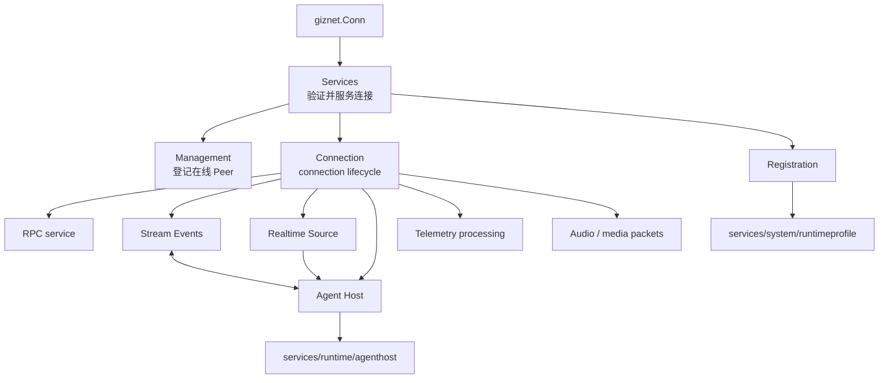

# Peer Runtime

Peer Runtime 负责把已经建立的 `giznet.Conn` 接入 GizClaw 产品运行时。入口按职责模块组织；实现文件仅用于定位代码。

## 模块

| 模块 | 职责 | 实现文件 |
| --- | --- | --- |
| [Management](./manager) | 在线 Peer、连接替换、runtime 查询与设备信息刷新。 | `peer_manager.go` |
| Registration | 将 RegistrationToken 解析为 connection-scoped RuntimeProfile snapshot。 | `rpc_server.go`、`peer_conn.go` |
| [Connection](./conn) | 单条 connection 的 service、packet、Agent、telemetry 与 media 生命周期。 | `peer_conn.go`、`peer_conn_openai.go` |
| [Services](./service/overview) | 在 connection 上提供 Admin、Public HTTP、WebRTC 等 Giznet services。 | `peer_service.go`、`peer_service_*.go` |
| [Agent Host](./agent-host) | 为当前 Peer 组装 Agent Host。 | `peer_agent_host.go` |
| [Realtime Source](./realtime-source) | 将 Peer realtime input 接入 GenX stream。 | `peer_realtime_source.go` |
| [Stream Events](./stream-event) | 在 Agent chunks、产品 events 与 media packets 之间转换。 | `peer_stream_event.go` |

## 调用关系

```mermaid
flowchart TB
    Giznet["giznet.Conn"] --> Service["Services<br/>验证并服务连接"]
    Service --> Manager["Management<br/>登记在线 Peer"]
    Service --> Conn["Connection<br/>connection lifecycle"]

    Conn --> RPC["RPC service"]
    Conn --> Events["Stream Events"]
    Conn --> Realtime["Realtime Source"]
    Conn --> Host["Agent Host"]
    Conn --> Telemetry["Telemetry processing"]
    Conn --> Media["Audio / media packets"]

    Service --> Registration["Registration"]
    Registration --> Profile["services/system/runtimeprofile"]
    Host --> Runtime["services/runtime/agenthost"]
    Realtime --> Host
    Events <--> Host
```

WebRTC、DataChannel 与 service stream multiplexing 属于 `pkgs/giznet`；Peer 的持久化资源、route、run state 和 telemetry 聚合属于 `services/runtime`。Peer Runtime 拥有的是 connection-scoped 的产品接线。

## 下行音频 pacing

Peer Mixer 以 20 ms Opus frame 产生下行音频。`PeerConn` 先取得并编码 frame，再按绝对 deadline 发送，
而不是在每次编码或网络写入完成后再等待一个完整 frame 周期，因此编码和 `Conn.Write`
耗时不会逐包累积到到包间隔。首包立即发送；以每个间隔最多缩短 5 ms 的方式建立 500 ms
目标提前量，之后 deadline 按 20 ms 媒体周期推进。

活动音频错过 deadline 后保留原来的绝对时间线，已经逾期的 frame 不再额外等待；每次循环
仍然只读取、编码并写入一个 frame，不丢弃 PCM。恢复调度后可以连续发送多个逾期 frame，
直到追上绝对 deadline；追上后恢复正常周期，不会持续超前于 500 ms 目标。只有 mixer 明确
无 track 等待超过 500 ms 时才重置时间线；已有 track 的静音、编码、写入和调度延迟不触发重置。
测试可注入 pacing tick 验证一 tick 一包；确定性时钟测试覆盖持续迟到、缓冲耗尽后的追赶和
两轮对话之间的空闲，真实时钟测试与 Giztest E2E 验证写入延迟、接收侧间隔、漂移和缓冲盈余。
