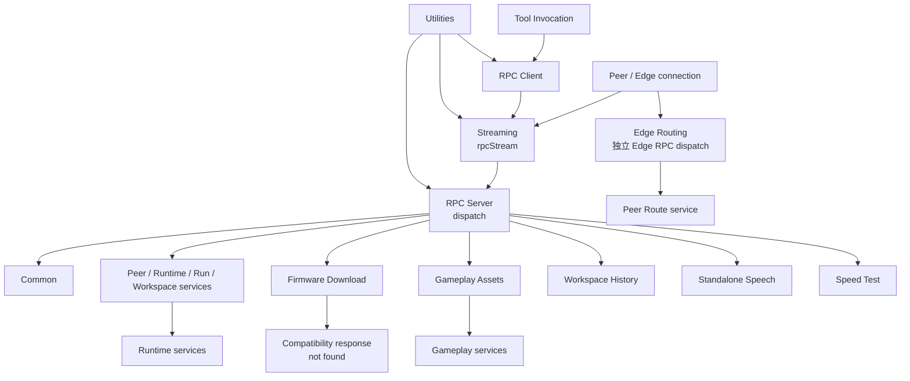

# RPC

RPC 模块负责 GizClaw RPC 的 client/server、dispatch、stream framing 和领域数据流适配。

## 模块

| 模块 | 职责 | 实现文件 |
| --- | --- | --- |
| [Common](./all) | 所有 RPC connection 共用的 Ping。 | `rpc_all.go` |
| [Client](./client) | Client-side RPC receiver、Client info 与 identifiers 查询。 | `rpc_client.go` |
| [Server](./server) | RPC Server composition、dispatch、Server methods 与未实现 method 处理。 | `rpc_server.go` |
| [Firmware Download](./firmware) | 保留 Firmware streaming RPC 的兼容 framing；当前 peer projection 返回 not found。 | `rpc_firmware.go` |
| [Gameplay Assets](./gameplay-pixa) | Gameplay pixa asset streaming。 | `rpc_gameplay_pixa.go` |
| [Workspace History](./workspace-history) | History audio streaming。 | `rpc_workspace_history.go` |
| [Speech Transcription](./transcription) | 独立流式 audio-to-text。 | `rpc_speech.go` |
| [Speech Synthesis](./synthesis) | 独立流式 text-to-audio。 | `rpc_speech.go` |
| [Speed Test](./speed) | 双向 RPC/DataChannel throughput test。 | `rpc_speed.go` |
| [Streaming](./stream) | Frame、protobuf envelope 与 EOS。 | `rpc_stream.go` |
| [Tool Invocation](./tool) | Server 调用在线 Peer tool。 | `rpc_tool.go` |
| [Utilities](./utils) | Request loop、typed payload 与 error helpers。 | `rpc_utils.go` |
| [Edge Routing](./edge) | Peer lookup、assignment 与 route resolve。 | `rpc_edge.go` |

## 调用关系

RPC source contract 属于 `api/proto/rpc/`，生成类型属于 `pkgs/gizclaw/api/rpcapi` 和 `rpcproto`。RPC 模块只拥有运行时接线、framing 与领域 service 适配。
