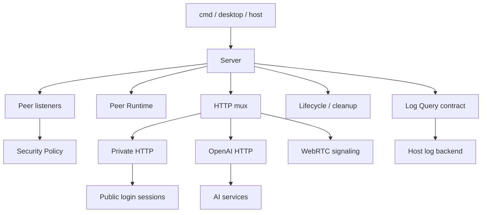

# Server

Server 模块负责完整 GizClaw Server 的组装、生命周期、HTTP 入口和连接安全策略。

## 模块

| 模块 | 职责 | 实现文件 |
| --- | --- | --- |
| [Server](./main) | Composition root、listeners、service 初始化与生命周期。 | `server.go` |
| [Log Query](./log-query) | 日志查询 contract、stream request 与错误模型。 | `server_log_query.go` |
| [OpenAI HTTP](./openai-http) | Server 级 OpenAI-compatible HTTP 接线。 | `server_openai_http.go` |
| [Private HTTP](./private-http) | Private ingress 的 session identity 与授权。 | `server_private_http.go` |
| [Security Policy](./security-policy) | Giznet Peer connection 和 service 准入。 | `server_security_policy.go` |

## 调用关系

领域 resource、validation 和 storage lifecycle 属于 `services/<domain>`；进程配置、真实 store backend 和监听地址属于宿主层。
