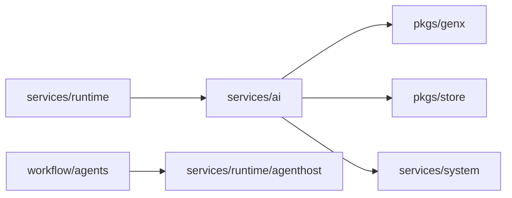

# services/ai

`pkgs/gizclaw/services/ai` 拥有 GizClaw 中可配置的 AI 资源和 provider integration，包括 credential、model、voice、workflow 和 workspace。它把这些资源整理成可被 Agent Runtime 消费的产品能力，但不负责 Agent instance 的在线生命周期。

## 目录结构

```text
services/ai/
├── credential/        # Provider credential 资源
├── model/             # Model 资源与 GenX model 解析
├── openaiapi/         # OpenAI-compatible product service
├── peergenx/          # Peer-backed GenX provider integration
├── providertenants/   # Provider tenant 资源与 provider-specific 配置
├── voice/             # Voice 资源与 provider voice 解析
├── workflow/          # Workflow 资源和 driver 选择
│   └── agents/        # 具体 workflow agent integration
└── workspace/         # Workspace 资源、runtime store 和 history
```

## 子目录职责

### [credential](https://pkg.go.dev/github.com/GizClaw/gizclaw-go@v0.0.0-20260707135347-b9bf1fb24b9f/pkgs/gizclaw/services/ai/credential)

拥有调用外部 AI provider 所需的 credential 资源及其持久化边界。Credential 是受保护的产品资源，不应泄漏到 workflow definition、workspace history 或通用 GenX abstraction。

### [model](https://pkg.go.dev/github.com/GizClaw/gizclaw-go@v0.0.0-20260707135347-b9bf1fb24b9f/pkgs/gizclaw/services/ai/model)

拥有 GizClaw model catalog，并把持久化的 model 定义解析为 GenX 可以使用的模型能力。通用模型接口属于 `pkgs/genx`；具体 GizClaw model 资源和选择逻辑属于这里。

### [openaiapi](https://pkg.go.dev/github.com/GizClaw/gizclaw-go@v0.0.0-20260707135347-b9bf1fb24b9f/pkgs/gizclaw/services/ai/openaiapi)

实现 GizClaw 的 OpenAI-compatible 产品服务，把已配置的 Agent/GenX 能力暴露到对应 HTTP surface。OpenAPI contract 属于 `api/`，route 组装属于根 `pkgs/gizclaw`，这里拥有该 surface 的 AI 业务行为。

### [peergenx](https://pkg.go.dev/github.com/GizClaw/gizclaw-go@v0.0.0-20260707135347-b9bf1fb24b9f/pkgs/gizclaw/services/ai/peergenx)

将 GizClaw peer 或 provider-backed generation 能力接入统一 GenX abstraction。Provider SDK integration 和 provider-specific resolution 留在这里，不应进入通用 `pkgs/genx`。

### [providertenants](https://pkg.go.dev/github.com/GizClaw/gizclaw-go@v0.0.0-20260707135347-b9bf1fb24b9f/pkgs/gizclaw/services/ai/providertenants)

拥有各 AI provider tenant 的产品资源，例如 provider endpoint、account-level 配置和 voice 同步所需信息。它可以依赖具体 provider SDK，但不能让 provider-specific 字段扩散到无关领域。

### [voice](https://pkg.go.dev/github.com/GizClaw/gizclaw-go@v0.0.0-20260707135347-b9bf1fb24b9f/pkgs/gizclaw/services/ai/voice)

拥有可供 Agent/GenX 选择的 voice 资源和 provider voice 映射。Audio codec、resampling 和 playback 等通用能力属于 `pkgs/audio`，不属于 voice catalog。

### [workflow](https://pkg.go.dev/github.com/GizClaw/gizclaw-go@v0.0.0-20260707135347-b9bf1fb24b9f/pkgs/gizclaw/services/ai/workflow)

拥有 workflow definition、driver 选择和 workflow 资源持久化。`workflow/agents` 保存具体 workflow engine 与 GizClaw Agent Host 之间的 integration，例如 Flowcraft、chatroom、AST translation 和 realtime workflow。

Workflow 描述如何运行 Agent，但不拥有 Agent instance 的在线状态和 stream lifecycle。

### [workspace](https://pkg.go.dev/github.com/GizClaw/gizclaw-go@v0.0.0-20260707135347-b9bf1fb24b9f/pkgs/gizclaw/services/ai/workspace)

拥有 workspace 资源、workspace runtime storage 和 history。Workspace 是实例化 Agent 环境的持久化边界；运行中的 Agent、输入输出和 connection stream 由 Runtime 领域负责。

## 依赖与边界



应该放在 `services/ai`：

- AI provider、credential、model、voice、workflow 和 workspace 的产品资源。
- Provider integration 和 GizClaw-specific GenX resolution。
- Workflow engine 与 GizClaw Agent Runtime 的适配。

不应该放在这里：

- 通用 GenX interface、audio codec 或 transport。
- Agent instance、peer connection 和在线运行生命周期。
- Provider credential 明文日志或跨领域复制。
- 仅属于 Admin/Peer HTTP route 注册的接线代码。
