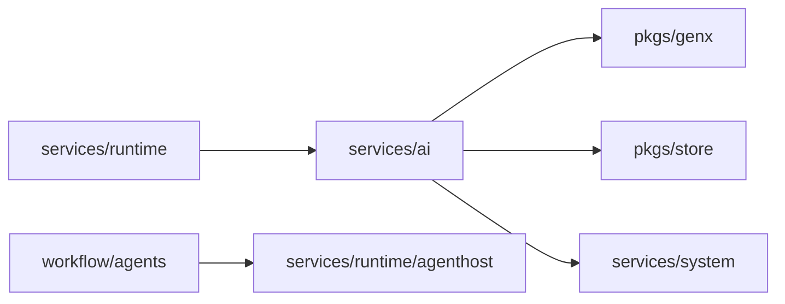

# services/ai

`pkgs/gizclaw/services/ai` 拥有 GizClaw 中可配置的 AI 资源和 provider integration，包括 credential、model、voice、workflow 和 workspace。它把这些资源整理成可被 Agent Runtime 消费的产品能力，但不负责 Agent instance 的在线生命周期。

## 目录结构

```text
services/ai/
├── credential/        # Provider credential 资源
├── model/             # Model 资源与 GenX model 解析
├── openaiapi/         # OpenAI-compatible product service
├── peergenx/          # Peer-backed GenX provider integration
├── providertenants/   # Provider tenant 资源与 provider-specific 配置
├── voice/             # Voice 资源与 provider voice 解析
├── workflow/          # Workflow 资源和 driver 选择
│   └── agents/        # 具体 workflow agent integration
└── workspace/         # Workspace 资源、runtime store 和 history
```

## 子目录职责

### [credential](https://pkg.go.dev/github.com/GizClaw/gizclaw-go@v0.0.0-20260707135347-b9bf1fb24b9f/pkgs/gizclaw/services/ai/credential)

拥有调用外部 AI provider 所需的 credential 资源及其持久化边界。Credential 是受保护的产品资源，不应泄漏到 workflow definition、workspace history 或通用 GenX abstraction。

### [model](https://pkg.go.dev/github.com/GizClaw/gizclaw-go@v0.0.0-20260707135347-b9bf1fb24b9f/pkgs/gizclaw/services/ai/model)

拥有 GizClaw model catalog，并把持久化的 model 定义解析为 GenX 可以使用的模型能力。通用模型接口属于 `pkgs/genx`；具体 GizClaw model 资源和选择逻辑属于这里。

### [openaiapi](https://pkg.go.dev/github.com/GizClaw/gizclaw-go@v0.0.0-20260707135347-b9bf1fb24b9f/pkgs/gizclaw/services/ai/openaiapi)

实现 GizClaw 的 OpenAI-compatible 产品服务，把已配置的 Agent/GenX 能力暴露到对应 HTTP surface。OpenAPI contract 属于 `api/`，route 组装属于根 `pkgs/gizclaw`，这里拥有该 surface 的 AI 业务行为。

### [peergenx](https://pkg.go.dev/github.com/GizClaw/gizclaw-go@v0.0.0-20260707135347-b9bf1fb24b9f/pkgs/gizclaw/services/ai/peergenx)

将 GizClaw peer 或 provider-backed generation 能力接入统一 GenX abstraction。Provider SDK integration 和 provider-specific resolution 留在这里，不应进入通用 `pkgs/genx`。

### [providertenants](https://pkg.go.dev/github.com/GizClaw/gizclaw-go@v0.0.0-20260707135347-b9bf1fb24b9f/pkgs/gizclaw/services/ai/providertenants)

拥有各 AI provider tenant 的产品资源，例如 provider endpoint、account-level 配置和 voice 同步所需信息。它可以依赖具体 provider SDK，但不能让 provider-specific 字段扩散到无关领域。

### [voice](https://pkg.go.dev/github.com/GizClaw/gizclaw-go@v0.0.0-20260707135347-b9bf1fb24b9f/pkgs/gizclaw/services/ai/voice)

拥有可供 Agent/GenX 选择的 voice 资源和 provider voice 映射。Audio codec、resampling 和 playback 等通用能力属于 `pkgs/audio`，不属于 voice catalog。

### [workflow](https://pkg.go.dev/github.com/GizClaw/gizclaw-go@v0.0.0-20260707135347-b9bf1fb24b9f/pkgs/gizclaw/services/ai/workflow)

拥有 workflow definition、driver 选择和 workflow 资源持久化。`workflow/agents` 保存具体 workflow engine 与 GizClaw Agent Host 之间的 integration，包括 Flowcraft、Chatroom、AST Translate、DashScope Realtime、Doubao Realtime、Doubao Realtime Duplex 和 Eino。

Workflow 描述如何运行 Agent，但不拥有 Agent instance 的在线状态和 stream lifecycle。

#### Flowcraft 组合边界

Flowcraft workflow factory 只负责把 typed Workflow 配置与 Workspace owner 的 RuntimeProfile alias、LogStore、KV Store、ObjectStore 和 Audio Dock 组装成通用 Flowcraft Transformer。它不创建 Claw、本地 Flowcraft Workspace、`config.yaml` 或 BBH。

History 使用 AgentHost 注入的 `logstore.MutableStore`，State 使用按 Owner/Workspace/Agent prefix 的 `kv.Store`。启用长期 Memory 时，`agent_host.flowcraft.memory_store` 优先选择借用的 provider-neutral Store；未配置时，factory 仍可通过 Memory object persistence 构造内嵌 Flowcraft Store。Workflow 与 Workspace resource 只配置 policy，不能选择 Store 或 backend。最后一个 Workspace Agent 引用释放时，只关闭本 Agent 构造的 adapter，不关闭 Server 拥有的底层 Store，也不删除持久数据。

Public `FlowcraftWorkflowSpec` 要求显式 `agent.graph`，Graph 至少有一个 node，且 `entry` 必须引用已定义 node。支持 `llm`、inline `script` 与 `passthrough`；`publish: true` 决定哪些 node 输出进入 GenX Stream。Graph、Memory extraction/rerank/embedding、ASR 和 voice 都直接填写 Workspace owner RuntimeProfile 暴露的 alias。

Workflow 保留 `conversation`、Graph、Memory policy 与 `voice_adapter`。它不接受本地目录、History driver、Memory Store alias、`settings`/`models` 二级映射、parallel switch、隐式单模型 Agent 或 Tool 配置。选择外部 Store 时，专用于内嵌 provider 的 extraction、embedding、rerank、graph 与 layout 配置会被拒绝而不是静默忽略。App-bound Store view 只强制把 Workspace ID 写入 `memory.Scope.AppID`，不会推导或改写 UserID、AgentID、RunID；Flowcraft 自身会把 `agent.id` 作为 AgentID 提交，因此同一 Workspace 中不同 Agent 默认不会共享 Memory。reload 仅释放当前引用，仍有其他引用时复用现有 Agent。

#### DashScope、Doubao Duplex 与 Eino 边界

`dashscope-realtime`、`doubao-realtime-duplex` 和 `eino` 都是持久化 Workflow 与 Workspace driver。对应 factory 解析 typed RuntimeProfile Model/Voice alias，并构造既有 GenX Transformer。DashScope 要求 DashScope realtime Model；Doubao Duplex 要求 Volc `realtime-duplex` Model；Eino 分别解析每个 `chat_model` node。

Eino 暴露 invocation-local graph state 以及 provider-neutral recall/observe policy。没有 Memory 的 Workflow 不需要 Memory Store；声明 Memory 后必须配置 `agent_host.eino.memory_store`，借用只绑定 App 的 view，并把 Workflow identity 作为 AgentID 提交。产品层不暴露持久化 Eino State 或 History。三个 driver 都不依赖 ToolCall，也不会把 Toolkit policy 映射成 provider-native tool。

#### Pet 组合边界

`pet` driver 只作为 GizClaw 的领域 wrapper 保留。它在每个 turn 解析 Workspace 对应的 Pet、PetDef 与当前 Gameplay，并把瞬态 `tmp_*` Board input 提供给嵌套 Workflow。`spec.pet` 与普通非 Pet Workflow 使用相同的 reusable driver 加对应 payload 结构，也包含三个新增 driver，但不能递归选择 `pet`。

内层 driver 拥有 Graph、conversation、Memory、model、voice 与 toolkit 配置，并通过普通注册 factory 构造。内层 Flowcraft driver 与普通 Flowcraft Workflow 接收相同的 AgentHost-injected State、内部 History、Memory-object Store 与可选 provider-neutral Memory Store。所有符号引用都从不可变的 system Workspace owner RuntimeProfile 解析。GizClaw 不再合成 Pet Graph、固定 model alias、Workspace voice 或内层 driver fallback。

### [workspace](https://pkg.go.dev/github.com/GizClaw/gizclaw-go@v0.0.0-20260707135347-b9bf1fb24b9f/pkgs/gizclaw/services/ai/workspace)

拥有 workspace 资源、workspace runtime storage 和 history。Workspace 是实例化 Agent 环境的持久化边界；运行中的 Agent、输入输出和 connection stream 由 Runtime 领域负责。

Workspace 还拥有不可变的 `system` 生命周期分类。通用创建写入 `system: false`；领域拥有的创建同时写入 `system: true` 与唯一且不可变的 `owner_public_key`。通用 put 只能修改 Chatroom system Workspace 的 input mode；owner、Workflow、领域 mode、history/transcript policy、labels 或 toolkit 的变化都会被拒绝，因此 Pet system Workspace 没有可变的执行配置。通用 delete 始终拒绝 system Workspace。删除用户 Workspace 时，会原子创建或复用一条 `kind=workspace` PendingDeletion，同时保留 active record 与 owner index；runtime、history、icon、object 和 file 也留给后续清理。内部 system lifecycle surface 只提供给拥有该 Workspace 的 Social 或 Gameplay service；Social relationship 删除成功后可调用 retirement capability，为对应 system Chatroom Workspace 创建或复用 `PendingDeletion`，但不在请求路径同步删除 Workspace 内容。

## 依赖与边界


```mermaid
flowchart LR
    Runtime["services/runtime"] --> AI["services/ai"]
    AI --> GenX["pkgs/genx"]
    AI --> Store["pkgs/store"]
    AI --> System["services/system"]
    Workflow["workflow/agents"] --> AgentHost["services/runtime/agenthost"]
```

应该放在 `services/ai`：

- AI provider、credential、model、voice、workflow 和 workspace 的产品资源。
- Provider integration 和 GizClaw-specific GenX resolution。
- Workflow engine 与 GizClaw Agent Runtime 的适配。

不应该放在这里：

- 通用 GenX interface、audio codec 或 transport。
- Agent instance、peer connection 和在线运行生命周期。
- Provider credential 明文日志或跨领域复制。
- 仅属于 Admin/Peer HTTP route 注册的接线代码。
