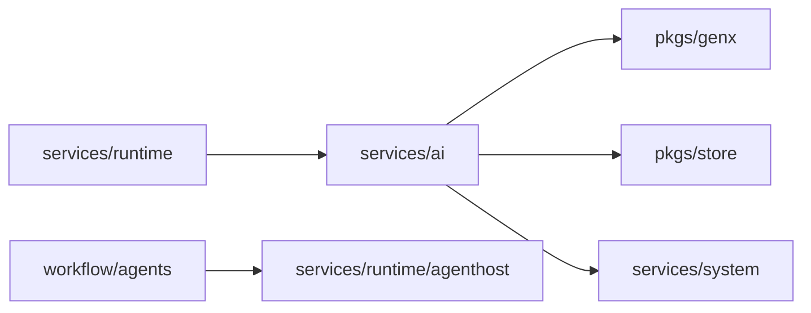

# services/ai

`pkgs/gizclaw/services/ai` 拥有 GizClaw 中可配置的 AI 资源和 provider integration，包括 credential、model、voice、workflow 和 workspace。它把这些资源整理成可被 Agent Runtime 消费的产品能力，但不负责 Agent instance 的在线生命周期。

## 目录结构

```text
services/ai/
├── credential/        # Provider credential 资源
├── memorylayout/      # Portable Memory provider policy 资源
├── model/             # Model 资源与 GenX model 解析
├── openaiapi/         # OpenAI-compatible product service
├── peergenx/          # Peer-backed GenX provider integration
├── providertenants/   # Provider tenant 资源与 provider-specific 配置
├── voice/             # Voice 资源与 provider voice 解析
├── workflow/          # Workflow 资源和 driver 选择
│   └── agents/        # 具体 workflow agent integration
└── workspace/         # Workspace 资源、runtime store 和 history
```

## 子目录职责

### [credential](https://pkg.go.dev/github.com/GizClaw/gizclaw-go@v0.0.0-20260707135347-b9bf1fb24b9f/pkgs/gizclaw/services/ai/credential)

拥有调用外部 AI provider 所需的 credential 资源及其持久化边界。Credential 是受保护的产品资源，不应泄漏到 workflow definition、workspace history 或通用 GenX abstraction。

### [model](https://pkg.go.dev/github.com/GizClaw/gizclaw-go@v0.0.0-20260707135347-b9bf1fb24b9f/pkgs/gizclaw/services/ai/model)

拥有 GizClaw model catalog，并把持久化的 model 定义解析为 GenX 可以使用的模型能力。通用模型接口属于 `pkgs/genx`；具体 GizClaw model 资源和选择逻辑属于这里。

### memorylayout

拥有 connection-free `MemoryLayout` Admin 资源。一个 Layout 同时声明 Flowcraft、Mem0 与 `volc_mem0` policy；实际 driver、endpoint、API key、project、DSN 或目录由 RuntimeProfile memory binding 选择。详见 [Memory Store](/zh/developing/stores/memory)。

### [openaiapi](https://pkg.go.dev/github.com/GizClaw/gizclaw-go@v0.0.0-20260707135347-b9bf1fb24b9f/pkgs/gizclaw/services/ai/openaiapi)

实现 GizClaw 的 OpenAI-compatible 产品服务，把已配置的 Agent/GenX 能力暴露到对应 HTTP surface。OpenAPI contract 属于 `api/`，route 组装属于根 `pkgs/gizclaw`，这里拥有该 surface 的 AI 业务行为。

### [peergenx](https://pkg.go.dev/github.com/GizClaw/gizclaw-go@v0.0.0-20260707135347-b9bf1fb24b9f/pkgs/gizclaw/services/ai/peergenx)

将 GizClaw peer 或 provider-backed generation 能力接入统一 GenX abstraction。Provider SDK integration 和 provider-specific resolution 留在这里，不应进入通用 `pkgs/genx`。

### [providertenants](https://pkg.go.dev/github.com/GizClaw/gizclaw-go@v0.0.0-20260707135347-b9bf1fb24b9f/pkgs/gizclaw/services/ai/providertenants)

拥有各 AI provider tenant 的产品资源，例如 provider endpoint、account-level 配置和 voice 同步所需信息。它可以依赖具体 provider SDK，但不能让 provider-specific 字段扩散到无关领域。

### [voice](https://pkg.go.dev/github.com/GizClaw/gizclaw-go@v0.0.0-20260707135347-b9bf1fb24b9f/pkgs/gizclaw/services/ai/voice)

拥有可供 Agent/GenX 选择的 voice 资源和 provider voice 映射。Audio codec、resampling 和 playback 等通用能力属于 `pkgs/audio`，不属于 voice catalog。

### [workflow](https://pkg.go.dev/github.com/GizClaw/gizclaw-go@v0.0.0-20260707135347-b9bf1fb24b9f/pkgs/gizclaw/services/ai/workflow)

拥有 workflow definition、driver 选择和 workflow 资源持久化。`workflow/agents` 保存具体 workflow engine 与 GizClaw Agent Host 之间的 integration，包括 Flowcraft、Chatroom、AST Translate、DashScope Realtime、Doubao Realtime、Doubao Realtime Duplex 和 Eino。

Workflow 描述如何运行 Agent，但不拥有 Agent instance 的在线状态和 stream lifecycle。

#### Flowcraft 组合边界

Flowcraft workflow factory 把扁平的 `spec.flowcraft.graph`、`conversation`、`max_iterations` 和 `voice_adapter` 与 Workspace owner 的 RuntimeProfile alias、History、State、Memory 和 Audio Dock 组装成 Transformer。Workspace `input` 缺省为 `push-to-talk`：该模式由客户端 audio EOS 完成一轮；`realtime` 复用 ASR Transformer 的 definite-utterance transcript EOS，在外层音频输入保持打开时完成一轮。客户端显式 audio route EOS 会终结当前 ASR provider session，下一条 route 再打开新 session；没有 route EOS 的连续音频仍由 provider VAD 分段。Audio Dock 与 Flowcraft 保留并顺序组合 ASR text delta，不重新解释 provider 断句。`id` 与 `name` 不在 Flowcraft payload 中重复配置，分别由 Workspace 与 Workflow metadata 派生。

Public `FlowcraftWorkflowSpec` 要求显式 `graph`，Graph 至少有一个 node，且 `entry` 必须引用已定义 node。除 `llm`、inline `script` 与 `passthrough` 外，`memory_recall` 和 `memory_observe` node 负责 Memory 的消费与写入。Workflow 顶层 `memory` 是 RuntimeProfile memory alias；provider extraction、embedding、rerank、lane 与 write policy 属于其 `MemoryLayout`，不再嵌套在 Flowcraft payload。

同一 Workspace 的所有 stream 共用一个 Agent instance。Factory 为当前 RuntimeProfile binding 构造或借用 Store generation，以 Workspace 名作为 AppID；reload 关闭旧 generation 并按新 snapshot 重建，但不会因为 Layout policy 变化改写持久化 identity 或删除 canonical facts。

#### DashScope、Doubao Duplex 与 Eino 边界

`dashscope-realtime`、`doubao-realtime-duplex` 和 `eino` 都是持久化 Workflow 与 Workspace driver。对应 factory 解析 typed RuntimeProfile Model/Voice alias，并构造既有 GenX Transformer。DashScope 要求 DashScope realtime Model；Doubao Duplex 要求 Volc `realtime-duplex` Model；Eino 分别解析每个 `chat_model` node。

Eino Graph 也通过 typed `memory_recall` 与 `memory_observe` node 消费同一个 Workflow memory alias；不存在 Eino 专属的 Memory block 或 Server Config binding。`conversation.starts: agent` 支持主动开场，Workspace conversation parameters 可以选择 `on_reload` 或仅空 history 时一次开场；并发 stream 只允许一个成功 claim，失败可重试，用户输入可以沿既有 interruption 路径打断开场。产品层继续使用持久 History，但 Graph state 仍是 invocation-local。

#### Pet 组合边界

`pet` driver 只作为 GizClaw 的领域 wrapper 保留。它在每个 turn 解析 Workspace 对应的 Pet、PetDef 与当前 Gameplay，并把瞬态 `tmp_*` Board input 提供给嵌套 Workflow。`spec.pet` 与普通非 Pet Workflow 使用相同的 reusable driver 加对应 payload 结构，也包含三个新增 driver，但不能递归选择 `pet`。

内层 driver 拥有 Graph、conversation、model、voice 与 toolkit 配置，并通过普通注册 factory 构造。Memory 只允许在外层 Workflow 配置一份；Pet 内层禁止 `memory` 或第二份 driver 选择，并接收外层已经解析的同一个 Store binding。所有符号引用都从 system Workspace owner RuntimeProfile snapshot 解析。

### [workspace](https://pkg.go.dev/github.com/GizClaw/gizclaw-go@v0.0.0-20260707135347-b9bf1fb24b9f/pkgs/gizclaw/services/ai/workspace)

拥有 workspace 资源、workspace runtime storage 和 history。Workspace 是实例化 Agent 环境的持久化边界；运行中的 Agent、输入输出和 connection stream 由 Runtime 领域负责。

Workspace 还拥有不可变的 `system` 生命周期分类。通用创建写入 `system: false`；领域拥有的创建同时写入 `system: true` 与唯一且不可变的 `owner_public_key`。通用 put 只能修改 Chatroom system Workspace 的 input mode；owner、Workflow、领域 mode、history/transcript policy、labels 或 toolkit 的变化都会被拒绝，因此 Pet system Workspace 没有可变的执行配置。通用 delete 始终拒绝 system Workspace。删除用户 Workspace 时，会原子创建或复用一条 `kind=workspace` PendingDeletion，并立即拒绝该 Workspace 的选择、运行、history/icon 与 mutation；Admin Workspace get/list 仍可诊断 retained record。Production handler quiesce runtime，删除 exact Gameplay/History/runtime/icon/object/filesystem artifact，验证 absent 后原子删除 Workspace、index 与 mutable task state。内部 system lifecycle surface 只提供给拥有该 Workspace 的 Social 或 Gameplay service；Social relationship 或 Peer retirement 为选中的 system Workspace 创建同样的 handoff。

## 依赖与边界


```mermaid
flowchart LR
    Runtime["services/runtime"] --> AI["services/ai"]
    AI --> GenX["pkgs/genx"]
    AI --> Store["pkgs/store"]
    AI --> System["services/system"]
    Workflow["workflow/agents"] --> AgentHost["services/runtime/agenthost"]
```

应该放在 `services/ai`：

- AI provider、credential、model、voice、workflow 和 workspace 的产品资源。
- Provider integration 和 GizClaw-specific GenX resolution。
- Workflow engine 与 GizClaw Agent Runtime 的适配。

不应该放在这里：

- 通用 GenX interface、audio codec 或 transport。
- Agent instance、peer connection 和在线运行生命周期。
- Provider credential 明文日志或跨领域复制。
- 仅属于 Admin/Peer HTTP route 注册的接线代码。
