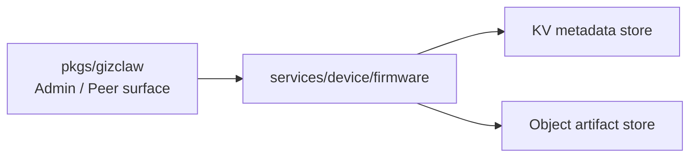

# services/device

`pkgs/gizclaw/services/device` 保存由设备领域拥有的服务端资源。目前该目录只有 `firmware/`，负责 Firmware catalog、artifact 和 OTA metadata。

## 目录结构

```text
services/device/
└── firmware/    # Firmware metadata、channel artifact 和文件分发
```

## firmware

`firmware` 拥有：

- Firmware catalog 和 channel metadata。
- Firmware artifact 的上传、索引、读取和删除。
- OTA 查询和文件下载所需的服务端数据。
- Firmware metadata store 与 artifact object store 的协调。

它不拥有设备连接、peer registration、runtime status 或 telemetry。设备通过什么 transport 连接、当前是否在线、上报了什么状态，属于根 peer 接线与 `services/runtime`。

## 依赖与边界



应该放在 `services/device/firmware`：

- Firmware 和 channel 的领域规则。
- Artifact storage、metadata 和 OTA download 行为。
- Firmware 文件作为不可信输入时的 validation 与 cleanup。

不应该放在这里：

- WebRTC connection、device signaling 或 telemetry transport。
- Peer identity、registration approval 或 ACL resource ownership。
- Board-specific flash、bootloader 或 firmware implementation。
- CLI storage backend 和 filesystem root 的创建。

未来新增 device 领域服务时，应先确认它是否拥有独立资源和生命周期，再决定新增 `services/device/<service>`，不要把所有与设备有关的逻辑都放进 `firmware/`。
