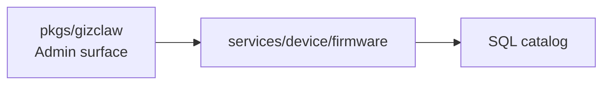

# services/device

`pkgs/gizclaw/services/device` 保存由设备领域拥有的服务端资源。目前该目录只有 `firmware/`，负责 Firmware catalog 和 OTA channel 配置。

## 目录结构

```text
services/device/
└── firmware/    # Firmware metadata 和 external channel package
```

## firmware

`firmware` 拥有：

- Firmware catalog 和 channel metadata。
- 校验和保存每个 channel 的 HTTPS `.tar.zlib` URL、SHA-256 和 archive size。
- stable、beta、develop 三个 slot 的完整替换与严格校验。

它不拥有设备连接、peer registration、runtime status 或 telemetry。设备通过什么 transport 连接、当前是否在线、上报了什么状态，属于根 peer 接线与 `services/runtime`。

## 依赖与边界


```mermaid
flowchart LR
    GizClaw["pkgs/gizclaw<br/>Admin surface"] --> Firmware["services/device/firmware"]
    Firmware --> SQL["SQL catalog"]
```

应该放在 `services/device/firmware`：

- Firmware 和 channel 的领域规则。
- stable、beta、develop 的声明式 external package metadata。
- Firmware 配置作为不可信输入时的 validation。

不应该放在这里：

- WebRTC connection、device signaling 或 telemetry transport。
- Peer identity、RegistrationToken 或通用 resource ownership。
- Board-specific flash、bootloader 或 firmware implementation。
- Package download、proxy、unpack 或 binary storage。
- CLI storage backend 和 filesystem root 的创建。

未来新增 device 领域服务时，应先确认它是否拥有独立资源和生命周期，再决定新增 `services/device/<service>`，不要把所有与设备有关的逻辑都放进 `firmware/`。

Firmware catalog 保存在 `firmwares` 业务表中，ID 为主键，描述、创建时间和更新时间为独立列，频道配置保留为 JSON。Server 启动时初始化表结构，并复用配置的 SQL 连接池；请求不执行 DDL。列表按 ID 使用数据库范围查询与 `LIMIT` 分页，更新和删除使用 SQL `RETURNING`，不通过 KV 枚举。

Package 的 `version` 在 create、put 和 resource apply 写入时必填：严格 SemVer 2.0.0，最多 128 个 ASCII 字符，支持预发布和 build metadata，不接受 `v` 前缀、空白或非法数字前导零。拒绝写入时保留已有配置。共享 package Schema 和 SDK 模型将版本声明为可选，因为读取还要支持没有版本的已有包：Admin get/list/resource show、设备 HTTP 和 RPC 正常返回包并省略 `version`。读取不补写、不推断版本；更新这类包时必须提供真实版本，删除仍可正常执行。已有记录中存在但非法的版本仍返回 internal error，删除在返回记录校验失败时回滚。空 channel 可以省略 package。Channel 允许指向较低版本用于回滚；build metadata 不影响 SemVer 排序，SHA-256 仍标识精确的包字节。
