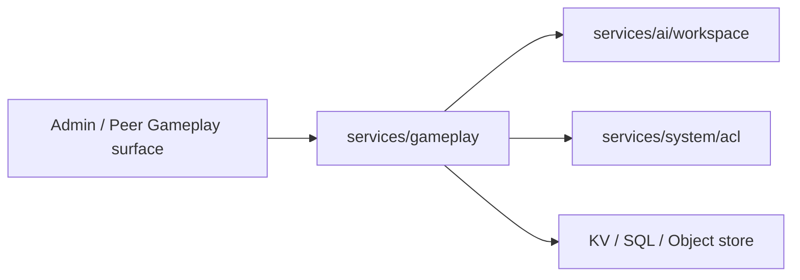

# services/gameplay

`pkgs/gizclaw/services/gameplay` 拥有 GizClaw Gameplay 的 catalog、玩家状态、奖励行为和数字资产。当前 Gameplay 服务保持为一个 package，因为这些资源共同参与同一套规则和事务边界。

## 领域内容

```text
services/gameplay/
├── Catalog       # GameRuleset、PetDef、BadgeDef 和 GameDef
├── Runtime       # Pet、points、badge 和 game result 状态
├── Reward        # Reward grant 与 points/badge 变化
├── Assets        # PetDef/BadgeDef 等 pixa 资源
└── Storage       # KV、object store 与 gameplay SQL state
```

这是一张领域职责图，不是 Go 文件或类型清单。

## Ownership

Gameplay 拥有：

- GameRuleset 定义的 Gameplay 规则集合。
- Pet、badge 和 game 的 catalog definition。
- Pet adoption、更新、删除和 drive 等 care action。
- Points account、transaction、reward grant 和 badge progression。
- Game result 的写入和查询。
- Gameplay definition 关联的 pixa 数字资产。

Gameplay 可以使用 workspace 作为 pet workspace 或 Agent memory 的关联边界，但 workspace 资源本身仍由 `services/ai/workspace` 拥有。Gameplay 也使用 ACL 完成访问判断，但不重新定义 role 或 policy binding。

## 依赖与边界



应该放在 `services/gameplay`：

- Gameplay catalog 和 player/pet state。
- Points、reward、badge、game result 和 care action 的领域规则。
- Gameplay-owned pixa assets 和一致性检查。

不应该放在这里：

- 通用 digital content storage 或 pixa codec。
- Workspace、Agent Runtime 或 social graph 的实现。
- Admin/Peer transport 和 route registration。
- 与 Gameplay 无关的通用 accounting、SQL 或 object-store helper。

当 Gameplay 继续增长时，应根据资源 ownership 和事务边界决定是否拆子 package，不能只按 API endpoint 数量机械拆分。
