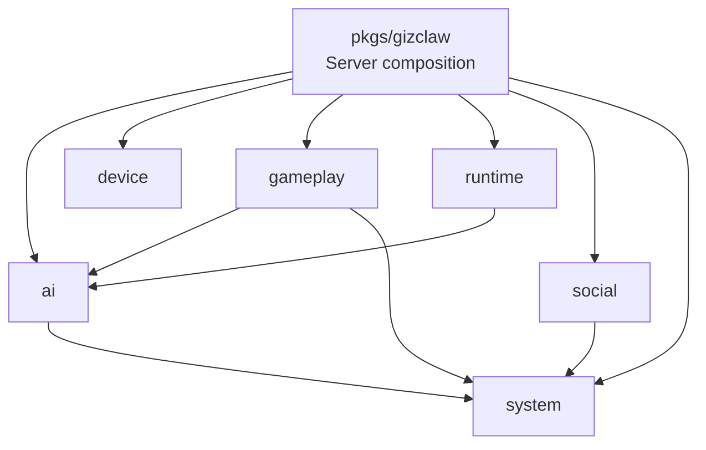

# GizClaw Services 总览

`pkgs/gizclaw/services` 按产品领域组织 GizClaw Server 的可复用服务。这里是业务资源、领域规则、持久化行为和 runtime service 的主要 ownership root。

根 `pkgs/gizclaw` package 负责把这些服务组装到 Peer、Admin、Edge 和 OpenAI-compatible public surface；`services/` 自身不拥有 transport listener、进程启动或完整 Server composition。

## 目录结构

```text
pkgs/gizclaw/services/
├── ai/          # AI provider、model、voice、workflow 和 workspace
├── device/      # Device-owned resources，目前主要是 firmware
├── gameplay/    # Gameplay catalog、pet、points、reward 和 assets
├── runtime/     # Peer 与 Agent 的在线运行能力
├── social/      # Contact、friend 和 friend group
└── system/      # RuntimeProfile、ownership、public login 和统一资源管理
```

## 领域关系



图中的依赖表示允许存在的显式协作，不表示一个领域拥有另一个领域的数据：

- Runtime 使用 AI 资源启动 Agent，但不拥有 workflow、workspace、model 或 credential。
- Gameplay 可以使用 workspace、RuntimeProfile 和 ownership，但不拥有 Agent Runtime。
- AI、Gameplay 和 Social 使用 System 提供的 RuntimeProfile、ownership 或统一资源能力，但各自仍拥有自己的领域资源。

## 服务目录规则

一项能力进入 `services/<domain>`，通常应满足：

- 它拥有明确的产品领域资源或在线运行职责。
- 它有自己的 validation、storage 或 lifecycle。
- 它可以由不同 public surface 复用，而不是只属于某个 HTTP/RPC handler。
- 它不依赖具体 CLI command、desktop UI 或 transport implementation。

不应把下面的内容放进 `services/`：

- OpenAPI、protobuf 和生成 API contract。
- WebRTC、HTTP-over-stream 或其他通用 transport。
- CLI config、storage backend 创建和进程启动。
- 只做 public route 注册、不拥有领域行为的接线。
- 可以跨 GizClaw 产品复用的通用 store、audio、GenX 或 encoding library。

## 领域指引

- [AI](ai.md)
- [Device](device.md)
- [Gameplay](gameplay.md)
- [Runtime](runtime/overview.md)
- [Social](social.md)
- [System](system.md)
- [RuntimeProfile](runtime-profile.md)
