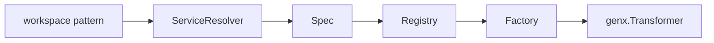

# Agent

[Go API Reference](https://pkg.go.dev/github.com/GizClaw/gizclaw-go/pkgs/gizclaw/services/runtime/agent)

`agent` 把 workspace pattern 解析成可运行的 workflow Transformer。它拥有 workflow factory registry 和从持久化 Workspace/Workflow 到运行规格的解析，但不拥有 Agent instance 的长期在线状态。

## 调用关系

## 核心结构与主函数

| 结构或函数 | 作用 |
| --- | --- |
| `Spec` | 保存已经解析完成的 Workspace 与 Workflow 配置。 |
| `Resolver` / `ServiceResolver.Resolve` | 从产品 service 读取 Workspace 和 Workflow，形成 `Spec`。 |
| `ParseWorkspacePattern` | 校验并提取 workspace pattern。 |
| `Registry.Register` / `Registry.Get` | 按 workflow type 管理 `Factory`。 |
| `Factory.NewAgent` | 从 `Spec` 构造一个 `genx.Transformer`。 |
| `Host.Transform` | 完成解析、factory 选择并启动 Transformer。 |
| `Service.Reload` | 根据当前 pattern、source 和 consumer 替换 connection-owned runtime。 |

`agent` 不负责 Peer connection、audio output、ToolKit 授权或 workspace lease；这些在线生命周期由 `agenthost` 组合。
