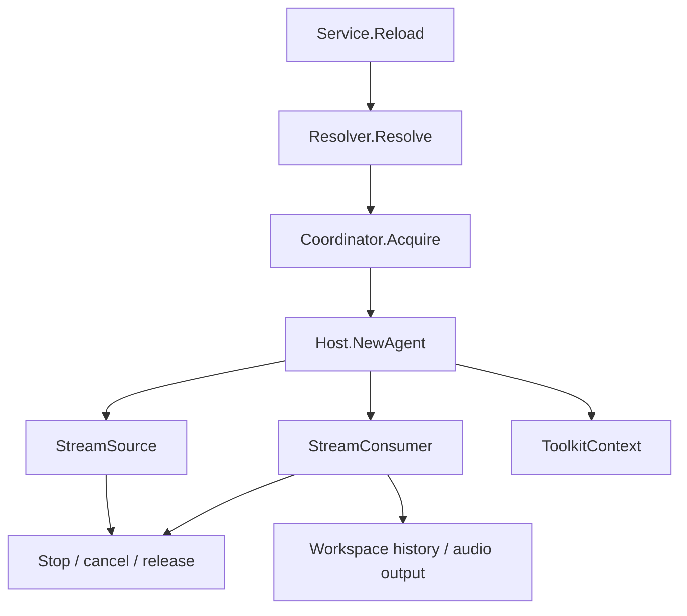

# Agent Host

[Go API Reference](https://pkg.go.dev/github.com/GizClaw/gizclaw-go/pkgs/gizclaw/services/runtime/agenthost)

`agenthost` 拥有 Agent instance 的在线生命周期。它解析运行规格、取得 workspace lease、建立输入输出 Stream、接入 history 与 ToolKit，并维护当前 runtime registry。

## 运行流程

## 核心结构与主函数

| 结构或函数 | 作用 |
| --- | --- |
| `Service.Reload` | 停止旧 runtime，并按当前 Peer run selection 创建新 runtime。 |
| `Service.Status` / `Stop` | 查询或终止当前 Agent runtime。 |
| `Service.SetRunAgent` | 在与 reload、stop 相同的 transition 边界内持久化 pending Peer selection；只有改变 active workspace 的 selection 才推进 runtime revision。 |
| `Service.RuntimeRevision` / `PushInputIfCurrentRevision` / `ReloadAndPushInputIfCurrentRevision` | 仅当 connection-scoped input 仍属于当前稳定 runtime revision 时允许写入或原子化地恢复后写入。 |
| `Service.WorkspaceState` | 返回当前 workspace 的运行状态。 |
| `RuntimeRegistry` | 维护当前在线 runtime。 |
| `Coordinator` / `MemoryCoordinator` | 为 workspace 提供排他 lease。 |
| `Host` / `Registry` | 根据解析后的 `Spec` 选择并创建 Agent。 |
| `InputStream` / `PushSource` | 将连续输入转换为 Agent 消费的 GenX Stream。 |
| `MixerOutput` | 按 `(StreamID, canonical MIME)` 将 Agent audio decode 为 PCM，并接到独立 mixer track；MIME EOS 只关闭对应 track，control-only EOS 关闭 route 下全部 track。 |
| `ToolkitContext` | 为一次 runtime 组合授权后的 ToolKit。 |

所有 runtime 创建路径都必须具有对称的 cancel、stream close、lease release 和 registry cleanup。Agent definition、Workflow 与 Workspace 的持久化仍属于 AI services。

每个 `Service` 为其单个 Peer 串行化 selection 写入、reload、stop 与每次 Realtime input push。transition 在生命周期工作前后改变 runtime revision；只有改变 active workspace 的 selection 才是会推进 revision 的 transition。Realtime chunk 会在可能等待其他 input write 前采样 revision；如果它观察到 revision 已变化或正处于 transition 中，即为过期输入，必须丢弃，不能重新打开或进入新的 workspace。input recovery 在同一个未变化的稳定 revision gate 内 reload 并写入原始 chunk；pending selection 仅在它改变当前 workspace 时才抑制恢复，因此同 workspace 的 selection 仍可恢复 inactive source。该边界不串行化无关 Peer，也不替代共享 `RuntimeRegistry` 对 workspace agent 的 ownership。

`RuntimeRegistry` 按 Workspace 复用同一个已构造 Agent，并对每个 attach 返回独立 release。单个 Peer reload 只释放自己的引用；剩余引用继续使用原 Agent，既不会被打断，也不会重跑 initiative。最后一个引用释放时，registry 移除该 Agent、关闭 factory 拥有的 per-Agent adapter 并释放 workspace lease；下一次 acquire 才重新解析构造期配置。

Transformer 与 history replay 必须尽快把 provider output drain 到 growable stream buffer，不在该层按播放时钟等待。Raw Opus、Ogg/Opus、MP3 与 PCM audio 都先 decode/normalize，再进入 mixer 的 PCM stream；`PeerConn` 只在 mixer 出口每个 20ms pacing opportunity 读取一帧、编码 Opus 并写入 WebRTC。普通 EOS 使用 `CloseWrite` 让已缓存 PCM 排空，error EOS 使用 `CloseWithError` 丢弃对应 track 和尚未消费的 stream backlog。
