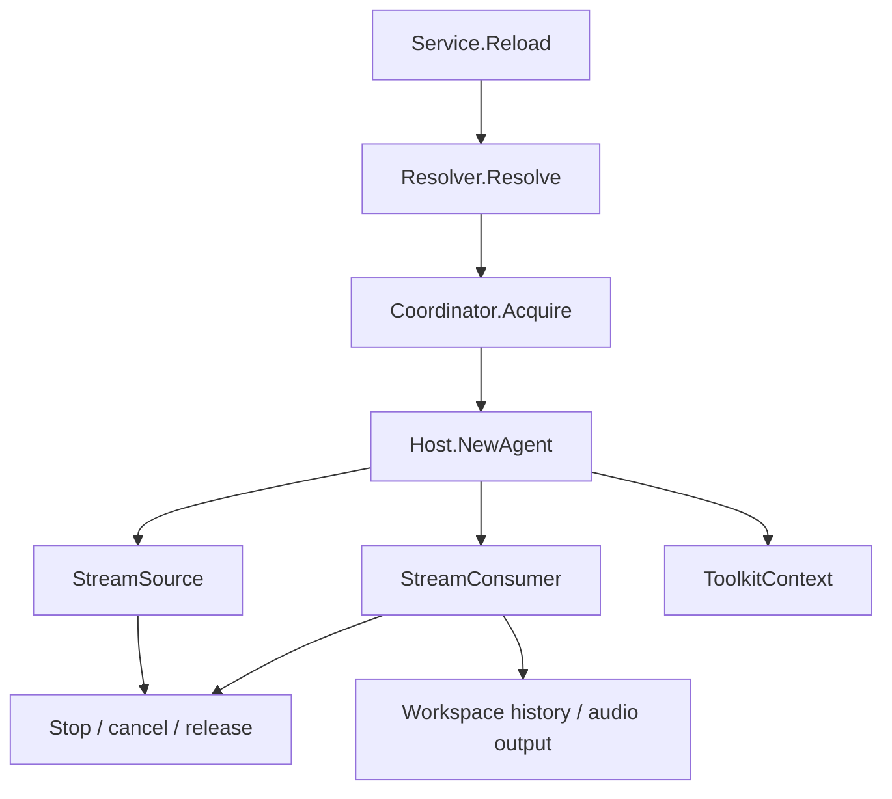

# Agent Host

[Go API Reference](https://pkg.go.dev/github.com/GizClaw/gizclaw-go/pkgs/gizclaw/services/runtime/agenthost)

`agenthost` 拥有 Agent instance 的在线生命周期。它解析运行规格、取得 workspace lease、建立输入输出 Stream、接入 history 与 ToolKit，并维护当前 runtime registry。

## 运行流程

## 核心结构与主函数

| 结构或函数 | 作用 |
| --- | --- |
| `Service.Reload` | 停止旧 runtime，并按当前 Peer run selection 创建新 runtime。 |
| `Service.Status` / `Stop` | 查询或终止当前 Agent runtime。 |
| `Service.WorkspaceState` | 返回当前 workspace 的运行状态。 |
| `RuntimeRegistry` | 维护当前在线 runtime。 |
| `Coordinator` / `MemoryCoordinator` | 为 workspace 提供排他 lease。 |
| `Host` / `Registry` | 根据解析后的 `Spec` 选择并创建 Agent。 |
| `InputStream` / `PushSource` | 将连续输入转换为 Agent 消费的 GenX Stream。 |
| `MixerOutput` | 按 `(StreamID, canonical MIME)` 将 Agent audio decode 为 PCM，并接到独立 mixer track；MIME EOS 只关闭对应 track，control-only EOS 关闭 route 下全部 track。 |
| `ToolkitContext` | 为一次 runtime 组合授权后的 ToolKit。 |

所有 runtime 创建路径都必须具有对称的 cancel、stream close、lease release 和 registry cleanup。Agent definition、Workflow 与 Workspace 的持久化仍属于 AI services。

Transformer 与 history replay 必须尽快把 provider output drain 到 growable stream buffer，不在该层按播放时钟等待。所有 MIME 最终都进入 mixer 的 PCM stream；`PeerConn` 只在 mixer 出口每个 20ms pacing opportunity 读取一帧、编码 Opus 并写入 WebRTC。普通 EOS 使用 `CloseWrite` 让已缓存 PCM 排空，error EOS 使用 `CloseWithError` 丢弃对应 track 的缓存。
