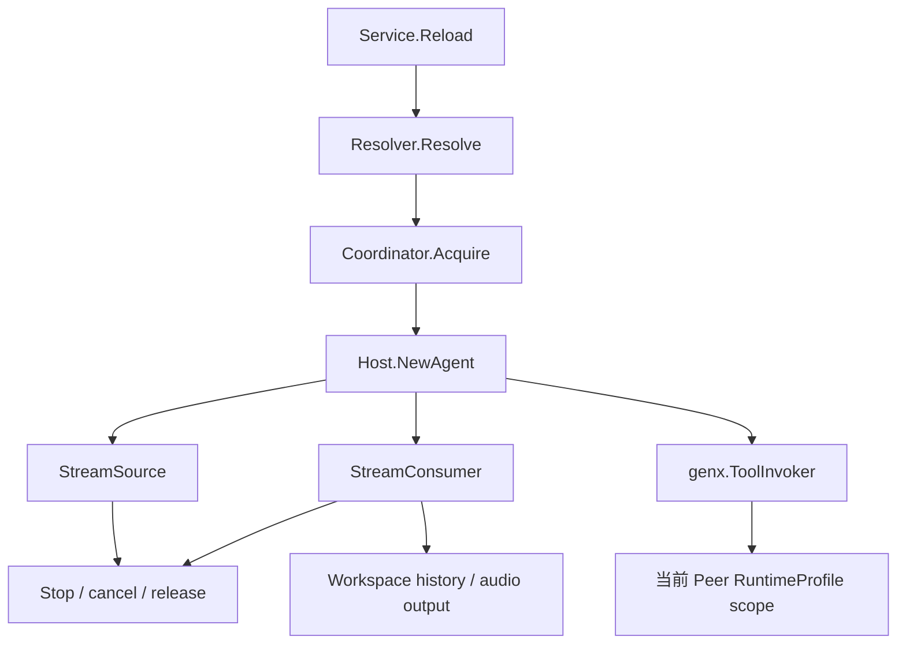

# Agent Host

[Go API Reference](https://pkg.go.dev/github.com/GizClaw/gizclaw-go/pkgs/gizclaw/services/runtime/agenthost)

`agenthost` 拥有 Agent instance 的在线生命周期。它解析运行规格、取得 Workspace lease、建立输入输出 Stream、接入 History 与 Memory、组合 context-scoped ToolInvoker，并维护当前 runtime registry。

## 运行流程

```mermaid
flowchart TD
    Reload["Service.Reload"] --> Resolve["Resolver.Resolve"]
    Resolve --> Lease["Coordinator.Acquire"]
    Lease --> Agent["Host.NewAgent"]
    Agent --> Input["StreamSource"]
    Agent --> Output["StreamConsumer"]
    Output --> History["Workspace history / audio output"]
    Agent --> Toolkit["genx.ToolInvoker"]
    Toolkit --> Profile["当前 Peer RuntimeProfile scope"]
    Input --> Stop["Stop / cancel / release"]
    Output --> Stop
```

## 核心结构与主函数

| 结构或函数 | 作用 |
| --- | --- |
| `Service.Reload` | 破坏式停止当前 Peer 的旧 runtime，并按当前 Peer run selection 创建新 runtime；失败后由 connection-local ErrorTransformer 接管新 BOS。 |
| `Service.Status` / `Stop` / `Shutdown` | 查询或终止当前 Agent runtime；连接 teardown 会永久关闭该 service。 |
| `Service.SetRunAgent` | 当 `PeerRun` 提供可选 `PeerRunSelectionStore` capability 时，在与 reload、stop 相同的 transition 边界内持久化 pending selection；只有改变 active workspace 的 selection 才推进 runtime revision。 |
| `Service.RuntimeRevision` / `PushInput` / `ReloadAndPushInputIfCurrentRevision` | 仅当 connection-scoped input 仍属于当前稳定 runtime revision 时允许写入或原子化地恢复后写入。 |
| `Service.WorkspaceState` | 返回当前 workspace 的运行状态。 |
| `RuntimeRegistry` | 维护当前在线 runtime。 |
| `Coordinator` / `MemoryCoordinator` | 为 workspace 提供排他 lease。 |
| `Host` / `Registry` | 根据解析后的 `Spec` 选择并创建 Agent。 |
| `InputStream` / `PushSource` | 将连续输入转换为 Agent 消费的 GenX Stream。 |
| `MixerOutput` | 按 `(StreamID, canonical MIME)` 将 Agent audio decode 为 PCM，并接到独立 mixer track；MIME EOS 只关闭对应 track，control-only EOS 关闭 route 下全部 track。 |
| `ToolkitInvoker` | 在当前 Transform 的 Peer scope 中重新解析、授权并分发 canonical Tool。 |

所有 runtime 创建路径都必须具有对称的 cancel、stream close、lease release 和 registry cleanup。Agent definition、Workflow 与 Workspace 的持久化仍属于 AI services。

AgentHost 写入的 History entry 会带内部 `origin=agenthost` 标记。持久化成功后，
callback 收到精确 entry identity，而不是仅收到时间戳。这个 callback 只是有界且
可丢弃的 Gameplay 调度提示，不是 durable high-water receipt；丢弃不会改变已持久化
History。runtime 成功发布后，AgentHost 还会报告该精确 Workspace 的激活，让 Gameplay
只对它的 History checkpoint 做懒对账。两个 callback 都不执行 GenX 调用，也不把奖励
evaluator 暴露为 Agent Tool。导入或旧 History 没有该 origin，因此不会被对话奖励
dispatcher 当成新活动。

## 当前 Peer 的 Tool scope

Workflow 使用 `sfu` driver 的 Workspace 是空的运行入口：`ServiceResolver` 只返回
Workspace、Workflow 与 agent type，不解析 owner RuntimeProfile、toolkit 或 Memory。
因此任何 Server 都能只依赖共享 Social KV 与本地 driver 激活 Social SFU Workspace，
即使 owner Peer 注册在其他 Server 上。

Tool execution context 与 Workspace-owner Resource access 相互独立。Workspace
owner 仍决定 Workspace、Workflow、Model 与 Memory resource，但不能替换当前已连接
Peer 的 Tool 集合。`Service.Reload` 会快照该 Peer 的 RuntimeProfile Tool binding，
并把这个连接专属的 execution handle 放入 run context。

`Spec` 只暴露 `genx.ToolInvoker`。Flowcraft、Eino、DashScope Realtime 与豆包
Realtime Duplex 只接收该接口，不接收 Resource、RuntimeProfile、Credential、
policy、alias 或 Peer transport 内部对象。`ResolveTools` 与 `InvokeTool` 每次都从
Transform context 读取 scope，因此一个 Workspace Agent 可以由不同 Profile 和
handler 的多个 Peer 并发共享；Invoker 不捕获构造 Agent 时的 Peer 状态。

Workspace 与 Workflow policy 只包含 canonical Tool resource ID，并且只能缩小
当前 Peer Profile 选择的集合。缺少 Tool scope 会返回明确配置错误。Disconnect、
reload、stop 或 connection replacement 会取消旧 context；迟到调用不能转发到新
connection 或其他在线 Peer。Resource declaration 与 provider Credential 在调用时
读取；只有完成基于 ID 的授权后，AgentHost 才使用 Tool 的不可变 execution name
分发。可能产生副作用的 Tool 永远不会自动 retry。

## Store 依赖 ownership

Host process 在启动时解析一次 `agent_host` Server Config 引用，并把 borrowed Store interface 注入 GizClaw Server、Peer Manager 与已注册 Workflow factory。Store Registry 仍是这些共享 backend 的唯一 owner；AgentHost、Workspace reload、Flowcraft、Pet、Eino 和 per-Agent adapter 都不能关闭它们。

`runtime_store` ObjectStore 持久化 Workspace runtime metadata 与 runtime object；Workspace History 的文本和结构化 metadata 由 `services.workspace.history_store` 持久化，二进制 replay asset 则使用独立的 `services.workspace.history_assets_store` ObjectStore。Flowcraft 接收相互独立且可选的 State、内部 History、Memory-object 与 provider-neutral Memory capability。Pet 委托给相同的已注册 inner-driver factory。Eino 只接收可选的 provider-neutral Memory capability；产品层不暴露持久化 Eino State 与 History。

Flowcraft 与 Eino 在已配置的 Memory Store 上只绑定 Workspace 这一层 App 边界。通用 Scope 的各维度仍然独立：Agent 逻辑可以保留自己的 User、Agent 与 Run 值，AgentHost 绝不会用 Peer public key 替代 UserID。Flowcraft 优先选择已配置 Store，而不是内嵌 provider；Eino 只有在 Workflow 声明 Memory policy 时才强制要求该 Store。

这些绑定属于 process-start configuration。Reload 会根据当前 Workflow 与 Workspace resource 重建 Agent，但不会 hot-swap 共享 Store 依赖。修改绑定后必须重启 Server，已有数据不会自动移动。

每个 `Service` 为其单个 Peer 串行化 selection 写入、reload、stop 与每次 Realtime input push。transition 在生命周期工作前后改变 runtime revision；只有改变 active workspace 的 selection 才是会推进 revision 的 transition。Realtime chunk 会先进入 runtime transition gate、再进入 per-input queue，并在 gate 内采样稳定 revision，因此输入与控制面操作共享同一个排序点。如果它观察到 revision 已变化或正处于 transition 中，即为过期输入，必须丢弃，不能重新打开或进入新的 workspace。input recovery 在同一个未变化的稳定 revision gate 内 reload 并写入原始 chunk；pending selection 仅在它改变当前 workspace 时才抑制恢复，因此同 workspace 的 selection 仍可恢复 inactive source。Peer teardown 会永久 shutdown 该连接级 service、取消仍在 gate 内的操作、原子阻止任何进行中的 reload 再发布新 runtime，并用有界 context 停止已经发布的 runtime。该边界不串行化无关 Peer，也不替代共享 `RuntimeRegistry` 对 workspace agent 的 ownership。

`Service.Reload` 在取得 transition ownership 后先从当前 Peer 摘掉并停止旧 runtime，再解析和构造 replacement。旧 runtime 的迟到 output、completion 与 error 都会因为失去 active identity 而被忽略。selection、Agent factory、Transform、activation 或 publish 失败时，调用方收到原始 reload error；只要 connection 仍能打开 input，`Service` 同时安装 connection-local ErrorTransformer。ErrorTransformer 不进入共享 `RuntimeRegistry`，不会重新 attach 旧 Agent，并对每个新 BOS 返回同 `stream_id`、`AGENT_RELOAD_FAILED`、`retryable=false` 的 error EOS。该 EOS 只结束对应 logical stream，ErrorTransformer 会保持到下一次成功 reload 或 Peer teardown。

`RuntimeRegistry` 按 Workspace 复用同一个已构造 Agent，并对每个 attach 返回独立 release。单个 Peer reload 只释放自己的引用；剩余引用继续使用原 Agent，既不会被打断，也不会重跑 initiative。最后一个引用释放时，registry 移除该 Agent、关闭 factory 拥有的 per-Agent adapter 并释放 workspace lease；下一次 acquire 才重新解析构造期配置。

Agent 构造可以共享，但每个 connection attachment 都拥有独立 input、transformed output、consumer 与 cancellation，因此 Peer lifecycle correlation 留在这些 connection-scoped stream boundary 上，不进入共享 Agent object。GenX 通过 stream wrapper 与 terminal EOS 保留 owning boundary 写入的无 payload `FailureClass`（`provider` 或 `transform`）；首个有效 class 优先，cancellation、deadline 与 clean completion 不会被赋予 failure class。Reload failure 由有界的 `AGENT_RELOAD_FAILED` EOS 表示并映射为 `transform_error`；provider-classified output EOS 映射为 `provider_error`；未分类 failure 与 stream 未产生 EOS 就结束均映射为 `stream_error`；cancellation 与 deadline 继续分开。Lifecycle record 不增加 raw provider 或 transform error。

Transformer 与 history replay 必须尽快把 provider output drain 到 growable stream buffer，不在该层按播放时钟等待。Raw Opus、Ogg/Opus、MP3 与 PCM audio 都先 decode/normalize，再进入 mixer 的 PCM stream；`PeerConn` 只在 mixer 出口每个 20ms pacing opportunity 读取一帧、编码 Opus 并写入 WebRTC。普通 EOS 使用 `CloseWrite` 让已缓存 PCM 排空，error EOS 使用 `CloseWithError` 丢弃对应 track 和尚未消费的 stream backlog。

## SFU Workspace runtime

Friend 与 Friend Group 的 SFU Workspace 走同一套 Reload、lease、registry 与 cancellation 路径，但 `Host.NewAgent` 对 `sfu` driver 不套 History wrapper，而是安装 `noHistoryAgent`：history list 返回空列表，play 返回 `not_found`，不写 History，也不触发 `workspace_history_updated` 与 Gameplay reward callback。SFU runtime 把 LiveKit connection、Track publish 与远端 Track reader 全部挂在 Transform context 上，因此 `Service.Reload` 先停旧 runtime 再激活新 selection 的现有顺序就是 Workspace 切换的取消通路，不新增状态机。

SFU 下行每个远端 participant 使用不同的 `stream_id` 和不同的 `label`（等于 participant identity）。`MixerOutput` 按 `(StreamID, MIME)` 分离解码与 mixer track，而 cutover 会在 BOS 时替换同 `label` 的其他 stream，所以 label 不同才能让多路远端音频并发混合。connector 行为见 [SFU 组合边界](/zh/developing/gizclaw/services/ai#sfu-组合边界)，激活与撤权见 [services/social](/zh/developing/gizclaw/services/social#sfu-workspace)。

Direct Workspace turn 可以安装 request-scoped History observer。它在 History 已持久化且 attachment 尚未释放时接收准确 entry，不按 timestamp 扫描，也不复制文本。取消与 callback synchronization 由请求 attachment 拥有，不改变普通 Peer-run capture。
