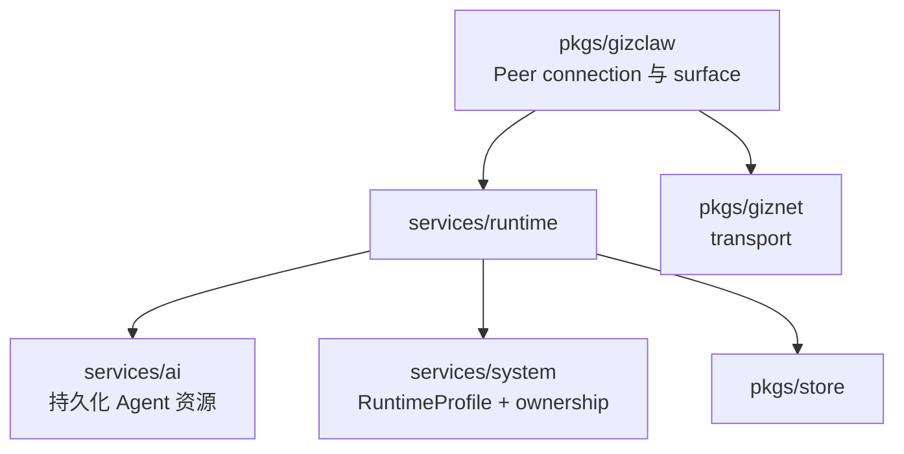

# services/runtime 总览

`pkgs/gizclaw/services/runtime` 负责把持久化的 GizClaw 产品资源转换为在线运行能力。它管理 Peer 与 Agent 的 runtime state、资源聚合、telemetry、route assignment 和 tool execution，但不拥有底层 transport 或 AI catalog。

## 目录结构

```text
services/runtime/
├── agent/           # Agent 选择、registry 和资源解析
├── agenthost/       # Agent instance、输入输出、stream 和 lifecycle
├── peer/            # Peer 资源、identity 和基础状态
├── peerresource/    # 面向 peer 的跨领域资源聚合
├── peerroute/       # Peer assignment 与 edge route 数据
├── peerrun/         # Peer 当前运行 Agent 的选择状态
├── peertelemetry/   # Telemetry 解码、映射、status 和 metrics
└── toolkit/         # Tool 资源、policy、执行器和 runtime view
```

## 子目录职责

### [agent](./agent)

负责从 workflow、workspace 等产品资源解析可运行 Agent，并维护 GizClaw 支持的 Agent 类型与选择边界。它不直接拥有每个 Agent instance 的 stream 和生命周期。

### [agenthost](./agenthost)

负责 Agent instance 的在线运行，包括 runtime 创建与清理、输入输出、source、stream、history 和 toolkit 接线。Workflow driver 可以接入 Agent Host，但第三方 workflow 的持久化配置仍属于 AI 领域。

### [peer](./peer)

拥有 Server 侧 Peer 资源、identity、registration 和基础状态。Transport public key 是 peer identity 的基础，但 `giznet` connection lifecycle 不由这个 package 实现。

### [peerresource](./peerresource)

聚合 peer 可以访问的 AI、firmware、gameplay、social 和 tool 等领域资源，为 Peer-facing surface 提供一致入口。它只做跨领域协调，不重新拥有或复制各领域资源。

### [peerroute](./peerroute)

拥有 Server 记录的 peer assignment 与 route 数据，服务于 Edge/Server 查找目标 peer 的控制平面。当前数据是本 Server 的 route state，不代表已经存在 mesh-wide directory 或自动同步。

### [peerrun](./peerrun)

保存 peer 当前选择运行哪个 Agent 的状态。Agent definition 和 workspace 不属于这里；这里拥有的是 peer 到运行选择之间的关联。

### [peertelemetry](./peertelemetry)

接收并解释 peer telemetry，将设备上报映射为 Server status 和 metrics。Telemetry schema 属于 `api/proto/telemetry`，metrics backend 属于 `pkgs/store/metrics`。

### [toolkit](./toolkit)

拥有 GizClaw Tool 资源、policy、executor 和 Agent 可见的 runtime ToolKit。它负责授权后的 tool view 和调用边界，不应成为任意业务 handler 的通用函数集合。

## 依赖与边界



应该放在 `services/runtime`：

- Peer 和 Agent 的在线状态及生命周期。
- 持久化资源到运行实例的解析与组合。
- Telemetry 到 status/metrics 的投影。
- Peer route、run selection 和授权后的 tool execution。

不应该放在这里：

- WebRTC、service stream 或 packet transport。
- Workflow、workspace、model、voice 和 credential 的 catalog ownership。
- Gameplay、social 或 firmware 的领域规则。
- CLI process、storage backend 和 listener 创建。
