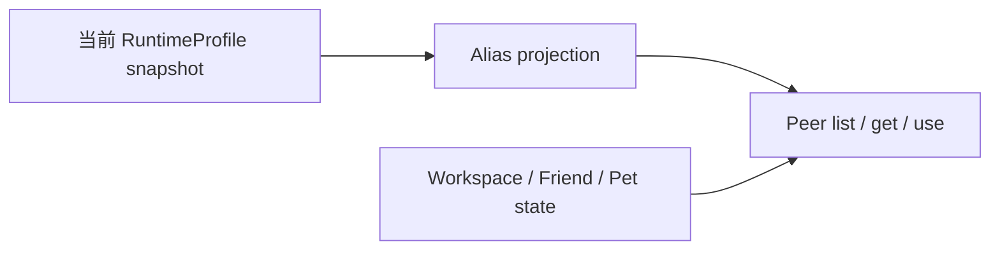

# Peer Resources

[Go API Reference](https://pkg.go.dev/github.com/GizClaw/gizclaw-go/pkgs/gizclaw/services/runtime/peerresource)

`peerresource` 把当前 RuntimeProfile 投影为 Peer RPC surface。Workflow、Model、Voice 和 Tool 都使用安全 alias DTO；AST Workflow 还会携带与 alias 无关的 Workspace 默认语言对。projection 不返回真实资源 ID、provider、tenant、credential、ownership 或 executor routing。

Workflow list 必须传明确的 Collection，并保持 `workflows.collections` 中的动态成员关系。Workflow alias 全局唯一，因此 get 只需要 alias。Model、Voice 和 Tool catalog 分别来自 RuntimeProfile 对应的 resource map。所有 catalog 响应都携带 RuntimeProfile name 与内容 revision。

Peer 侧只有 Workspace 状态支持 create/put/delete。真实 Workflow、Model、Credential 和 Tool 统一由 Admin 修改。Workspace create 校验 `collection` 与 `workflow_alias`，把 Collection 写成内部 label；list 按 Collection 精确筛选。通用 labels 只是 Admin/storage 细节，不进入 Peer DTO。

Firmware 不属于 RuntimeProfile alias catalog。Peer 可由 RegistrationToken 绑定一个 Firmware release-line；`server.firmware.get` 和 download 都从 caller Peer 读取该绑定，设备只在 download request 中选择 channel。Peer RPC 不提供 Firmware list。

每次 catalog 操作都重新取得当前 profile snapshot。Dangling alias 只表现为不可用，不泄漏真实 target。删除 Workflow alias 不会删除或隐藏已有 Workspace；在兼容 alias 恢复前，执行操作返回 not found。
