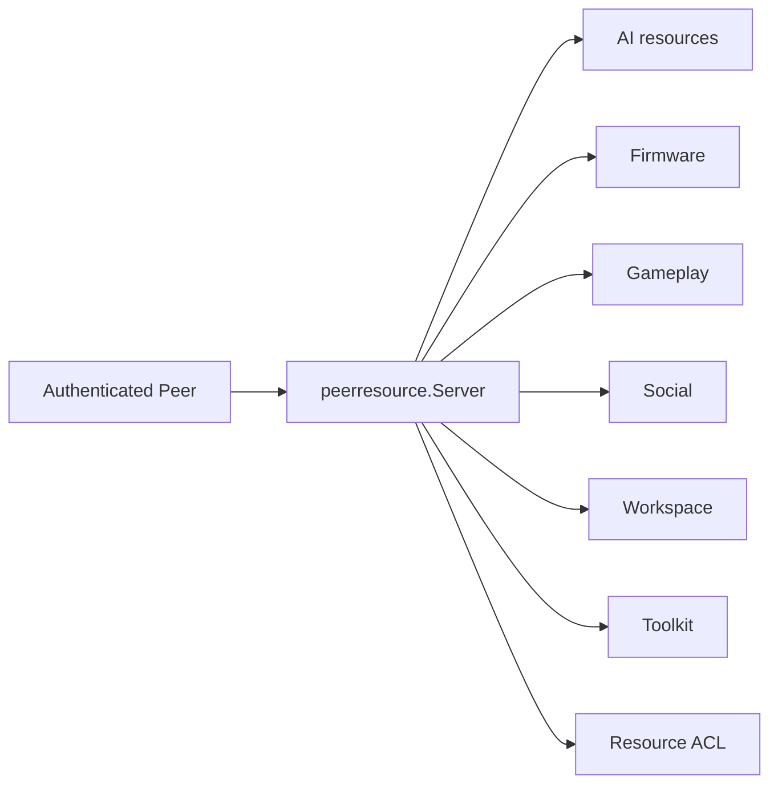
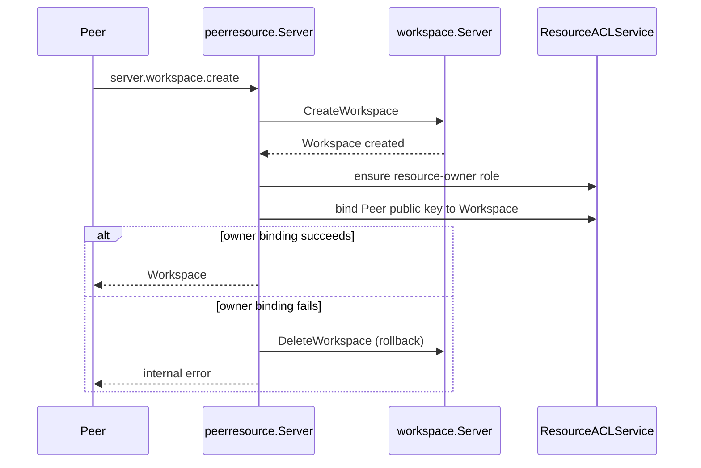

# Peer Resources

[Go API Reference](https://pkg.go.dev/github.com/GizClaw/gizclaw-go/pkgs/gizclaw/services/runtime/peerresource)

`peerresource` 是 Peer RPC 的跨领域资源聚合层。它把 AI、firmware、gameplay、social、workspace history 和 Tool 等领域 service 组合成 Peer 可以调用的统一 surface，并在进入领域 service 前执行 identity 与 ACL 约束。

## 资源方向

## 核心结构与主函数

| 结构或函数 | 作用 |
| --- | --- |
| `Server` | 实现 Peer resource RPC handlers，并持有各领域 service。 |
| `IsMethod` | 判断 RPC method 是否属于本聚合 surface。 |
| `Authorizer` | 对当前 Peer subject 执行资源授权和 discovery。 |
| `ResourceACLService` | 为 Peer 创建的 Workspace 和 Tool 建立、查询与清理 resource owner role/binding。 |
| `WorkspaceHistoryService` | 为 Peer RPC 提供 workspace history 能力。 |

`peerresource` 可以转换 API/RPC DTO，但不能复制领域资源的持久化规则。新增资源必须由对应领域 service 拥有，并在此处只增加协调、授权和 wire conversion。

## Peer 创建的 Workspace

Peer 通过 `server.workspace.create` 创建 Workspace 时，`peerresource` 不只转发 Workspace service：它还必须为调用方建立该 Workspace 的 owner binding。

Owner binding 使用当前 Peer public key 作为 subject、Workspace name 作为 resource，并授予统一的 `resource-owner` role。该 role 包含 `read`、`use` 和 `admin` 权限；Workspace 与 Tool 共用同一套 owner role 定义和 ACL service。

删除 Workspace 时顺序相反：先删除 Workspace，再清理对应 owner binding。如果 binding 清理失败，服务会用已删除 Workspace 的内容重新创建 Workspace，并向 Peer 返回错误，避免出现“Workspace 已删除但 ACL owner binding 仍残留”的半完成状态。binding 已不存在视为删除成功。

因此，Workspace 的资源记录和 owner binding 对 Peer RPC 表现为一个整体：创建操作不能留下没有 owner 权限的 Workspace，删除操作不能正常返回却遗留孤立的 owner binding。
