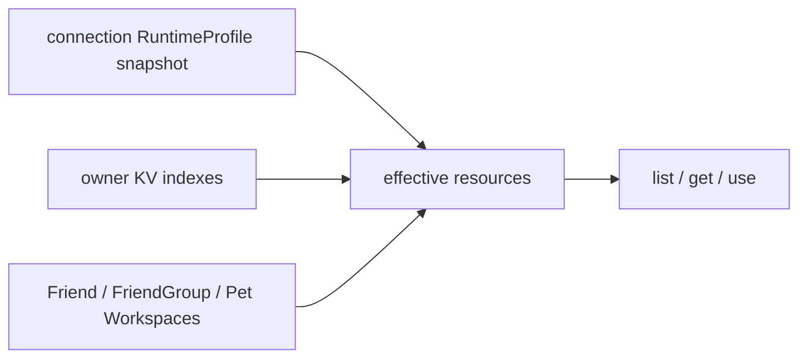

# Peer Resources

[Go API Reference](https://pkg.go.dev/github.com/GizClaw/gizclaw-go/pkgs/gizclaw/services/runtime/peerresource)

`peerresource` 是 Peer RPC 的跨领域资源聚合层。它把 AI、Firmware、Gameplay、Social、Workspace history 和 Tool 组合成统一 RPC surface，并按当前 connection 的 RuntimeProfile、调用方 ownership 和领域关系计算可见资源。

## 有效资源集合

RuntimeProfile map 的 value 是真实资源名。聚合列表按 alias 排序加入 profile 资源、去重，再加入 owner 资源；Workspace 还会加入 Friend、FriendGroup 和 Pet 领域资源。引用目标返回 404 时跳过，不让整个列表失败。

Get 和 use 对 RuntimeProfile 资源不检查 owner。更新和删除只允许 owner，或交给对应 system Workspace 领域规则。未注册 connection 没有 profile snapshot，但仍可调用相同 RPC，并访问自己拥有或领域关系允许的资源。

## 创建和 owner

Peer 通过公开 CRUD 创建 Workspace、Model、Credential 或 Tool 时，领域 service 从 context 写入 `owner_public_key`，并把资源加入 owner KV index。资源记录与 owner index 使用原子 batch 写入。Owner 字段不可通过后续 put 转移。

Workflow 的公开 RPC 只支持 list/get。Admin surface 仍可以统一管理全部资源。RuntimeProfile alias 只用于 profile 内部的 allow list 和 Gameplay 引用，普通 RPC 参数始终使用真实资源名。
