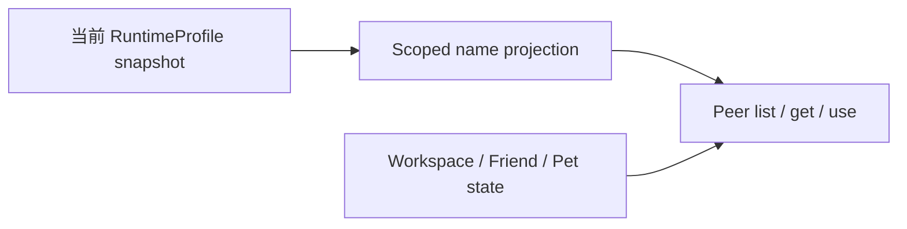

# Peer Resources

[Go API Reference](https://pkg.go.dev/github.com/GizClaw/gizclaw-go/pkgs/gizclaw/services/runtime/peerresource)

`peerresource` 把当前 RuntimeProfile 投影为 Peer RPC surface。Workflow、Model、Voice 和 Tool 都使用带 scope 的 `name` DTO。这些 name 来源于 RuntimeProfile binding alias，但它们是 Peer 唯一可见的资源 identity；AST Workflow 还会携带 Workspace 默认语言对。projection 不返回真实资源 ID、provider、tenant、credential、ownership 或 executor routing。

```mermaid
flowchart LR
    Profile["当前 RuntimeProfile snapshot"] --> Name["Scoped name projection"]
    Name --> RPC["Peer list / get / use"]
    Domain["Workspace / Friend / Pet state"] --> RPC
```

Workflow list 必须传明确的 Collection，并保持 `workflows.collections` 中的动态成员关系。投影后的 Workflow name 在当前 RuntimeProfile 内唯一，因此 get 只需要 name。Model、Voice 和 Tool catalog 分别来自 RuntimeProfile 对应的 resource map。所有 catalog 响应都在 legacy `runtime_profile_name` wire 字段中携带 canonical RuntimeProfile ID，并同时返回内容 revision。

Peer 侧只有 Workspace 状态支持 create/put/delete。真实 Workflow、Model、Credential 和 Tool 统一由 Admin 修改。Workspace create 校验 `collection` 与 `workflow_name`，把 Collection 写成内部 label；list 按 Collection 精确筛选。通用 labels 只是 Admin/storage 细节，不进入 Peer DTO。

Firmware 不属于 RuntimeProfile name catalog。RegistrationToken 可以给 Peer 绑定一个 caller-defined canonical Firmware ID；`server.register` 返回独立的 peer-visible Firmware name，`server.firmware.get` 从 caller Peer 解析绑定但不暴露 ID。设备请求一个 channel，并得到 external HTTPS `.tar.zlib` URL、SHA-256 与 archive size。Peer RPC 不提供 Firmware list，也不传输 package bytes。

每次 catalog 操作都重新取得当前 profile snapshot。Dangling internal binding 只表现为不可用，不泄漏真实 target。删除 Workflow binding 不会删除或隐藏已有 Workspace；在相同 Peer name 恢复前，执行操作返回 not found。
