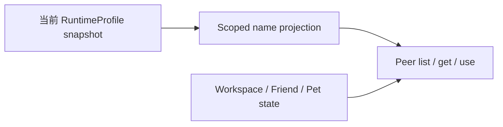

# Peer Resources

[Go API Reference](https://pkg.go.dev/github.com/GizClaw/gizclaw-go/pkgs/gizclaw/services/runtime/peerresource)

`peerresource` 把当前 RuntimeProfile 投影为 Peer RPC surface。Workflow、Model、Voice 和 Tool 都使用带 scope 的 `name` DTO。这些 name 来源于 RuntimeProfile binding alias，但它们是 Peer 唯一可见的资源 identity；AST Workflow 还会携带 Workspace 默认语言对。projection 不返回真实资源 ID、provider、tenant、credential、ownership 或 executor routing。

```mermaid
flowchart LR
    Profile["当前 RuntimeProfile snapshot"] --> Name["Scoped name projection"]
    Name --> RPC["Peer list / get / use"]
    Domain["Workspace / Friend / Pet state"] --> RPC
```

Workflow list 必须传明确的 Collection，并保持 `workflows.collections` 中的动态成员关系。投影后的 Workflow name 在当前 RuntimeProfile 内唯一，因此 get 只需要 name。Model、Voice 和 Tool catalog 分别来自 RuntimeProfile 对应的 resource map。所有 catalog 响应都携带 `runtime_profile_name` 和内容 revision。RuntimeProfile 没有独立的 Peer alias，因此该 Peer name 是 canonical RuntimeProfile ID 的原样投影，不是兼容字段。

Peer 侧只有 Workspace 状态支持 create/put/delete。真实 Workflow、Model、Credential 和 Tool 统一由 Admin 修改。Workspace create 校验 `collection` 与 `workflow_name`，把 Collection 写成内部 label；list 按 Collection 精确筛选，并跳过已进入 pending deletion 的 Workspace，因此同一 Collection 中其余 Workspace 在异步删除完成前仍可列出。通用 labels 只是 Admin/storage 细节，不进入 Peer DTO。

Workspace create/put 的 `toolkit.tool_names` 在当前 RuntimeProfile 中解析为内部 Tool ID：优先匹配 Tool binding alias；没有同名 alias 时，可以使用该 Profile 已绑定 Tool 的 `invoke_name`。未绑定或不存在的名称返回 `NOT_FOUND`，空名称或带首尾空白的名称返回 `INVALID_ARGUMENT`，且不写入 Workspace。响应优先投影为当前 Profile 的 alias；没有 binding 但 Tool 仍可读取时使用 `invoke_name`。Tool 读取失败、目录不可用或回退调用名与另一个 Tool 的 alias 冲突时跳过该项，toolkit 数据不能让 Workspace list/get 或已成功写入后的 put/parameters-set/delete 响应失败。投影不修改已存 ID，也不授予工具权限，AgentHost 仍与当前连接的 Profile 和 Workflow 策略取交集。

当前 Schema 只有可选的名称选择列表，没有 stale/unresolved 状态字段；省略策略已有“继承”的含义，不能用它表示未解析的限制。因此所有项都无法投影时返回 `tool_names: []`，与显式禁用在 Peer 响应中不可区分；部分失效时只返回可表示项。响应是可表示名称的视图，不是已存策略的无损备份。把投影列表原样 put 会替换存储中的选择；仅修改参数或保留原限制时应省略 `toolkit`。Admin 仍可读取完整 Tool ID 策略。

创建时省略 `toolkit` 或提供没有 `tool_names` 的空对象完全等价：内部存储 nil 策略，响应省略 `toolkit`，继承产品默认集合；显式空列表表示不提供任何工具。Protobuf 用可选 `tool_names` message 包装 repeated `value`，空列表在 wire 上是存在的空 message；Go 和持久化 JSON 保留显式空数组，不能改为 `null`。put 省略 `toolkit` 保留原策略，提供 `toolkit: {}` 则清除已有选择并恢复同一个 nil 继承状态。Workspace 策略与 Workflow `spec.toolkit.tool_ids` 及当前连接的 RuntimeProfile 集合取交集，不能扩大工具权限。

`server.workspace.toolkit.roundtrip.giztest.yaml` 覆盖 create/get/put 的选择、空列表、继承及未知名称。`go test ./cmd/internal/server -run '^TestWorkspaceToolkitGiztest$' -count=1` 在临时 SQLite Server 上通过真实 WebRTC 执行该文档，不需要外部服务。`client.tool.workspace.empty/subset/inherit.giztest.yaml` 使用标准 Giztest RuntimeProfile 中的 `giztest_echo` 和 `giztest_other`，覆盖禁用、子集与默认工具调用。三个调用场景需要已 provision 的端点、registration token 和模型/Memory 服务；完成回复后的精确累计 client RPC 计数证明被排除工具没有到达设备。empty 场景先在继承策略的控制 Workspace 中调用一次，再确认禁用 Workspace 没有增加计数。

`server.app_config.list` 与 `server.app_config.get` 投影 `spec.app_config`，是 catalog 之外唯一的 RuntimeProfile 下发面。list 对 key 排序后复用与 Workflow、Model、Voice、Tool 相同的 revision-bound cursor 分页，revision 变化时返回 `ABORTED`；get 返回原样 value，key 不存在返回 `NOT_FOUND`，空 key 返回 `INVALID_ARGUMENT`。value 对本层不透明，不解析也不校验格式。list 只返回 key，因为 64 个 4096 字节 value 无法放进一个 RPC frame。

Firmware 不属于 RuntimeProfile name catalog。RegistrationToken 可以给 Peer 绑定一个 caller-defined canonical Firmware ID；`server.register` 不返回 Firmware identity，`server.firmware.get` 从内部 binding 解析 Firmware 但不暴露 ID。设备请求一个 channel，并得到 external HTTPS `.tar.zlib` URL、SHA-256 与 archive size。Peer RPC 不提供 Firmware list，也不传输 package bytes。

每次 catalog 操作都重新取得当前 profile snapshot。Dangling internal binding 只表现为不可用，不泄漏真实 target。删除 Workflow binding 不会删除或隐藏已有 Workspace；在相同 Peer name 恢复前，执行操作返回 not found。

Social 方法同样经由 `peerresource` 分发，但只做解码、参数校验与错误映射：`server.friend.ping` 与 `server.friend_group.ping` 要求非空且无首尾空白的 `name`，领域规则由 social 服务执行；`server.profile.get` 校验 1–16 个规范 public key、去重后逐个读取公开资料，存储错误统一脱敏为 `profile lookup failed`。

内置 SFU Workspace 的运行选择不依赖 RuntimeProfile；同一 Peer 重连后无需再次注册即可选择仍有成员权限的 SFU Workspace。选择仍校验当前 Social 成员关系与 Workspace 删除状态，普通 Workflow Workspace 仍依赖当前 RuntimeProfile。
