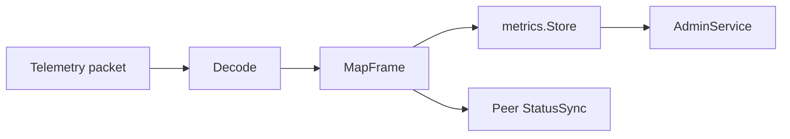

# Peer Telemetry

[Go API Reference](https://pkg.go.dev/github.com/GizClaw/gizclaw-go/pkgs/gizclaw/services/runtime/peertelemetry)

`peertelemetry` 解码 Peer telemetry packet，将 frame 投影为 metrics sample 和固定的 Peer status patch，并为 Admin 查询提供聚合入口。

## 数据流

## 核心结构与主函数

| 结构或函数 | 作用 |
| --- | --- |
| `Decode` | 校验并解码 telemetry protobuf payload。 |
| `MapFrame` | 将 frame 映射为 metrics 与 `StatusPatch`。 |
| `Service` | 处理 Peer telemetry ingestion。 |
| `StatusSync` | 将 patch 合并到 Peer runtime status。 |
| `AdminService` | 提供 telemetry metrics 的 Admin 查询。 |
| `PeerStatusStore` / `StatusService` | 隔离持久化 status 与更新接口。 |

Telemetry schema 属于 `api/telemetry`，metrics persistence 属于 `pkgs/store/metrics`。本 package 只拥有解码、映射和同步策略。
