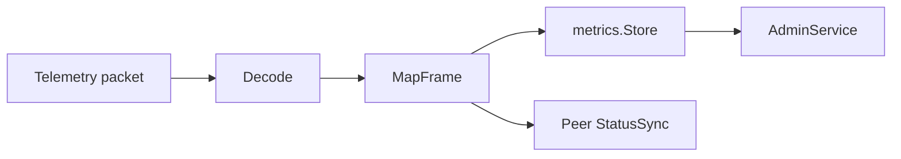

# Peer Telemetry

[Go API Reference](https://pkg.go.dev/github.com/GizClaw/gizclaw-go/pkgs/gizclaw/services/runtime/peertelemetry)

`peertelemetry` 解码 Peer telemetry packet，将 frame 投影为 metrics sample 和固定的 Peer status patch，并为 Admin 查询提供聚合入口。

## 数据流

```mermaid
flowchart LR
    Packet["Telemetry packet"] --> Decode["Decode"]
    Decode --> Map["MapFrame"]
    Map --> Metrics["metrics.Store"]
    Map --> Status["Peer StatusSync"]
    Metrics --> Admin["AdminService"]
```

## 核心结构与主函数

| 结构或函数 | 作用 |
| --- | --- |
| `Decode` | 校验并解码 telemetry protobuf payload。 |
| `MapFrame` | 将 frame 映射为 metrics 与 `StatusPatch`。 |
| `Service` | 处理 Peer telemetry ingestion。 |
| `StatusSync` | 将 patch 合并到 Peer runtime status。 |
| `AdminService` | 提供 telemetry metrics 的 Admin 查询。 |
| `PeerStatusStore` / `StatusService` | 隔离持久化 status 与更新接口。 |

Telemetry schema 属于 `api/proto/telemetry`，metrics persistence 属于 `pkgs/store/metrics`。本 package 只拥有解码、映射和同步策略。

Network observation 的 `imei` / `imsi` 经模式与蜂窝路由校验后进入 `StatusPatch`，由 `StatusSync` 以逐字段观测时间合并到 `PeerStatus.network_imei` / `network_imsi`，不写指标、不写日志；规则见 [Telemetry API](/zh/developing/api/proto/telemetry#network-上报)。

Activity observation 的 `activity` 与可选 `detail` 一起进入 `StatusPatch`，由 `StatusSync` 作为一个整体合并到 `PeerStatus.activity` / `activity_detail`，同样只写状态不写指标；`SystemObservation.firmware_version` 以同一逐字段规则进入 `PeerStatus.firmware_version`。规则见 [Telemetry API](/zh/developing/api/proto/telemetry#activity-上报)。

每个 telemetry 来源字段的观测时间保存在 typed 的 `PeerStatus.telemetry_observed_at` 中，成员名与它描述的
`PeerStatus` 字段同名，值为 RFC 3339 时间戳。这些时间戳正是逐字段排序的依据：迟到或重放的上报会被拒绝，
而不会覆盖更新的观测。字段在首次被观测到之前，对应成员不存在。

`telemetry_observed_at` 由 Server 维护，不接受设备写入：控制响应里携带的 `telemetry_observed_at` 会被丢弃，
观测时间只来自 Server 处理该次观测时的记录。

OTA observation 校验后由 `StatusSync` 写入可查询的 runtime OTA 状态，不记录 payload 日志，也不映射为 metrics；字段和 SDK 用法见 [Telemetry API](/zh/developing/api/proto/telemetry#ota-上报)。
