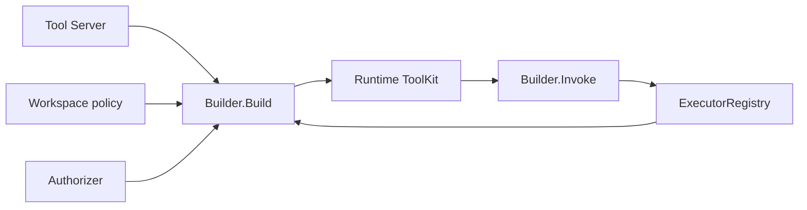

# Toolkit

[Go API Reference](https://pkg.go.dev/github.com/GizClaw/gizclaw-go/pkgs/gizclaw/services/runtime/toolkit)

`toolkit` 拥有持久化 Tool 资源、executor registry，以及针对一次 Agent runtime 构造的授权 ToolKit view。ToolKit 不是通用 helper 集合，而是 Agent 可见和可执行能力的安全边界。

## 调用关系

## 核心结构与主函数

| 结构或函数 | 作用 |
| --- | --- |
| `Tool` / `ToolKit` | 持久化 Tool model 与一次 runtime 的过滤视图。 |
| `Server` | 使用 KV store 实现 Tool CRUD。 |
| `NormalizeTool` / `NormalizePolicy` | 校验并规范化 Tool 与 exposure policy。 |
| `Builder.Build` | 根据 enabled、policy、ACL 和 executor availability 构造 ToolKit。 |
| `Builder.Invoke` | 确认调用仍在授权 view 内，再交给 executor。 |
| `ExecutorRegistry` | 注册 builtin/device executor 并按名称调用。 |
| `DeviceRPCExecutor` | 将 device-owned Tool 调用发送到对应 Peer RPC。 |
| `FromAPI` / `FromRPC` / `FromSpec` | 在持久化 model 与不同 contract surface 间转换。 |

Tool schema、ACL 和 executor availability 必须在调用时重新约束，不能仅依赖展示 ToolKit 时的过滤结果。具体业务 handler 不应把任意函数塞入 Toolkit 绕过领域 service。
